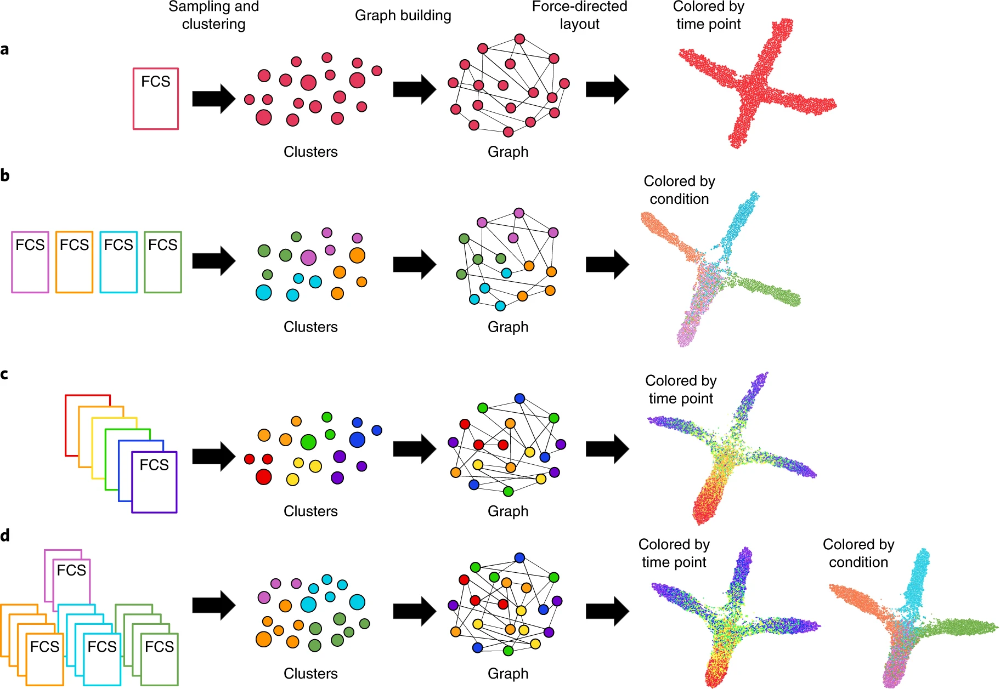

# FLOW-MAP: a graph-based, force-directed layout algorithm for trajectory mapping in single-cell time course datasets

Nature Protocols (2020 Jan)
University of Virginia 

paper link:
https://www.nature.com/articles/s41596-019-0246-3

github link: 
https://github.com/zunderlab/FLOWMAP/

## Summary
FLOW-MAP 提供了一种直观的方式来分析和可视化单细胞数据集中的动态变化，特别适用于研究细胞分化和其他复杂生物过程。
-  FLOW-MAP is a GUI-based software tool that uses graph layout analysis with sequential time ordering to visualize cellular trajectories in high-dimensional single-cell datasets obtained from flow cytometry, mass cytometry or single-cell RNA sequencing experiments.
- The main steps are: 1) data preprocessing within FLOW-MAP (downsampling, transforming data), 2) graph building between nodes from adjacent time points, and 3) graph visualization after iterative force-directed layout.
- It accommodates multiple FLOW-MAP modes for analyzing a single sample, multiple conditions at one time point, one time course, or multiple time courses.
- Key parameters that affect the output include the ratio of cells subsampled to number of clusters, edge density parameters, and choice of markers used for clustering.
- The output is a 2D graph representation showing patterns of change over time across multiple markers. Node size indicates number of cells, color indicates marker expression or metadata.
- It enables visualization of cellular trajectories, branchpoints, and marker expression patterns in dynamic processes like cell differentiation, without directly tracing individual cells.
- It can be applied to mass cytometry and single-cell RNA-seq data, with examples shown for mouse embryonic stem cell differentiation and hematopoiesis.

## Structure
Introduction

- Overview of FLOW-MAP algorithm and applications
- Comparison to other single-cell analysis methods
- Limitations

Overview of FLOW-MAP algorithm

- Data preprocessing
- FLOW-MAP graph building
- FLOW-MAP graph layout and visualization

Materials

- Equipment
- Software

Equipment setup

- FLOWMAPR installation

Procedure

1. Setting up files and specifying parameters for FLOW-MAP analysis
2. Running FLOW-MAP
3. Visualizing FLOW-MAP results

Anticipated results

- Specifying different FLOW-MAP settings
- Comparison of FLOW-MAP with other single-cell analysis methods
- FLOW-MAP analysis of mESC differentiation time course
    - Combined analysis of all conditions
    - Individual condition analysis
- Using FLOW-MAP to analyze scRNA-seq data

## Algorithm framework

The FLOW-MAP algorithm has three major stages: data preprocessing, including optional subsampling or density-dependent downsampling and clustering (Steps 1–3); graph building between nodes from adjacent time points, allotting edges in a density-dependent manner (Step 4); and graph visualization after iterative force-directed layout and postprocessing (Steps 5–9). Workflow and example outputs are shown for the four available modes: a, single time point, single condition; b, single-time point, multiple conditions; c, multiple time points, single condition; and d, multiple-time points, multiple conditions. The default input for FLOW-MAP is an FCS file, but the tool can be applied to other formats. Example FLOW-MAPs are shown on synthetic 2D datasets.

1. Data preprocessing within FLOW-MAP

- This stage involves preparing the input data for graph building.
- If necessary, the data is transformed using an Arcsinh transform.
- Downsampling methods can be applied to reduce the dataset size, including density-dependent downsampling to preserve rare cell populations, random subsampling, or hierarchical clustering.
- An overclustering approach is recommended when downsampling/clustering.

2. FLOW-MAP graph building
- 距离矩阵是使用细胞/簇之间的欧几里得距离或曼哈顿距离计算的。
- 图的构建以细胞/簇为节点。每个节点的边的数量由其局部密度决定。局部密度是通过计数在一个固定分位数定义的半径内的邻居数来估计的。
- 每个节点根据分配的边数连接到来自相同或相邻时间点的k个最近邻居。
- 为了确保图的连通性，添加了最小生成树边。对于时间序列数据，图的构建是针对每对相邻时间点依次进行的。节点注释包括细胞测量值、时间点、条件等信息。

3. FLOW-MAP图布局和可视化
- 初始图输出时没有任何布局信息。然后应用ForceAtlas2布局算法进行一定次数的迭代以生成2D布局。生成的布局可以加载到如Gephi的图可视化软件中进行交互式可视化和精细化。
- 节点大小表示细胞数量，颜色表示标记表达或元数据。最终的可视化输出用于识别细胞轨迹、分支和表达模式。

### Arcsinh transform

Arcsinh变换将正态分布的数据转换为具有更高偏度和峰度的分布,即sinh-arcsinh分布。这种变换对于处理具有重尾和偏斜特征的数据非常有用。

    变换过程
    1. 生成多元正态分布的样本Z ~ N(0, R),其中R是相关矩阵。
    2. 选择偏度参数ε和峰度参数δ。
    3. 对每个分量Zi,应用如下变换:
    X = sinh((arcsinh(Zi) - ε) / δ)

通过调整ε和δ,可以控制sinh-arcsinh分布的偏度和峰度。

#### 偏度(Skewness)
偏度衡量数据分布的不对称性,描述数据相对于平均值的偏斜程度。
偏度=0,表示数据分布呈对称分布,如正态分布。
偏度>0,表示数据右偏(正偏),分布在平均值右侧有较长尾部。
偏度<0,表示数据左偏(负偏),分布在平均值左侧有较长尾部。
偏度的绝对值越大,表明数据分布偏离对称性的程度越高。

#### 峰度(Kurtosis)
峰度描述数据分布曲线顶端的尖锐或扁平程度,反映数据分布相对于正态分布的陡峭程度。
峰度=0,表示数据分布峰度与正态分布相同。
峰度>0,表示数据分布峰部较高尖锐,为尖顶峰。
峰度<0,表示数据分布峰部较低扁平,为平顶峰。
峰度的绝对值越大,表明数据分布相对于正态分布的陡缓程度差异越大。）

#### ForceAtlas2
ForceAtlas2是一种用于网络可视化的连续图布局算法,它模拟了一个物理系统来空间化网络。

算法原理
- 节点之间存在排斥力,就像带电粒子互相排斥一样。
- 边会使相连的节点之间产生吸引力,就像弹簧一样。
- 这些力会产生一个运动,最终收敛到一个平衡状态。

算法特点
- 连续算法:不断迭代直到收敛,避免陷入局部最优。
- 度依赖排斥力:高度节点受到更大的排斥力,防止它们相互靠拢。
- 引力调整:根据边权重调整节点间吸引力的大小。
- 自适应速度:根据节点的运动情况动态调整速度。

## Baseline model, Evaluation metrics and Datasets  
1. Baseline model (基线模型):
在 FLOW-MAP 的情况下,基线模型可以是其他常用于分析单细胞数据的降维方法,例如 PCA、t-SNE、diffusion maps、SPADE 和 Monocle 等。通过将 FLOW-MAP 与这些基线模型的结果进行比较,可以评估 FLOW-MAP 在可视化和解释高维单细胞时间序列数据方面的性能和优势。
2. Evaluation metrics (评估指标):
评估指标是用于量化算法性能的标准。然而,由于缺乏已知的参考标准,评估 FLOW-MAP 等降维方法在真实数据集上的准确性和全面性存在局限性。Instead,FLOW-MAP 生成的可视化图的实用性可以通过其预测细胞轨迹和形成可测试假设的能力来评估。另一个评估 FLOW-MAP 性能的方法是使用不同的参数设置进行多次分析,以评估结果的稳健性和重现性。
3. Datasets (数据集):
- 模拟的2D单细胞分化数据集,其中包括从单个祖先分化出的三个分支谱系。
- 使用质谱流式细胞术测量的小鼠胚胎干细胞分化时间序列数据集,包括分化为内胚层、中胚层和外胚层的三种培养条件。
- 使用单细胞 RNA 测序技术分析造血细胞分化的已发表数据集。

## 计算机语言， 软件包 以及 计算资源
1. 计算机语言:
- R 语言:FLOW-MAP 算法主要在 R 语言环境中实现。R 是一种用于统计计算和图形显示的开源编程语言,在生物信息学领域被广泛使用。
- C++ 语言:FLOW-MAP 使用的 ForceAtlas2 布局算法是用 C++ 实现的,并通过 R 调用。
2. 软件包:
- FLOWMAPR:这是一个专门用于 FLOW-MAP 分析的 R 包。它封装了 FLOW-MAP 算法的主要步骤,并提供了一个用户友好的界面。FLOWMAPR 依赖于多个其他的 R 包,例如:
    - igraph:用于图形数据结构和算法。
    - Rclusterpp:用于高性能聚类。
    - shiny 和 tcltk:用于创建交互式图形用户界面。
- Gephi:一个开源的图形可视化和分析软件。FLOW-MAP 生成的图形布局文件可以导入到 Gephi 中进行交互式探索和美化。
3. 计算资源:
- FLOW-MAP 对计算资源的要求取决于输入数据的大小和复杂度。主要的计算开销来自于聚类步骤和力导向布局步骤。
- 在 FLOW-MAP 文章提供的示例中,使用 2.7 GHz Intel Core i5 处理器和 16 GB 内存的 MacBook Pro 可以在合理的时间内处理数千个节点的数据集。
