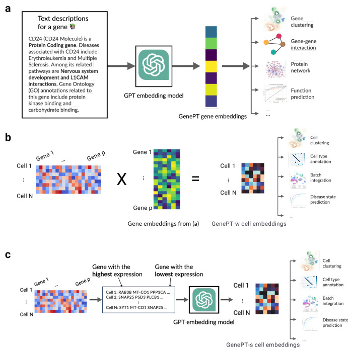

# GenePT: A Simple But Effective Foundation Model for Genes and Cells Built From ChatGPT

preprint (2023 Oct) Stanford

paper link: 
https://www.ncbi.nlm.nih.gov/pmc/articles/PMC10614824/

github link:
https://github.com/yiqunchen/GenePT
 
 ## Summary
 本文介绍了GenePT，这是一种简单但有效的方法，使用GPT-3.5的自然语言嵌入来表示基因和细胞。
 1. 基因嵌入：GenePT通过将NCBI基因摘要传递给GPT-3.5来嵌入基因。对于细胞，GenePT要么通过基因表达加权平均基因嵌入(GenePT-w),要么通过嵌入按表达排名的基因名称句子(GenePT-s)来表示细胞。
 2. 基因级任务：在预测功能类、性质和基因-基因相互作用等基因级任务中，GenePT在不需要预训练的情况下，实现了与Geneformer相当或更好的性能。
 3. 细胞级任务：GenePT嵌入捕捉了细胞类型和疾病状态，与scGPT和Geneformer想当。特别是GenePT-s提供了与基于表达的模型互补的信息。
 4. 对批次效应的鲁棒性：GenePT嵌入对患者变异等批次效应具有鲁棒性，同时保留了基础生物学信号。
 5. 结果：结果表明，基因/细胞描述的语言模型嵌入是一种简单但强大的生物表示学习方法，为大规模基于表达的预训练提供了一种高效的替代或补充。

 ## Structure 
 1. 引言(Introduction)
    - 介绍了利用大规模基因表达数据开发单细胞转录组基础模型的最新进展
    - 提出了一种利用ChatGPT嵌入基因文献信息的简单替代方法GenePT
    - 阐述了研究问题和贡献
 2. 相关工作(Related Work)
    - 综述了用于单细胞转录组学的基础模型
    - 讨论了将语言模型应用于细胞生物学的现有工作
    - 回顾了探究自然语言嵌入表示的方法
 3. 方法(Methods)
    - 数据收集和转换:介绍了如何获取基因摘要并生成GenePT嵌入表示
    - 下游基因和细胞水平的应用:详细描述了用于评估GenePT性能的各项任务
 4. 结果(Results)
    - GenePT嵌入表示捕获了基因功能的本质属性
    - GenePT在染色质动力学和基因剂量敏感性预测任务上实现了良好表现
    - GenePT学习的细胞表示反映了已知的生物学特征
    - GenePT嵌入表示能够去除批次效应同时保留疾病相关的生物学差异
 ## Workflow
 1. 数据收集和预处理
    - 收集了Geneformer和scGPT使用的基因词汇表，并进行了统一
    - 对于每个基因，从NCBI基因数据库中提取摘要信息进行文本清洗
 2. 基因嵌入表示学习
    - 将处理后的基因摘要通过GPT-3.5进行编码,得到基因的嵌入向量表示
    - 对于缺失NCBI摘要的少数基因,使用GPT-3.5生成其功能描述并进行编码
 3. 细胞嵌入表示学习
    - GenePT-w:根据基因在细胞中的表达量,对基因嵌入向量进行加权平均,得到细胞的嵌入表示
    - GenePT-s:将每个细胞表示为一个由基因名按表达量排序构成的"句子",并使用GPT-3.5对其进行编码
 4. 下游任务评估
    - 基因功能分类:使用GenePT基因嵌入对15个主要功能类别进行预测
    - 基因特性预测:评估GenePT在多个二分类任务上的性能,如剂量敏感性、组蛋白修饰等
    - 基因-基因相互作用:使用GenePT基因嵌入对基因间相互作用进行预测
    - 细胞类型注释:比较不同细胞嵌入方法在细胞类型分类任务上的表现
    - 批次效应校正:评估GenePT细胞嵌入去除技术批次影响同时保留生物学差异的能力
 5. 结果比较和分析
    - 将GenePT的性能与Geneformer、scGPT、Gene2Vec等现有方法进行比较
    - 分析GenePT在不同任务和数据集上的优势和局限性
    - 探讨了将GenePT与表达量驱动的方法相结合的可能性
 6. 讨论和总结
    - 总结了GenePT作为一种简单有效的基因和细胞表示学习范式的潜力
    - 讨论了基于LLM的嵌入方法在生物学领域应用的局限性和未来方向
    - 强调了GenePT在提供有效的生物学先验知识方面的独特优势

 ## Algorithm framework 
 
    (a) 对于每个基因，我们从NCBI提取其相应的文本摘要，并使用GPT-3.5文本嵌入作为其表示。
    (b) 在GenePT-w细胞嵌入框架中，我们对步骤(a)中的基因嵌入按其在细胞中的表达水平进行加权平均，并将这些细胞嵌入归一化到单位ℓ2范数。
    (c) 在GenePT-s细胞嵌入框架中，输入的单细胞数据中的每个细胞都根据基因表达排名被翻译成一句自然语言句子，并使用整句的GPT-3.5嵌入来表示该细胞。

 1. 第一部分:基因嵌入(Gene Embedding)
    a. 输入:基因g的NCBI摘要文本 text_g
    b. 文本预处理:
        - 去除摘要中的超链接和日期
        - 对于缺失摘要的基因,使用预定义的提示生成其功能描述
    c. 使用GPT-3.5对处理后的文本进行编码:embed_g = GPT-3.5(text_g)
    d. 输出:基因g的嵌入向量表示embed_g
 2. 第二部分:细胞嵌入(Cell Embedding)
    a. 输入:单细胞RNA测序数据矩阵X,其中行对应细胞,列对应基因
    b. 数据预处理:
        - 对每个细胞的基因表达量进行归一化,使每个细胞的总表达量为10,000
        - 对归一化后的矩阵进行log(1+x)变换
 3. GenePT-w嵌入:
    a. 对于每个细胞c,计算其嵌入向量:embed_c = sum(embed_g * X[c, g]) / sum(X[c, g]),其中embed_g为基因g的嵌入向量,X[c, g]为基因g在细胞c中的归一化表达量。
 4. GenePT-s嵌入:
    a. 对于每个细胞c,生成一个由基因名按表达量降序排列构成的"句子":sentence_c = "gene1 gene2 ... geneN",其中gene1到geneN为表达量从高到低排列的基因名。
    b. 使用GPT-3.5对sentence_c进行编码:embed_c = GPT-3.5(sentence_c)
 5. 输出:细胞c的嵌入向量表示embed_c
    伪代码

```:
        # Gene Embedding
        function GeneEmbedding(text_g):
            text_g = preprocess(text_g)
            embed_g = GPT-3.5(text_g)
            return embed_g

        # Cell Embedding
        function CellEmbedding(X, method):
            X = normalize(X)
            X = log_transform(X)

            if method == "GenePT-w":
                for each cell c:
                    embed_c = sum(embed_g * X[c, g]) / sum(X[c, g])
            else if method == "GenePT-s":
                for each cell c:
                    sentence_c = rank_genes(X[c, :])
                    embed_c = GPT-3.5(sentence_c)

            return embed_c
```

    该算法框架的核心思想在于利用预训练语言模型GPT-3.5对基因的文本描述和细胞的"基因表达句子"进行编码,从而得到它们的低维嵌入表示。这种基于自然语言处理的表示学习方法避免了从头训练深度学习模型的巨大开销,同时还能捕获基因和细胞功能的关键生物学信息。

 ## Baseline models, Evaluation metrics, and Datasets
 1. 基线模型(Baseline Models):
    - Geneformer:一个在大规模单细胞转录组数据上预训练的transformer模型,用于基因和细胞嵌入表示学习。
    - scGPT:另一个在大规模单细胞多组学数据上进行生成式预训练的transformer模型。
    - Gene2Vec:基于基因共表达模式学习基因分布式表示的一种方法。
    - BioLinkBERT:一种在生物医学文本上预训练的语言模型。
 2. 评估指标(Evaluation Metrics):
    - 精确率(Precision)、召回率(Recall)、F1值:用于评估分类任务的预测性能。
    - ROC-AUC:评估二分类任务的预测性能。
    - 调整兰德指数(Adjusted Rand Index, ARI)和调整互信息(Adjusted Mutual Information, AMI):衡量聚类结果与真实标签的一致性.

    #### Adjusted Rand Index (ARI)
    是一种评估聚类算法性能的指标,用于衡量两种聚类结果之间的相似程度。它是对 Rand Index 的改进,通过考虑随机情况下的期望值,从而更准确地反映聚类质量。

        ARI 的计算过程如下:
        1. 构建两个聚类结果的contingency表,表示样本在两种聚类中的分配情况。
        2. 计算 Rand Index (RI),即样本对被正确分类(同一类或不同类)的比例。
        3. 计算 RI 在随机情况下的期望值 E(RI)。
        4. 使用公式:
            ARI = (RI - E(RI)) / (max(RI) - E(RI))
            对 RI 进行调整,得到 -1 到 1 之间的 ARI 值。
            其中 ARI=1 表示两个聚类结果完全一致,ARI=0表示与随机分配无异,ARI<0 表示两个聚类结果的差异大于随机水平。
    #### Adjusted Mutual Information (AMI) 
    是一种评估两个聚类结果相似度的指标,它是基于互信息(Mutual Information)的改进版本。
    什么是互信息
        互信息衡量两个随机变量之间的相关性。在聚类分析中,可以将两个聚类结果U和V看作两个随机变量,互信息I(U,V)反映了这两个聚类结果之间的一致性程度。
        然而,互信息的值域没有固定范围,难以解释和比较。而且,即使两个聚类结果是完全随机的,互信息也不为0,这使得评估变得困难。

        AMI的改进： 
        - 为了解决上述问题,AMI对互信息进行了调整:
        1. 计算互信息I(U,V)。
        2. 计算在随机情况下的期望互信息E[I(U,V)]。
        3. 使用公式:
            AMI = (I(U,V) - E[I(U,V)]) / (max(H(U),H(V)) - E[I(U,V)])  
            对互信息进行归一化,其中H(U)和H(V)分别是U和V的熵。
        通过减去期望互信息,AMI消除了随机效应的影响。归一化后,AMI的取值范围是[-1,1],更易于解释:
        - AMI=1,表示两个聚类结果完全一致
        - AMI=0,表示两个聚类结果与随机分配无异
        - AMI<0,表示两个聚类结果的差异大于随机水平
        - AMI广泛应用于评估聚类算法的性能,尤其在存在类别不平衡或噪声数据时,AMI比其他指标如Rand Index更可靠。

 3. 数据集(Datasets):
    - 基因功能分类数据集:包含15个最常见的基因功能类别的标注数据。
    - 基因特性预测数据集:包括剂量敏感性、组蛋白修饰、转录因子作用范围等多个二分类任务。
    - 基因-基因相互作用数据集:根据共享基因本体论(Gene Ontology)标注构建的基因相互作用预测任务。
    - 人类免疫组织单细胞数据集:用于无监督探索GenePT得到的基因模块。
    - 心肌细胞和主动脉单细胞数据集:用于评估GenePT去除批次效应同时保留生物学差异的能力。
    - 几个具有细胞类型标注的单细胞数据集(如hPancreas、Myeloid等):用于评估细胞嵌入表示捕获生物学变异的能力。


 ## Computing language，tools, packages and resources
 1. 计算语言(Computing Language):
    - Python:论文中提到使用了多个Python包进行数据处理和分析,如mygene、scanpy和sklearn,因此可以推断本文的主要编程语言为Python。
 2. 计算资源(Computing Resources):
    a. GPT-3.5 API:本文使用了OpenAI的GPT-3.5模型(text-embedding-ada-002)提供的API服务来生成基因和细胞的嵌入表示。这种基于云API的方式避免了在本地部署和训练大型语言模型的计算开销。
    b. 公共数据库:
        - NCBI基因数据库:用于获取基因摘要信息
        - Gene Expression Omnibus (GEO):用于获取基因表达数据集
        - Human Cell Atlas (HCA):用于获取人类细胞图谱数据
    c. 数据处理和机器学习库:
        - mygene:用于将Ensembl基因ID转换为基因名称
        - scanpy:用于单细胞RNA测序数据的预处理和分析
        - sklearn:用于机器学习任务,如logistic回归、随机森林等
    d. 可视化工具:
        - UMAP:用于生成基因和细胞嵌入的低维可视化


