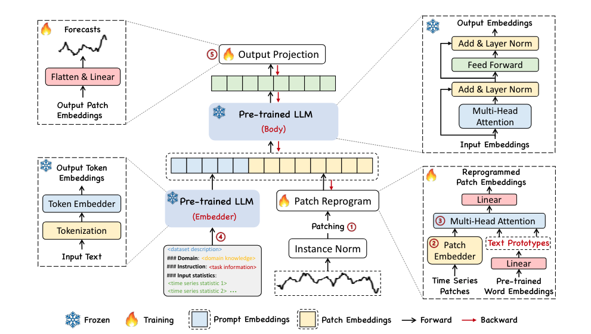

# TIME-LLM: TIME SERIES FORECASTING BY REPROGRAMMING LARGE LANGUAGE MODELS

ICLR (2024), The Hong Kong University of Science and Technology (Guangzhou)

https://arxiv.org/abs/2310.01728 

https://github.com/KimMeen/Time-LLM 

## Summary
本文提出了 TIME-LLM,这是一个无需微调模型参数就可以将大型语言模型 (LLM) 重新编程用于时间序列预测的框架。其关键思想是:
1. 将输入的时间序列重新编程为更适合 LLM 处理的文本原型表示。这将时间序列和自然语言模态对齐。
2. 使用 Prompt-as-Prefix (PaP) 以声明性提示的形式丰富输入上下文,提供数据集背景、任务指令和输入统计信息。这指导了 LLM 对时间序列数据的推理。
3. 将 LLM 的输出投影,以生成最终的时间序列预测。
全面实验表明,TIME-LLM 在保持 LLM 不变的情况下,优于专门的最先进时间序列预测模型,特别是在小样本和零样本设置下。这表明通过所提出的重新编程方法,LLM 可以成为有效的时间序列学习器。
作者将此定位为迈向擅长语言和时序数据任务的多模态基础模型的一步。重新编程框架提供了一种可扩展的范式,无需微调即可赋予 LLM 原始预训练之外的新功能。
## Structure
1. 引言 
   - 时间序列预测的重要性及现有模型的局限性
   - 大型语言模型在自然语言处理和计算机视觉领域的成功
   - 将时间序列数据与自然语言对齐的挑战
   - TIME-LLM的提出及其优势

2. 相关工作
   - 特定任务的学习
   - 同模态适应 In-modality Adaptation
   - 跨模态适应 Cross-modality Adaptation

#### 同模态适应(In-modality Adaptation)
    - 是指在相同或相似的数据模态内,利用预训练模型进行迁移学习的过程。这里的"模态"可以理解为数据的类型或形式,如文本、图像、时间序列等。
    - 举个例子,假设我们有一个在大规模文本数据上预训练的语言模型,如 BERT 或 GPT。现在,我们希望将这个模型应用到一个新的文本分类任务上,如情感分析。由于新任务与预训练模型的原始任务(如语言建模)属于同一数据模态(文本),我们可以直接在预训练模型的基础上进行微调(fine-tuning),而无需从头开始训练。这个过程就是同模态适应。
    - 同模态适应的优势在于,预训练模型已经从大规模数据中学习了丰富的特征表示和通用知识,在同模态的下游任务上微调时,可以有效地利用这些知识,从而提高模型的性能,加快收敛速度,并减少对标注数据的需求。
    - 然而,同模态适应也存在一定的局限性。当面临不同模态的任务时,如将文本分类模型应用于图像分类,直接进行微调可能无法达到理想的效果。这时就需要考虑跨模态适应的方法,如将不同模态的数据映射到一个共同的表示空间,或设计专门的跨模态架构。
#### 跨模态适应 Cross-modality Adaptation
    - 跨模态适应(Cross-modality Adaptation)是指在不同数据模态之间进行迁移学习的过程。与同模态适应不同,跨模态适应旨在利用源模态(如文本)的知识来增强目标模态(如图像或时间序列)的任务性能。
    - 举个例子,假设我们有一个在大规模文本语料库上预训练的语言模型,如 BERT。现在,我们希望将这个模型应用到图像分类任务中。由于文本和图像属于不同的数据模态,直接在语言模型上进行微调可能无法取得理想的效果。这时,我们就需要考虑跨模态适应的方法。
    - 一种常见的跨模态适应方法是将不同模态的数据映射到一个共同的表示空间。例如,我们可以使用预训练的图像编码器(如 CNN)将图像转换为向量表示,然后将这些向量输入到预训练的语言模型中,利用语言模型的上下文理解能力来增强图像分类的性能。
    - 另一种方法是设计专门的跨模态架构,如多模态Transformer,它可以同时处理文本和图像输入,并学习它们之间的交互和对齐。这种架构通常需要在包含文本-图像对的大规模数据集上进行预训练,以学习跨模态的通用表示。
    - 跨模态适应的优势在于,它可以利用不同模态之间的互补信息和知识迁移,提高目标任务的性能。例如,在图像分类中利用文本描述,或在视频理解中利用音频信息等。此外,跨模态适应还可以缓解标注数据不足的问题,因为不同模态的数据可能更容易获取或共享。
    - 然而,跨模态适应也面临着一些挑战,如不同模态之间的语义鸿沟、数据分布差异和对齐难度等。因此,设计有效的跨模态适应方法仍然是一个活跃的研究领域。

3. 方法
   - 模型结构
     - 输入嵌入
     - 分块重编程
     - Prompt-as-Prefix
     - 输出投影
   - 训练过程

4. 实验结果
   - 长期预测
   - 短期预测 
   - 小样本预测
   - 零样本预测
   - 模型分析
     - 语言模型变体
     - 跨模态对齐
     - 重编程解释
     - 重编程效率

5. 结论与未来工作
   - TIME-LLM的优势总结
   - 未来工作展望
     - 探索最优重编程表示
     - 通过持续预训练丰富LLM的时间序列知识
     - 构建多模态模型以实现时间序列、自然语言等的联合推理
     - 将重编程框架应用于赋予LLM更广泛的时间序列分析能力或其他新能力

## Workflow

给定一个输入时间序列，我们首先通过1 补丁化和2 定制嵌入层对其进行标记和嵌入。然后将这些补丁嵌入与浓缩文本原型重新编程以对齐两种模态。为了增强LLM的推理能力，3 额外的提示前缀被添加到输入中以引导输入补丁的转换。4 来自LLM的输出补丁被投影以生成预测。

#### 补丁化(Patching):
    补丁化是一种将时间序列数据划分为固定大小的小块(补丁)的方法。就像将一幅大图像切割成许多小图块一样,补丁化将一个长时间序列切割成许多小的时间片段。
    举个例子,假设我们有一个长度为1000的时间序列。如果我们设定补丁大小为50,那么这个时间序列就会被划分为20个补丁,每个补丁包含连续的50个时间步。
    补丁化的优势在于:
    1. 它可以将长时间序列转化为一系列短的时间片段,更适合输入到神经网络模型中。
    2. 通过调整补丁大小,我们可以控制局部时间信息的粒度,捕捉不同尺度下的时间模式。
    3. 补丁化可以减少模型的计算复杂度,因为处理许多小补丁通常比处理整个长时间序列更加高效。

#### 定制嵌入层(Customized Embedding Layer):
    定制嵌入层是一种将时间序列补丁映射到低维连续向量表示的方法。它的作用类似于自然语言处理中的词嵌入(Word Embedding),将离散的词映射到连续的向量空间。
    在TIME-LLM中,定制嵌入层通过一个简单的线性变换将每个时间序列补丁映射到一个固定长度的向量。这个过程可以看作是对补丁的特征提取和压缩。
    定制嵌入层的优势在于:
    1. 它将原始时间序列补丁转化为更加紧凑和有意义的表示,捕捉补丁的本质特征。
    2. 嵌入向量可以作为补丁的统一表示,方便后续的重编程和跨模态对齐操作。
    3. 通过端到端的训练,定制嵌入层可以自适应地调整,以更好地适应特定的时间序列预测任务。

总的来说,补丁化和定制嵌入层是TIME-LLM处理时间序列数据的两个基础步骤。补丁化将长时间序列转化为一系列短的时间片段,而定制嵌入层则将这些片段映射到连续的向量表示。通过这两个步骤,TIME-LLM可以更加高效和有效地利用预训练语言模型进行时间序列预测任务。

## Algorithm Framework
输入:
- 多元时间序列 X ∈ ℝ^(N×T)
- 预训练的大型语言模型 f(·)
- 输入分块长度 L_p
- 分块嵌入维度 d_m
- 文本原型数量 V'
- Prompt-as-Prefix 模板

算法步骤:
1. 对输入时间序列 X 进行处理:
   - 对每个单变量时间序列 X^(i) 进行实例归一化
   - 将每个归一化后的时间序列划分为长度为 L_p 的分块,得到 X_P^(i) ∈ ℝ^(P×L_p)
   - 使用线性层将分块嵌入到 d_m 维空间,得到 X̂_P^(i) ∈ ℝ^(P×d_m)

2. 利用预训练词嵌入矩阵 E ∈ ℝ^(V×D) 线性探测出 V' 个文本原型 E' ∈ ℝ^(V'×D)

3. 使用多头注意力机制将时间序列分块嵌入 X̂_P^(i) 重编程为文本原型表示:
   - 计算查询矩阵 Q_k^(i) = X̂_P^(i) W_k^Q
   - 计算键矩阵 K_k^(i) = E' W_k^K
   - 计算值矩阵 V_k^(i) = E' W_k^V
   - 对于每个注意力头,计算注意力权重并加权求和值矩阵
   - 拼接所有注意力头的输出并线性投影,得到重编程后的分块嵌入 O^(i) ∈ ℝ^(P×D)

4. 根据 Prompt-as-Prefix 模板构建提示,并将其嵌入为向量

5. 将提示嵌入作为前缀与重编程后的时间序列分块嵌入 O^(i) 拼接,输入到冻结的预训练语言模型 f(·) 中进行前向传播

6. 丢弃语言模型输出中的前缀部分,仅保留与时间序列对应的输出表示 Õ^(i) ∈ ℝ^(P×D)

7. 将 Õ^(i) 展平并通过线性层投影到最终的预测结果维度,得到预测值 Ŷ^(i) ∈ ℝ^H

8. 计算损失函数(如均方误差)并进行梯度反向传播,更新输入转换和输出投影层的参数,保持语言模型 f(·) 的参数不变

输出:
- 训练好的 TIME-LLM 模型,可用于时间序列预测任务

这个算法框架展示了 TIME-LLM 如何通过时间序列分块重编程、Prompt-as-Prefix 以及冻结的预训练语言模型,实现端到端的时间序列预测。在训练过程中,只更新输入转换和输出投影层的参数,保持语言模型不变,从而有效地利用语言模型的知识和泛化能力。
## Baseline Model, Evaluation Metrics, and Datasets
Baseline Models:

1. Transformer 类模型:PatchTST、ESTformer、Non-Stationary Transformer、FEDformer、Autoformer、Informer 和 Reformer
2. 其他最新的竞争模型:GPT4TS、DLinear、TimesNet 和 LightTS
3. 短期预测中额外比较的模型:N-HiTS 和 N-BEATS
4. 零样本预测中额外比较的模型:LLMTime

Evaluation Metrics:

1. 长期预测任务:
   - 均方误差 (MSE)
   - 平均绝对误差 (MAE)
2. 短期预测任务 (M4 基准测试):
   - 对称平均绝对百分比误差 (SMAPE)
   - 平均绝对比例误差 (MASE)
   - 总体加权平均误差 (OWA),M4 比赛中使用的特定指标
3. 短期预测任务 (M3 季度数据集):
   - SMAPE
   - 平均相对绝对误差 (MRAE)
   - 平均绝对百分比误差 (MAPE)

Datasets:

1. 长期预测任务:
   - ETT (Electricity Transformer Temperature) 数据集:ETTh1、ETTh2、ETTm1 和 ETTm2
   - 天气数据集 (Weather)
   - 电力数据集 (Electricity)
   - 交通数据集 (Traffic)
   - 流感样病例数据集 (ILI)
2. 短期预测任务:
   - M4 基准测试数据集:包含来自不同领域的 100,000 个时间序列,分为 6 个子数据集 (M4-Yearly、M4-Quarterly、M4-Monthly、M4-Weekly、M4-Daily 和 M4-Hourly)
   - M3 基准测试数据集的季度数据 (M3-Quarterly)

## Computing Language, Tools, Packages, and Resources
本文使用以下计算语言、工具、包和资源进行实验:

计算语言:
- Python

深度学习框架和工具:
- PyTorch: 一个开源的深度学习框架,用于实现 TIME-LLM 模型

预训练语言模型:
- Llama-7B: 论文中默认使用的预训练语言模型,在大多数实验中使用其全部 32 层
- GPT-2: 在消融实验中使用,比较不同语言模型在 TIME-LLM 框架下的性能

优化器:
- AdamW: 一种常用的深度学习优化算法,用于训练 TIME-LLM 模型

损失函数:
- 均方误差 (MSE): 用于计算模型预测值与真实值之间的差异,作为训练过程中的优化目标

评估指标计算工具:
- SMAPE、MASE 和 OWA: 用于计算短期预测任务中的评估指标

硬件资源:
- NVIDIA A100-80G GPU: 用于加速模型的训练和推理过程

代码托管平台:
- GitHub: 存储和共享 TIME-LLM 的源代码,并提供预处理后的数据集
  - 代码仓库: https://github.com/KimMeen/Time-LLM
  - 数据集: https://github.com/thuml/Time-Series-Library

