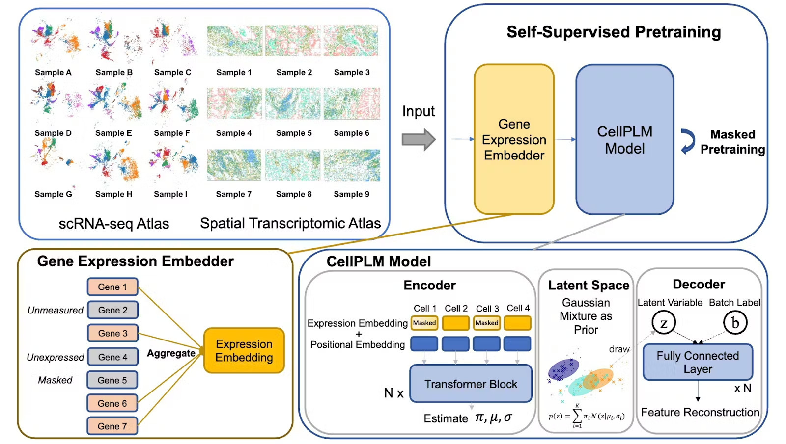

# CellPLM: Pre-training of Cell Language Model Beyond Single Cells

paper link: https://openreview.net/forum?id=BKXvPDekud 
github link: https://github.com/OmicsML/CellPLM

 ## Summary
1. 提出了"细胞语言模型"的概念,将细胞视为token而不是基因,以更好地建模细胞间关系。
2. 利用空间转录组学数据进行预训练,获取细胞空间位置信息。
3. 使用高斯混合模型作为先验分布,以克服数据量和质量的限制。
4. 在多个下游任务(如聚类、去噪、空间转录组学插补、细胞类型注释等)上进行了实验,表现优于现有方法。
5. 推理速度比其他预训练模型快100倍。

主要贡献:

- 首次提出将细胞作为token的单细胞预训练模型
- 首次利用空间转录组学数据进行预训练
- 引入合理的先验分布以解决数据限制问题  
- 在多个下游任务上验证了模型的有效性
- 大幅提高了推理速度

 ## Structure 

1. 引言 (Introduction)
   - 介绍单细胞分析的背景和现有预训练模型的局限性
   - 指出单细胞数据与自然语言数据的三个关键区别
   - 简要介绍CellPLM的创新点

2. 相关工作 (Single-cell Pre-trained Models)
   - 回顾现有的单细胞预训练模型
   - 指出它们的共同点和局限性

3. 方法 (Cell Language Model Beyond Single Cells)
   3.1 细胞语言模型 (Cell Language Model)
   3.2 模型架构 (Model Architecture)
      - 基因表达嵌入器 (Gene Expression Embedder)
      - Transformer 编码器 (Transformer Encoder)
      - 高斯混合潜在空间 (Gaussian Mixture Latent Space)
      - 批次感知解码器 (Batch-aware Decoder)
   3.3 模型预训练与微调 (Model Pre-training & Fine-tuning)

4. 实验 (Experiment)
   4.1 初步研究:零样本聚类 (Preliminary Study: Zero-shot Clustering)
   4.2 任务1:单细胞RNA-seq去噪 (Task 1: scRNA-seq Denoising)
   4.3 任务2:空间转录组学插补 (Task 2: Spatial Transcriptomic Imputation)
   4.4 任务3:细胞类型注释 (Task 3: Cell Type Annotation)

5. 结论 (Conclusion)

6. 附录 (Appendix)
   - 包含更多实验细节、数据集信息、额外可视化结果等

 ## Workflow

1. 数据准备：
   - 收集大规模的scRNA-seq数据和空间转录组学（SRT）数据
   - 对数据进行预处理，包括标准化和对数转换

2. 模型架构设计：
   - 基因表达嵌入器：将基因表达值转换为嵌入向量
   - Transformer编码器：捕捉细胞间关系
   - 高斯混合潜在空间：为细胞表示引入先验分布
   - 批次感知解码器：重建基因表达并消除批次效应

3. 预训练：
   - 使用掩码语言建模目标进行预训练
   - 同时在scRNA-seq和SRT数据上进行训练
   - 优化去噪变分下界（ELBO）

4. 下游任务适配：
   - 针对特定任务（如细胞类型注释、基因表达去噪等）设计任务特定的头部网络
   - 初始化模型参数为预训练权重

5. 微调：
   - 在下游任务数据集上微调整个模型
   - 使用任务特定的损失函数进行优化

6. 评估：
   - 在多个下游任务上评估模型性能
   - 与现有方法进行比较

7. 分析和可视化：
   - 进行消融实验以验证各组件的有效性
   - 可视化细胞和基因嵌入，分析模型学到的表示

 ## Algorithm framework 

CellPLM在大量的scRNA-seq和空间转录组学数据（总计超过1000万个细胞）上，通过细胞级掩码语言模型任务进行预训练。模型架构由四个关键模块组成：

1. 基因表达嵌入器：负责提取细胞内信息，并能够扩展到具有不同基因集的数据集。
2. Transformer编码器：利用Transformer提取每个细胞的细胞间上下文信息。对于空间转录组学数据，特别加入了空间位置嵌入。
3. 高斯混合潜在空间：编码器的输出被输入到潜在空间模块中，每个细胞都嵌入到具有高斯混合先验分布的潜在空间中。
4. 批次感知解码器：从细胞的潜在分布中采样的潜变量被输入到批次感知解码器模块，用于重构被掩盖的特征。值得注意的是，批次感知解码器在消除潜在空间的批次效应方面效果显著，这已经通过多项研究（如scVI）得到了实验证实。

 ## Baseline models, Evaluation metrics, and Datasets

1. 基线模型 (Baseline models):

a) 零样本聚类任务：
   - PCA
   - Geneformer
   - scGPT

b) 单细胞RNA-seq去噪任务：
   - DeepImpute
   - scGNN 2.0
   - GraphSCI
   - SAVER
   - DCA
   - scVI
   - MAGIC
   - scImpute
   - scGPT

c) 空间转录组学插补任务：
   - SpaGE
   - stPlus
   - gimVI
   - Tangram

d) 细胞类型注释任务：
   - CellTypist
   - ACTINN
   - SingleCellNet
   - TOSICA
   - scBERT
   - scGPT

e) 基因扰动预测任务：
   - GEARS
   - scGen

2. 评估指标 (Evaluation metrics):

a) 零样本聚类任务：
   - ARI (Adjusted Rand Index)
   - NMI (Normalized Mutual Information)

b) 单细胞RNA-seq去噪任务：
   - RMSE (Root Mean Square Error)
   - MAE (Mean Absolute Error)

c) 空间转录组学插补任务：
   - Pearson相关系数 (Correlation)
   - 余弦相似度 (Cosine similarity)

d) 细胞类型注释任务：
   - F1分数 (Macro F1)
   - 精确度 (Macro Precision)

e) 基因扰动预测任务：
   - RMSE (Root Mean Square Error)

3. 数据集 (Datasets):

a) 预训练数据：
   - 来自人类肿瘤细胞图谱（HTCA）、人类细胞图谱（HCA）和基因表达综合数据库（GEO）的11.4百万个细胞

b) 零样本聚类任务：
   - Li et al. (2020) 的公开数据集

c) 单细胞RNA-seq去噪任务：
   - PBMC 5K 
   - Jurkat

d) 空间转录组学插补任务：
   - Lung2 
   - Liver2

e) 细胞类型注释任务：
   - hPancreas
   - Multiple Sclerosis (MS)

f) 基因扰动预测任务：
   - Adamson Perturb-Seq 
   - Norman Perturb-Seq

 ## Computing language，tools, packages and resources

1. 计算语言 (Computing languages):
   - Python（主要编程语言）
   - R（用于一些基线模型，如SAVER和scImpute）

2. 工具和包 (Tools and packages):
   - PyTorch（深度学习框架，用于实现CellPLM）
   - Anndata（用于处理单细胞数据）
   - scvi-tools（用于实现gimVI基线）
   - DANCE（用于实现DeepImpute、scGNN2.0和GraphSCI基线）
   - Scanpy（常用的单细胞分析工具包）
   - CellPose（用于细胞分割）
   - UMAP（用于可视化）

3. 基线模型包 (Baseline model packages):
   - SAVER（R包）
   - scImpute（R包）
   - DCA（Python包）
   - MAGIC（Python包）
   - SpaGE（Python实现）
   - stPlus（Python包）
   - Tangram（Python包）
   - GEARS（Python包）
   - scGen（Python包）

4. 计算资源 (Computing resources):
   - GPU服务器（8个Nvidia Tesla v100 16GB卡）

5. 数据资源 (Data resources):
   - 人类肿瘤细胞图谱（HTCA）
   - 人类细胞图谱（HCA）
   - 基因表达综合数据库（GEO）
   - 10x Genomics数据集
   - MERSCOPE FFPE Human Immuno-oncology Data

6. 其他工具 (Other tools):
   - Github（用于代码版本控制和分享）

7. 评估指标实现 (Evaluation metric implementations):
   - scikit-learn（可能用于计算ARI、NMI等指标）
   - scipy（可能用于计算Pearson相关系数）
   - numpy（用于数值计算）

8. 可视化工具 (Visualization tools):
   - Matplotlib（可能用于绘图）
   - Seaborn（可能用于绘制高级统计图形）

