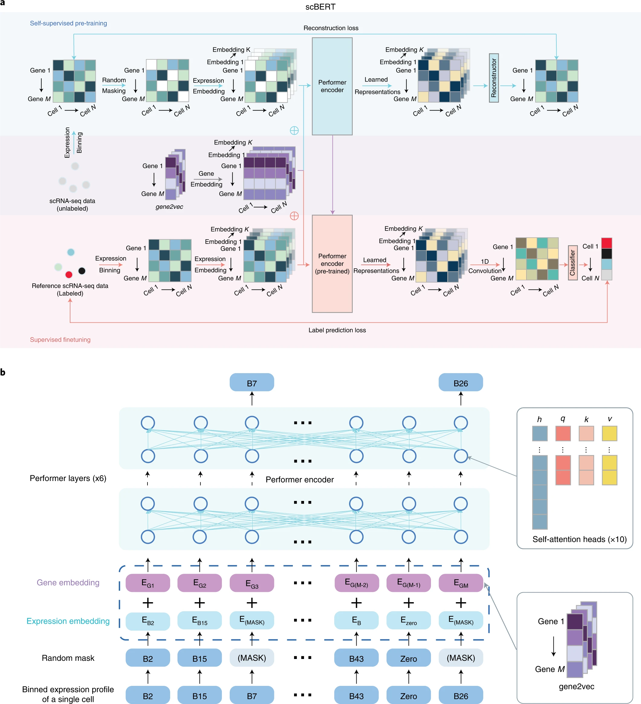

# scBERT as a large-scale pretrained deep language model for cell type annotation of single-cell RNA-seq data

Nature Machine Intelligence (October 2022), Tencent

paper link:
https://www.nature.com/articles/s42256-022-00534-z

github link:
https://github.com/TencentAILabHealthcare/scBERT 

## Summary
1. 作者提出了一种新的基于预训练和迁移学习的深度学习模型scBERT,用于单细胞RNA测序数据的细胞类型注释。scBERT采用了类似BERT的两阶段训练范式,并在输入、编码器结构等方面做了针对性改进,以更好适应单细胞转录组数据。
2. 大量实验表明,scBERT在细胞类型注释的准确性、稳健性、泛化性等方面整体优于目前主流的其他方法。它在多个数据集上展现了很好的跨队列和跨器官的稳定表现,且对批次效应、类别不平衡等问题有很强的鲁棒性。
3. 通过消融实验(Ablation experiment)和分析,文章展示了预训练、表达嵌入、注意力机制、自监督学习等关键设计和创新点对scBERT性能的重要贡献。同时通过可视化和enrichment分析,揭示了scBERT较好的可解释性。
4. 借助注意力机制,scBERT不仅能有效利用已知marker基因,还可以发现一些新的具有细胞类型特异性的基因,对解释细胞标注决策和发现新的marker基因有帮助。
5. 总的来说,这项工作将Transformer架构和自监督学习引入单细胞转录组分析,是细胞类型注释方法的一个重要进展。scBERT展现了深度学习技术在该领域的巨大潜力,有望进一步推动单细胞组学数据分析的发展。
6. 文章最后还讨论了scBERT目前的一些局限和可能的改进方向,如表达嵌入方法、基因交互建模、预训练的masking策略等,为该模型的进一步完善指明了方向。作者希望scBERT能在更多下游任务中得到拓展应用。
这项工作代表了单细胞转录组研究与前沿AI技术结合的一次有益尝试,对相关领域的研究人员有重要的启发意义。scBERT的开源也为生命科学研究者提供了一个强大的新工具。

#### 表达嵌入:
    想象你正在玩一个复杂的棋类游戏。这个游戏中有成千上万个棋子,每个棋子都有一个特定的数值,代表它在游戏中的"强度"。这就像单细胞RNA测序数据中的每个基因及其表达水平。
    现在,直接处理这么多棋子和它们的具体数值是非常困难的。所以你决定简化一下:
    1. 首先,你把棋子的强度分成几个等级,比如"弱"、"中等"、"强"和"超强"。这就像scBERT中将连续的基因表达值离散化的过程。这样做可以减少噪音,让你更容易看出棋子之间的大致差异。
    2. 其次,你发现有些棋子经常一起出现或者有相似的作用。于是你给每个棋子一个特殊的标记,这个标记能反映出它和其他棋子的关系。这就像scBERT使用gene2vec为每个基因生成的嵌入向量。这个标记帮助你快速理解棋子之间的关系,而不需要每次都从头分析。
    3. 最后,当你看一个特定的棋局时,你会同时考虑棋子的强度等级和它的特殊标记。这就像scBERT如何表示一个细胞中的基因表达情况。
    这种"表达嵌入"的方法有几个好处:
    - 它简化了复杂的信息,让计算机更容易处理。
    - 它保留了重要的模式和关系,让模型能学到有意义的东西。
    - 它减少了噪音的影响,提高了分析的稳定性。
    - 它融合了先验知识(棋子之间的关系)和实际数据(棋子在特定棋局中的强度),让分析更全面。
    总的来说,"表达嵌入"就是将复杂的基因表达数据转换成一种更容易理解和分析的形式,同时保留了重要的生物学信息。这为后续的细胞类型识别等任务奠定了基础。

## Structure
1. 引言
- 单细胞RNA测序数据的细胞类型注释的重要性
- 目前主流细胞类型注释方法的局限性
- 本文提出的scBERT模型的主要特点和创新点
2. 方法
- scBERT模型的整体架构、输入表示、预训练和微调策略等
- 数据集的选取和预处理
- 评估指标和基准测试方案
3. 结果
- scBERT在多个数据集上的性能评估,包括:
  - 同数据集内的交叉验证
  - 跨数据集的批次效应分析
  - 类别不平衡的影响
  - 新细胞类型的发现
- scBERT的可解释性分析,包括注意力权重可视化和富集分析
4. 讨论
- scBERT的优势总结
  - 强大的建模能力和泛化性
  - 对批次效应、类别不平衡等问题的稳健性
  - 可解释性
- scBERT的局限和改进方向
  - 表达嵌入方法
  - 基因交互建模
  - 预训练优化
- scBERT的进一步应用拓展
5. 方法补充
- 进一步的消融实验和分析,验证关键设计的有效性
  - 预训练的重要性
  - 非marker基因对分类的贡献
  - 超参数敏感性分析

## Workflow
1. 问题定义和动机
- 识别目前单细胞RNA测序数据细胞类型注释中存在的问题和挑战
- 提出利用深度学习技术,特别是预训练和迁移学习来解决这些问题的思路
2. 模型设计与创新
- 借鉴NLP领域的BERT模型,设计了针对单细胞转录组数据的scBERT架构
- 在输入表示、编码器选择等方面进行了针对性的改进和优化
3. 数据准备
- 收集用于预训练的大规模无标签单细胞转录组数据
- 选取多个具有可靠细胞类型注释的数据集用于微调和测试
- 对数据进行质量控制和预处理
4. 模型训练与评估
- 在预训练数据集上进行自监督预训练,学习基因表达模式
- 在下游任务数据集上进行有监督微调,进行细胞类型注释
- 使用多个数据集和多种评估指标对scBERT进行全面的性能评估与比较
5. 结果分析与解释
- 分析scBERT在细胞类型注释任务上的优异表现,总结其在准确性、稳健性、泛化性等方面的优势
- 通过可视化和富集分析来解释模型的注意力机制,探索潜在的新marker基因
- 进行消融实验和分析,验证关键设计的有效性和必要性
6. 总结与展望
- 总结scBERT的主要贡献和意义
- 讨论当前的局限性和未来的改进方向
- 展望scBERT在其他单细胞组学数据分析任务中的应用前景
这个工作流程体现了一个完整的研究故事,从问题提出到方法创新,再到全面实验和深入分析,最后到总结提炼和展望未来。这样的流程有助于读者清晰地理解研究的逻辑和贡献。同时,研究中广泛的实验评估和多角度分析,也反映了工作的严谨和扎实。

## Algorithm Framework

a. 无标签数据的自监督学习和特定任务数据的微调。在自监督预训练阶段，从PanglaoDB收集无标签数据。掩码表达嵌入和基因嵌入作为输入被添加，然后输入到Performer块中。重构器用于生成输出。用于掩码基因的输出用于计算重构损失。在监督微调阶段，特定任务的scRNA-seq数据被输入到预训练的编码器中。输出表示随后通过一维卷积层和分类器生成细胞类型预测。
代表元素逐一相加。Performer编码器是预训练和微调阶段模型共享的组件。重构器和分类器在预训练和微调过程中分别独立使用。

b. scBERT嵌入的示意图。预处理的scRNA-seq数据首先转换为离散化表达，然后随机掩码非零表达。以第一个基因为例，基因嵌入EG1（来自gene2vec的基因身份嵌入落在第一个箱中）和表达嵌入EB2（基因表达落在第二个箱中并转换为与EG1相同的维度）相加并输入到scBERT中以生成基因的表示。这些表示然后用于预训练或微调。

根据论文的方法部分,可以总结出scBERT的算法框架如下:

1. 输入表示
- 基因表达向量:将每个细胞的原始基因表达量映射为一个离散的表达向量,类似于NLP中的词袋模型
- 基因嵌入向量:利用预训练的gene2vec模型获得每个基因的分布式表示,捕捉基因间的语义相似性
2. 模型结构
- 编码器:使用多层Transformer的变体Performer作为主要的编码器结构,可以处理超过16,000个基因的输入
- 注意力机制:使用多头自注意力机制来学习基因之间的交互模式和依赖关系
- 输出层:根据下游任务的不同,使用不同的输出层和损失函数(如分类层和交叉熵损失)
3. 预训练阶段
- 数据:使用大规模无标签的单细胞转录组数据进行预训练
- 目标:通过自监督的掩码语言建模任务,让模型学习到通用的基因表达模式和调控关系
- 过程:随机遮挡部分非零表达值,然后训练模型根据其他基因的表达来预测被遮挡的表达值
4. 微调阶段
- 数据:在具有细胞类型注释的数据集上进行微调
- 目标:通过有监督的细胞类型分类任务,让模型适应特定的细胞类型注释问题
- 过程:将预训练得到的模型参数作为初始化,然后根据细胞类型标签进行端到端的微调
5. 推理阶段
- 数据:在新的测试数据上进行细胞类型注释
- 过程:将细胞的基因表达输入到训练好的scBERT模型中,得到每个类别的概率分布
- 后处理:根据预测概率对细胞进行注释,并可以设置阈值以识别新的未知细胞类型

总的来说,scBERT的算法框架继承了BERT的预训练-微调范式,并在输入表示和编码器结构上进行了针对性的改进,以适应单细胞转录组数据的特点。同时,scBERT充分利用了自监督学习和迁移学习的思想,通过在大规模数据上的预训练来学习通用的基因表达模式,再通过在特定任务上的微调来提取任务相关的特征表示,从而实现了高效、准确、稳健的细胞类型注释。

#### 将每个细胞的原始基因表达量映射为一个离散的表达向量
    想象你是一个厨师,正在分析不同菜品的配方。每个菜品就相当于一个细胞,而每种配料就相当于一个基因。配料的用量就相当于基因的表达量。

    原始数据:
    假设你有三道菜,每道菜有四种主要配料(盐、糖、醋、辣椒)的用量(单位:克):

    1. 菜A: 盐(2.3), 糖(15.7), 醋(8.1), 辣椒(0.5)
    2. 菜B: 盐(1.8), 糖(5.2), 醋(12.4), 辣椒(3.7)
    3. 菜C: 盐(3.1), 糖(0.3), 醋(6.9), 辣椒(0)

    将原始用量映射为离散的表达向量:
    为了简化分析,你决定将用量分为四个等级:无(0)、少量(1)、中等(2)、大量(3)。具体的映射规则如下:

    - 0克: 0 (无)
    - 0.1-2克: 1 (少量)
    - 2.1-10克: 2 (中等)
    - 10克以上: 3 (大量)

    应用这个规则后,你得到了离散化的表达向量:

    1. 菜A: [2, 3, 2, 1]
    2. 菜B: [1, 2, 3, 2]
    3. 菜C: [2, 1, 2, 0]

    这样,你就将每道菜(细胞)的原始配料用量(基因表达量)映射为了一个离散的表达向量。

    这种离散化的好处是:

    1. 简化数据: 不再需要处理精确的小数值,使分析更加高效。
    2. 降低噪声: 小的测量误差不会影响最终的分类。
    3. 突出差异: 更容易看出配料使用量的主要区别。
    4. 标准化: 不同菜品之间更容易比较。

    在实际的单细胞RNA测序数据中,这个过程会应用到成千上万的基因,但原理是相同的。scBERT通过这种方式将连续的基因表达数据转换为离散的表达向量,为后续的分析提供了一个更加结构化和易于处理的输入格式。
   
## Baseline Model, Evaluation Metrics, and Datasets

1. Baseline models
文章将scBERT与以下几类细胞类型注释方法进行了比较:
    1). 基于marker基因的方法:SCINA、Garnett、scSorter
    2). 基于相关性的方法:Seurat、SingleR、CellID、scmap
    3). 基于监督学习的方法:scNym、SciBet

2. Evaluation metrics
为了全面评估各种方法在细胞类型注释任务上的性能,文章使用了以下评估指标:
    1). Accuracy:衡量整体注释准确率
    2). Macro F1-score:衡量在不同类别上的平均性能,对类别不平衡更为稳健
    3). Confusion matrix:展示不同类别之间的错误分类情况,有助于分析模型的错误模式

3. Datasets
文章使用了多个公开的单细胞RNA测序数据集来评估scBERT和其他方法,主要包括:
    1). Zheng68K数据集:人类外周血单个核细胞(PBMC)数据,包含11种细胞类型,广泛用于细胞类型注释任务的基准测试
    2). 胰腺数据集:Baron、Muraro、Segerstolpe和Xin,来自人类胰腺的不同单细胞测序平台的数据
    3). MacParland数据集:来自人肝脏组织的单细胞转录组数据
    4). 心脏数据集:一个大规模的心脏单细胞数据集用于预训练,Tucker数据集用于微调和测试
    5). 肺数据集:来自新冠肺炎相关的人类肺组织的单细胞转录组数据
    6). 人类细胞图谱数据集:覆盖15个主要器官的人体单细胞数据集

这些数据集涵盖了不同物种、组织器官、测序平台和细胞类型,有助于全面评估scBERT在各种场景下的性能和稳健性。
## Computing Language, Tools, Packages, and Resources
1. Computing language
- Python

2. Tools and packages
    - PyTorch:一个流行的深度学习框架,用于实现scBERT模型的主要架构和训练过程。
    - Performer:Transformer的一个变体,用于处理长序列输入,提高scBERT在处理大规模单细胞数据时的计算效率。
    - scanpy:一个用于单细胞RNA测序数据分析的Python工具包,文章使用其进行数据预处理和质量控制。
    - anndata:一个用于存储和操作带注释的多维数组的Python包,常用于单细胞数据分析。
    - gene2vec:一个预训练的基因嵌入模型,用于捕捉基因之间的功能相似性。
    - SCINA、Garnett、scSorter、Seurat、SingleR、CellID、scmap、scNym、SciBet等:文章中用于比较的其他细胞类型注释方法,这些方法的代码大多是通过R或Python包的形式提供的。

3. Resources
    - PanglaoDB数据库:一个大规模的单细胞RNA测序数据集合,用于scBERT模型的预训练阶段。
    - 其他公开数据集:如Zheng68K、胰腺数据集、MacParland等,主要来自GEO、ArrayExpress等公共数据库,用于模型的微调和测试。
    - CellMarker数据库:一个手工注释的细胞类型标记基因数据库,部分实验中用于提供marker基因的信息。
    - Enrichr:一个基因富集分析的在线工具,用于对scBERT关注的基因进行功能解释。

