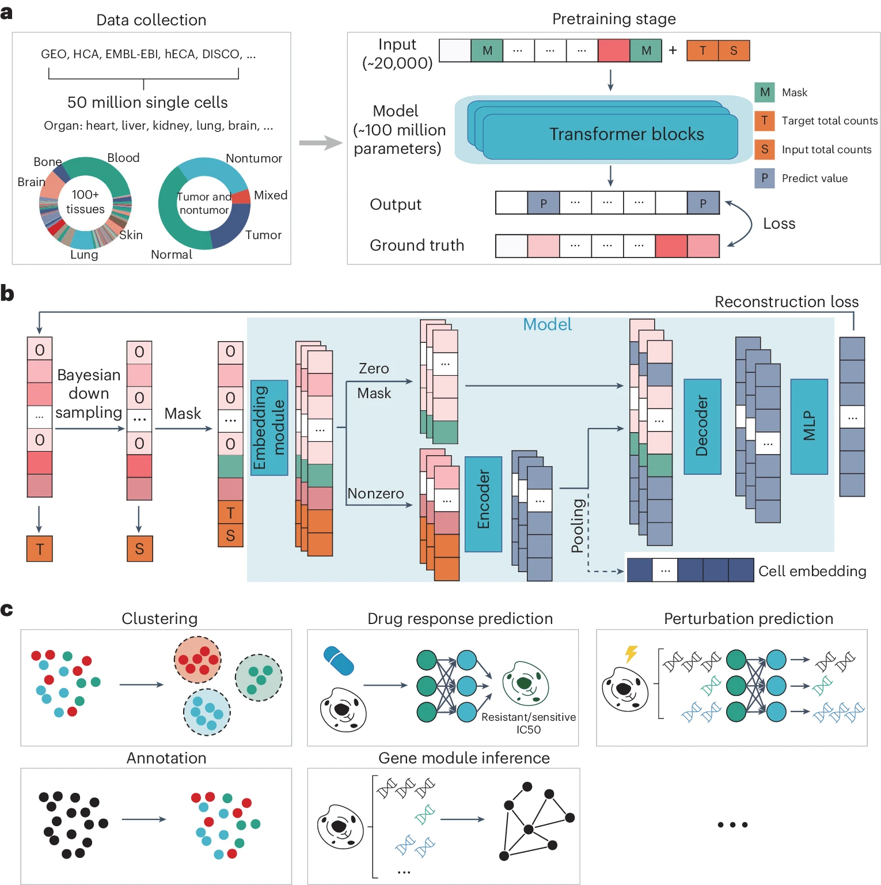

# Large-scale foundation model on single-cell transcriptomics

nature methods (June 2024), biomap

paper link:
https://www.nature.com/articles/s41592-024-02305-7

github link:
https://github.com/biomap-research/scFoundation 

## Summary
## Structure
## Workflow

## Algorithm Framework
## Baseline Model, Evaluation Metrics, and Datasets
## Computing Language, Tools, Packages, and Resources

