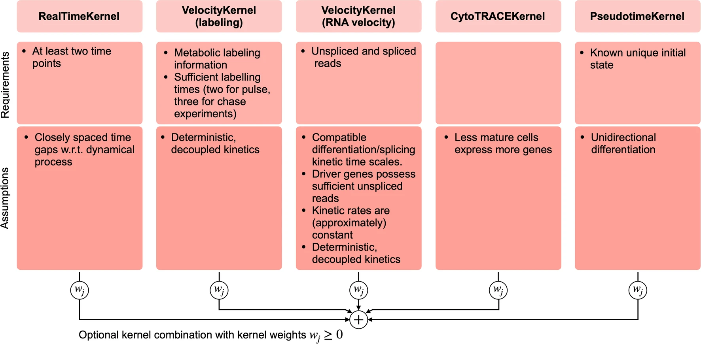
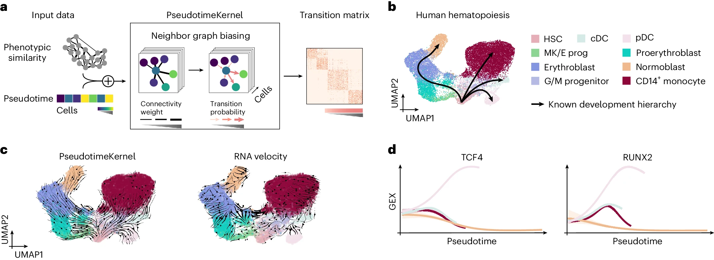

# CellRank 2: unified fate mapping in multiview single-cell data

nature methods(2024 June), Helmholtz Munich

paper link:
https://www.nature.com/articles/s41592-024-02303-9

github link:
https://github.com/theislab/cellrank 


## Summary
1. 采用kernel-estimator设计将转移矩阵的推断和分析解耦。Kernels用于根据不同数据视角估计转移矩阵,estimators用于分析转移矩阵得到初始状态、中间状态、终末状态等。这种模块化结构使CellRank 2适用于多种数据形式。
2. 引入了新的kernels用于处理pseudotime(PseudotimeKernel)、发育潜能(CytoTRACEKernel)、时间序列数据(RealTimeKernel)以及代谢标记数据,拓展了CellRank的应用范围。
3. 通过加速主要estimator、重构代码以及可视化随机游走等改进,大幅提升了计算效率和可解释性。
4. 成功应用于人类造血、内胚层发育、咽内胚层发育等多个生物学系统,展示了CellRank 2在揭示细胞命运和识别driver基因等方面的性能优势。
5. 未来计划引入局部kernel组合、整合扰动数据等,进一步增强CellRank 2揭示分子机制驱动细胞命运决策的能力。

## Structure
1. 介绍
    - 单细胞测序技术背景
    - 现有轨迹推断方法的局限性
    - CellRank 2的主要特点和改进
2. 结果
    - CellRank 2的模块化设计与关键创新
        - Kernel-estimator设计
        - 引入新的kernels处理多种数据形式
        - 计算效率和可解释性的改进
    - 应用1:利用pseudotime overcome RNA velocity limitations in造血
    - 应用2:利用发育潜能分析内胚层发育
    - 应用3:利用时间序列数据分析咽内胚层发育
    - 应用4:利用代谢标记数据估计肠器官中的动力学参数和命运
3. 讨论
    - CellRank 2在快速整合新数据形式方面的优势
    - 与其他时间序列数据分析方法的比较
    - 利用代谢标记数据研究基因调控策略
    - 不同kernels的适用场景与选择指南
    - 未来拓展方向:整合空间信息、遗传谱系示踪、扰动数据等
4. 方法
    - CellRank 2的整体框架
    - 各个kernels的原理与实现
    - 性能改进的技术细节
    - 数据集来源与预处理

## Workflow
1. 数据预处理
    - 过滤低质量细胞和基因
    - 标准化、log转换、高变基因选择等
2. 选择合适的kernel计算转移矩阵
    - RNA速度数据:VelocityKernel
    - Pseudotime数据:PseudotimeKernel
    - 发育潜能数据:CytoTRACEKernel
    - 时间序列数据:RealTimeKernel
        - 利用Waddington Optimal Transport (WOT)计算时间点间转移
        - 利用相似性计算时间点内转移
        - 组合时间点间和时间点内转移矩阵
    - 代谢标记数据:
        - 脉冲追踪实验估计转录和降解速率
        - 基于估计的动力学参数构建速度场
        - 利用VelocityKernel转化为转移矩阵



3. 利用estimators分析转移矩阵
    - 应用广义Perron聚类分析(GPCCA)识别初始态、中间态和终末态
    - 计算每个细胞到终末态的吸收概率作为命运概率
    - 通过命运概率与基因表达的相关性鉴定命运调控基因
    - 拟合广义可加模型(GAM)刻画沿着拟时间的基因表达变化

4. 下游分析与可视化
    - 初始态、中间态、终末态的UMAP/FLE可视化
    - 命运概率的圆形嵌入式可视化
    - 基因表达趋势的热图或线图可视化
    - 随机游走轨迹演化的低维投影

5. 与其他方法的对比
    - 通过轨迹始末态的识别、基因排名等指标定量比较不同kernels的性能
    - 与其他时间序列数据、代谢标记数据分析方法的结果比较

#### Kernel-estimator 
Kernel-estimator设计是CellRank 2的核心创新,它将转移矩阵的推断(inference)和分析(analysis)解耦为两个独立的步骤,由kernels和estimators分别负责。这种模块化的设计带来了以下优势:
1. 灵活处理多种数据形式:
    - Kernels根据不同的数据视角或先验知识估计细胞之间的转移概率,生成转移矩阵。每个kernel专门处理一种特定的数据输入,如RNA速度、伪时间轨迹、时间序列、代谢标记等。
    - Estimators则以转移矩阵为输入,推断细胞状态、命运概率等下游信息。由于estimators与具体的数据形式无关,因此可以方便地组合不同的kernels,实现多视角数据的整合分析。
2. 便于扩展新的数据类型:
    - 当新的单细胞数据类型出现时,只需开发相应的kernel,而无需修改现有的estimators。这种解耦设计让CellRank 2能快速适应单细胞测序技术的发展,持续拓展其应用范围。
    - 同时,研究者也可以开发自己的kernels,将CellRank 2与其他算法(如用于整合空间信息的方法)结合,发挥协同作用。

#### 转移矩阵 ： 
在CellRank 2的背景下,转移矩阵是一种数学工具,用来描述细胞状态变化的概率。通俗地说,它就像是一张"细胞命运地图",告诉我们每个细胞可能变成什么样子。

- 想象一个城市有三个区域:住宅区、商业区和工业区。每天,人们会在这些区域之间移动。转移矩阵就像是一张表格,记录了人们从一个区域移动到另一个区域的概率:

```
        住宅区   商业区   工业区
住宅区     0.7     0.2     0.1
商业区     0.3     0.6     0.1
工业区     0.2     0.3     0.5
```
这个表格告诉我们:
    - 在住宅区的人有70%的概率留在住宅区,20%的概率去商业区,10%的概率去工业区。
    - 在商业区的人有30%的概率回住宅区,60%的概率留在商业区,10%的概率去工业区。
    - 在工业区的人有20%的概率去住宅区,30%的概率去商业区,50%的概率留在工业区。
在细胞生物学中,这个"城市"就是我们的数据集,而"区域"则代表不同的细胞状态或类型。转移矩阵描述了细胞从一种状态转变为另一种状态的概率。

这个"细胞命运地图"帮助我们:
    - 预测细胞的未来发展方向
    - 识别关键的细胞状态转换点
    - 理解细胞分化过程中的主要路径

通过分析这个矩阵,研究人员可以推断出细胞的初始状态、中间状态和终末状态,以及细胞沿着不同发展路径的概率,从而深入理解细胞命运决策的过程。

#### 命运概率的嵌入式可视化
这种可视化方法将多维的命运概率数据映射到二维平面上的布局中,使得复杂的细胞命运信息更易于理解和解释。

e,f, Fate probabilities toward the mTEC terminal state (left) and top 20 lineage-correlated genes identified (right) based on the RealTimeKernel (e) or WOT’s pullback distribution  

## Algorithm Framework

1. Kernels: 根据不同的数据模态或先验知识构建转移矩阵
    - VelocityKernel: 基于RNA速度估计
    - PseudotimeKernel: 基于拟时间估计
        - 在基于表达相似性的最近邻图上,沿伪时间方向调整边权重
        - 支持软阈值和硬阈值两种策略
    - CytoTRACEKernel: 基于CytoTRACE发育潜能估计
        - 计算每个细胞表达的基因数(GEC)
        - 计算每个基因与GEC的Pearson相关性,取TOP200
        - 平均这200个基因的smoothed表达水平作为CytoTRACE值
    - RealTimeKernel: 整合时间序列数据
        - 利用Waddington Optimal Transport计算时间点间转移矩阵
        - 利用表达相似性计算时间点内转移矩阵
        - 将两种转移矩阵组装成全局转移矩阵
    -代谢标记数据:
       - 脉冲与追踪实验估计每个细胞中mRNA的转录和降解速率
       - 基于估计的动力学参数构建速度场
       - 利用VelocityKernel转化为马尔可夫转移矩阵

#### CytoTRACEKernel
    CytoTRACEKernel 是 CellRank 2 中的一个重要组件，它基于 CytoTRACE（Cellular (Cyto) Trajectory Reconstruction Analysis using Cytometry by Time-of-Flight）方法的原理。
    1. 基本假设：
    CytoTRACE 基于一个关键假设：未分化的细胞（如干细胞）通常比分化的细胞表达更多的基因。这是因为未分化细胞保持着更开放的染色质状态，允许更多的基因被转录。
    2. 计算步骤：
        a. 计算每个细胞表达的基因数（Gene Expression Counts, GEC）：
            对每个细胞，计算表达量大于零的基因数量。
        b. 计算基因与 GEC 的相关性：
            对每个基因，计算其表达量与 GEC 的 Pearson 相关系数。
        c. 选择顶部相关基因：
            选取与 GEC 相关性最高的前 200 个基因（默认设置）。
        d. 计算 CytoTRACE 得分：
            对每个细胞，计算这 200 个高相关基因的平均表达量。
            将这个平均值标准化到 0-1 范围内，得到 CytoTRACE 得分。
        e. 转换为伪时间：
            CytoTRACE 得分被反转（1 - 得分）以获得伪时间。
            较低的伪时间值对应于更未分化的状态。
    3. 构建转移矩阵：
        - 使用计算得到的伪时间来偏置细胞间的转移概率。
        - 在基于相似性的最近邻图上，调整边的权重，使其偏向伪时间增加的方向。
    4. 软阈值和硬阈值策略：
        - 软阈值：连续地调整边的权重，使其平滑地偏向伪时间增加的方向。
        - 硬阈值：更严格地限制转移，只允许向伪时间增加的方向转移。
    5. 优势：
        - 不需要预先定义初始细胞状态。
        - 可以应用于没有明确时间信息的快照数据。
        - 能够捕捉复杂的分化轨迹，包括分叉和汇聚。
    6. 应用：
        特别适用于研究早期发育过程或干细胞分化，这些过程中细胞状态的渐进变化与基因表达的复杂性密切相关。

2. Estimators: 基于转移矩阵推断细胞状态、命运和驱动基因
    - 初始态、中间态、终末态识别: 广义Perron聚类分析(GPCCA)
    - 命运概率计算: 基于吸收概率的快速算法
    - 命运驱动基因鉴定: 计算基因表达与命运概率的相关性
    - 拟合广义可加模型(GAM)刻画基因表达动态变化

#### 广义Perron聚类分析(GPCCA)
    广义Perron聚类分析(GPCCA)是一种用于分析复杂系统动态的数学方法。在CellRank 2中，它被用来识别细胞的初始、中间和终末状态。让我们通过一个简单的比喻来理解GPCCA：
    想象一个大型游乐园，有许多不同的游乐设施：
        1. 游客流动：
            - 游客（类比于细胞）在不同的游乐设施（细胞状态）之间移动。
            - 有些游乐设施很受欢迎，游客tend会在那里停留较长时间。
        2. GPCCA的工作原理：
            a. 观察游客行为：记录游客如何在游乐设施之间移动（类比于转移矩阵）。
            b. 识别关键区域：找出游客tend长时间停留的地方（稳定状态）。这些可能是热门游乐设施或休息区（终末状态）。
            c. 分组：将相似的游乐设施分组（聚类）. 例如，可能会将所有水上设施归为一组。
            d. 寻找入口和出口：识别游客通常从哪里开始游玩（初始状态）。找出游客常常结束游玩的地方（终末状态）。
            e. 分析路径：研究游客如何从入口到达不同的游乐设施（细胞轨迹）。
        3. GPCCA的特点：
            - 处理噪音：即使有些游客行为不规律，GPCCA也能找出主要模式。
            - 处理复杂性：可以分析有多个入口和出口的复杂游乐园布局。
            - 概率性：考虑到游客可能有多种选择，而不是固定路线。
        4. 在细胞生物学中的应用：
            - 初始状态：类似于游乐园的入口，可能是干细胞。
            - 中间状态：类似于游客经常中转的区域，可能是前体细胞。
            - 终末状态：类似于游客tend结束游玩的地方，可能是完全分化的细胞。

#### 广义可加模型(GAM)：
    想象你是一个冰激凌店的老板，想要了解影响冰激凌销量的因素。
        1. 基本概念：
           GAM就像是一个非常灵活的"魔法公式"，可以帮你理解不同因素如何影响冰激凌销量。
        2. 组成部分：
           - 你考虑的每个因素（如温度、时间、季节等）就是GAM中的一个"成分"。
           - GAM允许每个因素以自己独特的方式影响销量。
        3. 灵活性：
           - 不像简单的线性模型（比如"温度每升高1度，销量增加10个"），GAM可以捕捉更复杂的关系。
           - 例如，GAM可能发现温度对销量的影响是非线性的：销量在20-25度时达到峰值，更热或更冷时都会下降。
        4. 可加性：
           - "可加"意味着各个因素的影响是独立相加的。
           - 就像你可以分别考虑温度的影响、时间的影响，然后把它们加在一起。
        5. 可视化：
           - GAM的一大优势是可以轻松地将每个因素的影响可视化。
           - 你可以看到一条平滑的曲线，展示温度如何影响销量，另一条曲线展示时间的影响等。
        6. 在细胞生物学中的应用：
           - 用GAM分析基因表达时，可以看作是研究影响"基因表达量"的各种因素。
           - "拟时间"可能是一个重要因素，GAM可以展示基因表达如何随时间变化。
           - 其他因素可能包括细胞类型、实验条件等。
        7. 优势：
           - 捕捉非线性关系：细胞生物学中的很多过程是非线性的，GAM能很好地描述这种复杂性。
           - 易于解释：每个因素的影响可以单独观察和解释。
           - 平衡灵活性和过拟合：GAM提供了足够的灵活性来捕捉复杂模式，同时又不会像一些更复杂的模型那样容易过拟合。
        8. 实际运用：
            - 在分析细胞轨迹时，GAM可以帮助研究人员理解基因表达是如何随着发育进程变化的。
            - 它可以揭示基因表达的关键转折点，比如某个基因在特定发育阶段突然上调或下调。

3. 可视化: 直观展示细胞状态、命运和基因调控
    - 初始态、中间态、终末态的UMAP/FLE投影
    - 命运概率的圆形嵌入式可视化
    - 热图展示驱动基因的表达级联
    - 线图展示沿拟时间的基因表达趋势
    - 随机游走轨迹演化的低维投影

4. 评估: 多个指标定量比较不同kernels和其他方法的性能
    - 轨迹始末态的识别: 轨迹始末态鉴定分数(TSI)
    - 细胞类型间的过渡: 跨边界一致性分数(CBC)
    - 驱动基因排名: 与参考基因集的重合度、排序得分等

#### 轨迹始末态鉴定分数(Terminal State Identification, TSI)：
    想象你是一个探险家，正在探索一个复杂的洞穴系统：
        1. 洞穴探索比喻：
           - 洞穴系统代表细胞分化的过程。
           - 洞穴的入口是初始状态（如干细胞）。
           - 洞穴的不同出口是终末状态（如完全分化的细胞）。
        2. TSI的目标：
           - TSI的目标是评估你（或你的探索方法）有多好地找到了所有的洞穴出口。
        3. 理想情况：
           - 在理想情况下，每探索一个新区域，你就能发现一个新的出口，直到找到所有出口。
           - 这就像细胞分析方法能够准确地一个接一个识别出所有的终末状态。
        4. 计算方法：
           - 假设洞穴有5个出口。
           - 理想情况：探索5次，找到5个出口。
           - 实际情况：可能需要探索更多次才能找到所有出口，或者可能错过一些出口。
        5. 评分：
           - TSI比较你的探索效果与理想情况的接近程度。
           - 完美分数是1（表示你的探索效率和准确度与理想情况一样好）。
           - 分数越接近1，表示你的方法越好。
        6. 在细胞生物学中的应用：
           - "探索"相当于增加分析的复杂度或允许更多的细胞状态。
           - "发现出口"相当于识别一个新的终末细胞状态。
           - 高TSI分数意味着该方法能够有效且准确地识别出所有重要的细胞终末状态。
        7. 为什么重要：
           - 帮助评估不同细胞轨迹分析方法的性能。
           - 确保不会遗漏重要的细胞类型或状态。
           - 防止过度识别（即错误地将中间状态识别为终末状态）。
        8. 实际例子：
           - 方法A：TSI = 0.9，非常接近理想情况，几乎识别出所有正确的终末状态。
           - 方法B：TSI = 0.6，可能错过了一些终末状态或识别了过多的假终末状态。

        总的来说，TSI就像是对细胞分析方法的"探索能力"的评分。高分表示该方法能够有效地"探索细胞发展的洞穴系统"，准确找到所有重要的"出口"（终末状态）。这有助于研究人员选择最佳的分析工具，确保他们不会遗漏细胞发育过程中的关键终点。

#### 边界一致性分数(Cross-Boundary Correctness, CBC)：
    想象你是一个交通管理员，负责观察和预测城市不同区域之间的人口流动：
        1. 城市区域比喻：
           - 城市的不同区域代表不同的细胞类型。
           - 人口流动代表细胞从一种类型转变为另一种类型。
        2. CBC的目标：
           - 评估你的预测模型（比如CellRank 2）对人口流动的预测有多准确。
        3. 观察vs预测：
           - 实际观察：你在区域边界安装了摄像头，记录真实的人口流动。
           - 模型预测：你的模型根据各种数据预测人口如何流动。
        4. 边界概念：
           - "边界"是指两个不同细胞类型之间的过渡区域。
           - 在城市比喻中，这可能是住宅区和商业区之间的交界处。
        5. 一致性评估：
           - 你比较模型预测的流动方向和实际观察到的流动方向。
           - 高度一致意味着你的模型很好地捕捉了真实的流动模式。
        6. 计算CBC：
           - 对于每个边界区域的每个"人"（细胞），计算预测方向和实际方向的相似度。
           - 这些相似度的平均值就是CBC分数。
        7. 分数解释：
           - CBC分数越高，表示预测越准确。
           - 完美的CBC分数是1，意味着预测与实际观察完全一致。
        8. 在细胞生物学中的应用：
           - 预测细胞如何从一种类型转变为另一种类型。
           - 评估不同分析方法（如不同的CellRank 2 kernels）的准确性。
        9. 为什么重要：
           - 帮助验证计算模型的准确性。
           - 提高对细胞分化过程的理解。
           - 识别可能的错误预测，指导进一步研究。
        10. 实际例子：
            - 方法A的CBC = 0.9：非常准确地预测了大多数细胞类型转换。
            - 方法B的CBC = 0.6：预测较差，可能误判了一些细胞的发展方向。

        总的来说，CBC就像是对你的"细胞交通预测系统"的评分。高分意味着你的模型能够准确地预测细胞如何在不同状态之间"移动"。这对于理解复杂的生物过程（如细胞分化）至关重要，因为它帮助研究人员确信他们的分析工具正确地捕捉了细胞命运决策的动态过程。

## Baseline Model, Evaluation Metrics, and Datasets
1. Baseline models:
    - CellRank 1: 原始的CellRank工具,基于RNA速度推断细胞命运。
    - Palantir: 一种基于最短路径的拟时间推断和命运示踪工具。
    - Waddington Optimal Transport (WOT): 利用最优传输理论分析时间序列数据的工具。
    - 基于RNA速度的细胞命运概率计算(结合VelocityKernel和ConnectivityKernel)。
    - 传统的伪时间分析方法如diffusion pseudotime (DPT)。
    - dynamo: 一种基于代谢标记数据估计RNA动力学和细胞命运的工具。
    - 经典的基因差异表达分析方法(如t-test)用于鉴定命运驱动基因。
2. Evaluation metrics:
    - 轨迹始末态鉴定分数(Terminal State Identification Score, TSI):衡量一种方法识别出的终末态数量与最优策略的接近程度。
    - 跨边界一致性分数(Cross-Boundary Correctness Score, CBC):比较两个转移矩阵预测的细胞类型转换与经验转换的一致性。
    - 基因排名的富集度:衡量预测的命运驱动基因在参考基因集中的富集程度。
    - 基因排名的归一化排序得分:衡量预测的基因排名与最优排名的接近程度。
    - 吸收概率的Pearson相关系数:比较不同方法预测的细胞命运概率的一致性。
    - 终末态纯度:衡量划分到终末态的细胞中占主导的细胞类型的比例。
3. Datasets:
    - 人类造血数据:10x Genomics测序的人外周血单个核细胞。
    - 人类胚胎体(EB)发育数据:iPSC分化28天的单细胞转录组数据。
    - 小鼠胚胎成纤维细胞(MEF)重编程数据:MEF在18天内重编程为iPSC的单细胞转录组时间序列数据。
    - 小鼠咽部内胚层发育数据:E9.5到E12.5时期的单细胞转录组时间序列数据。
    - 单细胞EU标记的小鼠肠道类器官数据:脉冲标记实验测量不同时间的新生RNA。
    - C. elegans胚胎发育、斑马鱼胚胎发育等其他数据集用于验证CytoTRACE的适用性。
## Computing Language, Tools, Packages, and Resources
    1.Computing language:
        - Python
    2. Tools and packages:
        1). CellRank 2: 本文提出的细胞命运示踪工具,已在GitHub上开源。
        2). scVelo: 基于RNA速度模型的动力学建模工具,用于估计RNA速度和计算速度向量场。
        3). Scanpy: 单细胞基因表达数据分析的Python工具包,提供数据预处理、可视化和下游分析等功能。
        4). AnnData: 单细胞数据存储和操作的Python库,与Scanpy兼容。
        5). UMAP: 非线性降维算法,常用于单细胞数据的可视化。
        6). dynamo: 一种基于代谢标记数据估计RNA动力学和细胞命运的工具。
        7). wot: Waddington Optimal Transport的Python实现,用于分析时间序列数据。
        8). palantir: 基于最短路径的拟时间推断和命运示踪的Python工具。
        9). MAGIC: 基于流形学习的单细胞数据平滑和填充工具。
    3. Resources:
        1). GitHub: CellRank 2和其他相关工具的代码托管平台。
        2). figshare: 存储本文使用的单细胞数据集的在线资源库。
        3). Zenodo: 存储CellRank 2代码和分析流程的开放存储库。


