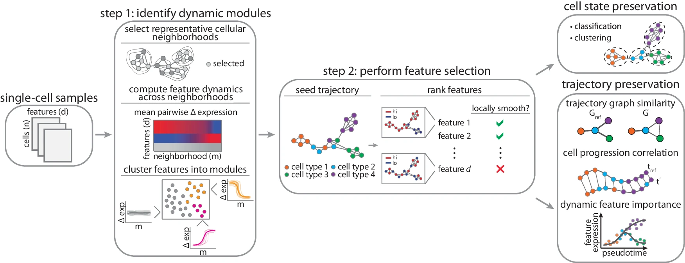

## DELVE: feature selection for preserving biological trajectories in single-cell data
nature communications (2024 March)
University of North Carolina at Chapel Hill 

文章link：
https://www.nature.com/articles/s41467-024-46773-z

github link：
https://github.com/jranek/delve 

## Summary
在从噪声单细胞数据中稳健识别细胞轨迹和特征的有效性及广泛适用性。
1. 识别能够稳健地重现噪声单细胞数据中细胞轨迹的信息特征。DELVE的关键创新在于其自下而上的方法，该方法首先识别时间上共表达特征的模块，然后根据这些动态模块初始化的近似轨迹图与特征的关联性对特征进行排序，从而减轻混杂变异的影响
2. DELVE的关键创新在于其自下而上的方法，该方法首先识别时间上共表达特征的模块，然后根据这些动态模块初始化的近似轨迹图与特征的关联性对特征进行排序，从而减轻混杂变异的影响。
3. 作者通过对各种生物学背景和技术（包括单细胞RNA测序和基于成像的分析）的模拟和真实单细胞数据集进行广泛的基准测试，证明了DELVE的有效性。
4. 将DELVE应用于细胞周期成像数据集，展示了其识别与进程相关的特征的能力，并且无需细胞标签即可匹配监督方法的性能。
5. 对11种其他特征选择方法在不同数据集和噪声条件下进行的广泛基准测试，确立了DELVE的稳健性和广泛适用性。

### bottom-up approach
DELVE采用了一种自下而上的方法来识别信息特征并构建细胞轨迹图。这种方法与传统的自上而下方法形成对比，后者通常直接在全部特征上进行分析。
1. 局部动态特征识别：
- 首先,DELVE在局部层面上分析每个细胞邻域内特征表达的动态变化。
- 通过聚类分析，DELVE识别出在这些局部领域内具有相似动态模式的特征模块。
- 这一步聚焦于局部动态特征，而不是一开始就考虑全局信息，有助于发现那些在全局层面可能被忽略的重要特征。
2. 动态模块评估：
- 接下来，DELVE评估每个特征模块的动态表达变化是否显著。
- 通过置换实验，DELVE踢除了表现出静态、随机或噪声模式的特征模块。
- 这一步进一步筛选出具有显著动态变化的特征模块，为后续分析奠定基础。
3. 全局轨迹图构建：
- 利用筛选出的动态特征模块，DELVE构建了一个全局的细胞轨迹图。
- 这个轨迹图反映了细胞状态之间的转换关系，并为特征排序提供了参考。
- 通过从局部动态模块出发构建全局轨迹图，DELVE能够更准确地刻画细胞状态的变化。
4. 特征排序和选择：
- 最后根据每个特征与轨迹图的相关性对其进行排序。
- 排名靠前的特征被认为能够很好地保持细胞轨迹结构，而排名靠后的特征可能是噪声或无关特征。
- 通过这一步，DELVE实现了全局层面上的特征选择，得到了一个信息特征子集。

## Structure
1. Introduction

- Background on single-cell technologies and their utility in studying dynamic biological processes
- Challenges in identifying informative features due to noise in single-cell data
- Overview of existing feature selection methods and their limitations
- Brief introduction to DELVE and its key innovations

2. Results
- Overview of the DELVE algorithm
- Splatter single-cell RNA sequencing simulation study
    -  Qualitative assessment of feature selection method performance
    - Quantitative assessment of feature selection method performance
- SymSim single-cell RNA sequencing simulation study
- Revealing molecular trajectories of proliferation and cell cycle arrest using imaging data
- Identifying molecular drivers of CD8+ T cell effector and memory formation using single-cell RNA sequencing data
- Characterizing human embryonic stem cell differentiation into the definitive endoderm using single-cell RNA sequencing data

3. Discussion
- Summary of DELVE's performance and key advantages over existing methods
- Limitations and potential future extensions of the approach
- Implications for the application of DELVE to diverse biological questions

4. Methods
- Detailed description of the DELVE algorithm
    - Problem formulation
    - Step 1: Dynamic seed selection
    - Step 2: Feature ranking
    - Guidelines on parameter selection
- Overview of benchmarked feature selection methods
- Description of datasets used for evaluation
- Evaluation metrics and procedures
- Classification and regression
- Precision@k
- Unsupervised clustering
- Protein-protein interaction networks
- Trajectory inference and analysis
- PHATE visualizations
- Aggregate scores

## Algorithm Framework

特征选择是一个两步过程。

    步骤1，DELVE根据在局部代表性细胞邻域内的表达动态对特征进行聚类，这些邻域是通过加权k近邻亲和图定义的。使用一种分布聚焦的草图算法对邻域进行采样，该算法保留了原始数据集的细胞类型频率和光谱特性。然后使用一种基于方差的测试统计量的置换测试来确定一组特征是（1）动态变化（动态）还是（2）表现出随机变化模式（静态）。

    步骤2，动态模块用于初始化一个近似的细胞轨迹图，并通过使用拉普拉斯评分（Laplacian Score）对特征进行排序和选择，以最佳保留局部结构，从而优化和细化轨迹图。在本研究中，我们将DELVE与其他无监督特征选择方法进行了比较，评估了它们在保留细胞类型和细胞类型转变方面的效果。

本文提出了一种名为DELVE(动态选择局部协变特征)的无监督特征选择方法，用于嘈杂的单细胞数据中识别能够稳健地重构细胞轨迹的信息特征。DELVE采用自下而上的方法，通过两个主要步骤来缓解混杂变异的影响并选择信息特征。
1. Step 1 动态种子选择(Dynamic Seed Selection):
    - 构建细胞之间的k近邻相似性图，将细胞状态建模为节点，细胞之间的相似性为边。
    - 通过对代表性细胞邻域的特征表达变化进行聚类，识别具有时间协表达模式的特征模块。
    - 使用置换检验评估每个模块的动态表达变化，排除静态、随机或噪声模式的特征模块。

    (以上通俗解释：
    1. 将细胞关系比作一张社交网络图：
        - 想象每个细胞都是社交网络中的一个用户，而细胞之间的相似性就像用户之间的好友关系。
        - DELVE会为每个细胞找到其最相似的k个好友形成一张细胞社交网络图。
        - 在这张图中，每个细胞就是一个节点，而细胞之间的相似性就是连接节点的边。
    2. 在细胞的“朋友圈”中寻找共同的特征：
     - 接下来，DELVE会在每个细胞的“朋友圈”(最相似的细胞群)中寻找共同的特征表达模式。
     - 就像在社交网络中，有些朋友群可能共享兴趣爱好。
     - DELVE通过聚类分析，将在不同的朋友圈中表现出相似动态变化模式的特征归为一组，形成特征模块。
    3. 鉴别“真朋友” or “假朋友”：
        - 然而，并非所有的相似性都是真实可靠的。有些“朋友”可能只是表面相似，实则并无太多共同之处。
        - DELVE通过置换检验来评估每个特征模块的动态表达变化是否显著，以区分"真朋友“和”假朋友“。
        - 那些表现保护明显动态变化的特征模块被视为”真朋友“，而静态、随机或噪声模式的特征模块被视为”假朋友“并排除。

        通过这一系列步骤,DELVE就像一个社交网络分析师,通过分析细胞之间的相似性网络,识别出真正具有共同动态特征的"朋友圈",并以此为基础构建后续的细胞轨迹图。这种动态种子选择的方法,有助于在嘈杂的单细胞数据中找到最可靠、最相关的特征组合,为后续的分析奠定基础。)

2. Step 2 特征排序(Feature Ranking):
    - 使用第一步中识别出的动态模块构建一个近似的细胞轨迹图。
    - 利用图信号处理技术(如拉普拉斯评分),根据每个特征与近似轨迹图的关联性对其进行排序。
    - 选择与轨迹结构高度相关的特征,排除噪声特征或与基础动态过程无关的特征。

    (以上通俗解释：
    想象你是一名侦探在一个人群中寻找线人。而线人就是细胞动态过程最重要的关键特征。
    1. 根据初步线索建立调查路线：
        - 动态种子选择获得了一些重要的线索(即动态特征模块)。
        - 根据这些线索,你建立了一条初步的调查路线(即近似的细胞轨迹图),以便更有针对性地寻找线人。
        - 这条路线连接了案件的关键场景和人物,为后续的排查提供了方向。
    2. 评估每个嫌疑人与案件的相关性:
        - 接下来,你开始对人群中的每个人(即每个特征)进行排查和评分。
        - 你使用一种评分方法(如拉普拉斯评分),根据每个人与调查路线的吻合度来评估他们与案件的相关性。
        - 那些与调查路线高度吻合的人,很可能就是你要找的线人(即关键特征)。
    3. 锁定关键线人,排除无关人员:
        - 通过评分排查,你锁定了一些得分最高的嫌疑人,他们就是最有可能掌握关键信息的线人。
        - 同时,你也排除了那些得分较低的无关人员(即噪声特征或与动态过程无关的特征)。
        - 最终,你得到了一份关键线人名单(即特征排序结果),他们很可能就是破案的关键。)

    ### 拉普拉斯评分(Laplacian Score)
        是一种常用的特征选择方法，用于评估每个特征与数据内在结构的相关性。在DELVE中,拉普拉斯评分被用来衡量每个特征与近似细胞轨迹图的相关性,从而实现特征排序。下面我将用一个简单的类比来解释拉普拉斯评分的工作原理。
        在DELVE中,拉普拉斯评分通过评估每个特征与近似细胞轨迹图的相关性,选出那些能够最好地反映细胞动态过程的关键特征。这些特征在与相似特征保持一致性的同时,又具有一定的独特性,因此能够更准确、更全面地刻画细胞状态的变化。通过拉普拉斯评分,DELVE能够有效地实现特征排序,为后续的分析提供最具代表性和相关性的特征子集。

## Workflow
1. 数据准备:
    - 收集并预处理多种类型的单细胞数据,包括模拟数据(Splatter和SymSim)和真实数据(RPE细胞周期、PDAC细胞周期、CD8+ T细胞分化和人胚胎干细胞分化)。
    - 对真实数据进行质量控制、标准化、批次校正和降维等预处理步骤。
2. 特征选择方法的应用:
    - 将DELVE应用于各个数据集,通过动态种子选择和特征排序两个步骤,识别出与细胞动态过程相关的关键特征。
    - 同时,将其他11种特征选择方法应用于相同的数据集,包括监督学习、无监督学习和基线方法,作为比较的基准。
3. 评估指标的计算:
    - 使用多种评估指标来衡量特征选择方法的性能,包括分类和回归性能、无监督聚类性能、蛋白质相互作用网络分析、轨迹推断和分析等。
    - 对于有真实标签的数据集,计算特征选择方法在细胞类型或状态分类、伪时间估计等任务上的准确性。
    - 对于无真实标签的数据集,评估特征选择方法在揭示细胞动态过程、识别关键调控因子等方面的能力。
4. 结果分析和可视化:
    - 对比分析DELVE与其他特征选择方法在各个数据集和评估指标上的表现,总结DELVE的优势和适用场景。
    - 使用PHATE等可视化方法,直观展示DELVE选择的特征在揭示细胞动态轨迹方面的效果。
    - 对DELVE识别出的关键特征和调控因子进行生物学解释和验证,探讨其在细胞动态过程中的作用机制。
5. 讨论和总结:
    - 总结DELVE方法的创新点、优势和局限性,讨论其在单细胞数据分析领域的潜在应用。
    - 探讨DELVE未来可能的改进方向,如结合先验知识、适应不同的细胞类型和数据类型等。
    - 强调特征选择在单细胞数据分析中的重要性,呼吁开发更加鲁棒、高效、易解释的特征选择方法。

## Baseline Model, Evaluation Metrics, and Datasets
1. 基线模型(Baseline Models):
    a. 监督方法:
    - 随机森林(Random Forest)
    b. 相似性方法:
    - 拉普拉斯评分(Laplacian Score, LS)
    - 邻域方差(Neighborhood Variance)
    - Hotspot
    c. 子空间学习方法:
    - 多集群特征选择(Multi-Cluster Feature Selection, MCFS)
    - 单细胞流形保持特征选择(Single-Cell Manifold-Preserving Feature Selection, SCMER)
    d. 方差方法:
    - 高变基因选择(Highly Variable Genes, HVG)
    - 最大方差选择(Max Variance)
    e. 基线方法:
    - 全部特征(All Features)
    - 随机特征(Random Features)
    - 动态种子特征(Dynamic Seed Features,即DELVE的第一步输出)
2. 评估指标(Evaluation Metrics):
    a. 分类和回归性能:
    - k近邻分类准确率
    - 支持向量机(SVM)分类准确率和回归均方根误差(RMSE)
    - Precision@k
    b. 无监督聚类性能:
    - 标准化互信息(Normalized Mutual Information, NMI)
    c. 蛋白质相互作用网络分析:
    - 置换检验显著性
    d. 轨迹推断和分析:
    - 轨迹图相似性(Trajectory Graph Similarity)
    - 伪时间相关性(Pseudotime Correlation)
    - 回归分析显著性和生物学相关性
    e. 聚合评分(Aggregate Scores)
3. 数据集(Datasets):
    a. 模拟数据:
    - Splatter单细胞RNA测序模拟数据
    - SymSim单细胞RNA测序模拟数据
    b. 真实数据:
    - 视网膜色素上皮(RPE)细胞周期成像数据
    - 胰腺导管腺癌(PDAC)细胞周期成像数据
    - CD8+ T细胞分化单细胞RNA测序数据
    - 人胚胎干细胞向确定性内胚层分化的单细胞RNA测序数据

## Computing Language, Tools, Packages, and Resources
根据文章的方法部分,我们可以总结出以下关于计算机语言、软件包和计算资源的信息:
1. 计算机语言:
    - Python:本文主要使用Python进行数据分析、特征选择算法实现以及结果可视化。
    - R:部分数据分析和可视化也使用了R语言。

2. 软件包:

    - Python软件包:

        - scikit-learn (v0.23.2):机器学习算法,如k近邻分类、支持向量机等。
        - scanpy (v1.9.3):单细胞数据分析工具。
        - scprep (v1.2.3):单细胞数据预处理。
        - networkx (v3.1):复杂网络分析。
        - statsmodels (v0.14.0):统计建模和回归分析。
        - gseapy (v1.0.4):基因集富集分析。
        - phate (v1.0.11):PHATE降维可视化。

    - R软件包:
        - Splatter (v1.18.2):单细胞RNA测序数据模拟。
        - SymSim (v0.0.0.9000):单细胞RNA测序数据模拟。
        - slingshot (v2.1.1):细胞轨迹推断。

    - 其他工具:
        - 10X Genomics Cell Ranger (v3.0.2):单细胞RNA测序数据处理。
        - Velocyto (v0.17):RNA速度估计。
        - ScVelo (v0.2.5):RNA速度分析。
        - STRING数据库:蛋白质相互作用数据。
        - Enrichr:基因集富集分析。

    #### Velocyto和ScVelo 
    在本文中,Velocyto和ScVelo主要用于分析人胚胎干细胞向确定性内胚层分化的单细胞RNA测序数据。这两个工具通过估计RNA速度(RNA velocity),帮助推断细胞的动态变化过程。
    1. Velocyto的应用:
        - 作者首先使用Velocyto对单细胞RNA测序数据进行处理,生成了细胞的拆分和未拆分reads计数的loom文件。
        - 这一步为后续的RNA速度估计奠定了基础,因为RNA速度的计算需要同时考虑拆分和未拆分的RNA reads数据。
        - Velocyto处理后的数据为ScVelo的进一步分析提供了必要的输入。
    2. ScVelo的应用:
        - 在得到Velocyto处理后的数据后,作者使用ScVelo对RNA速度进行估计。
        - ScVelo使用动力学模型,通过拟合每个细胞中拆分和未拆分RNA reads的比例,估计出每个细胞的RNA速度。
        - RNA速度反映了每个细胞的基因表达变化趋势,可以用于推断细胞的动态轨迹。
    3. RNA速度在特征选择中的比较:
        - 作者将ScVelo估计得到的RNA速度特征与其他特征选择方法(如DELVE、Laplacian score等)进行了比较。
        - 结果表明,基于RNA速度选择的特征在识别人胚胎干细胞向内胚层分化过程中的关键基因和调控因子方面,表现不如DELVE等其他方法。
        - 这可能是因为RNA速度更侧重于捕捉细胞的瞬时表达变化趋势,而其他方法则更侧重于识别在整个分化过程中始终保持动态变化的关键特征。
