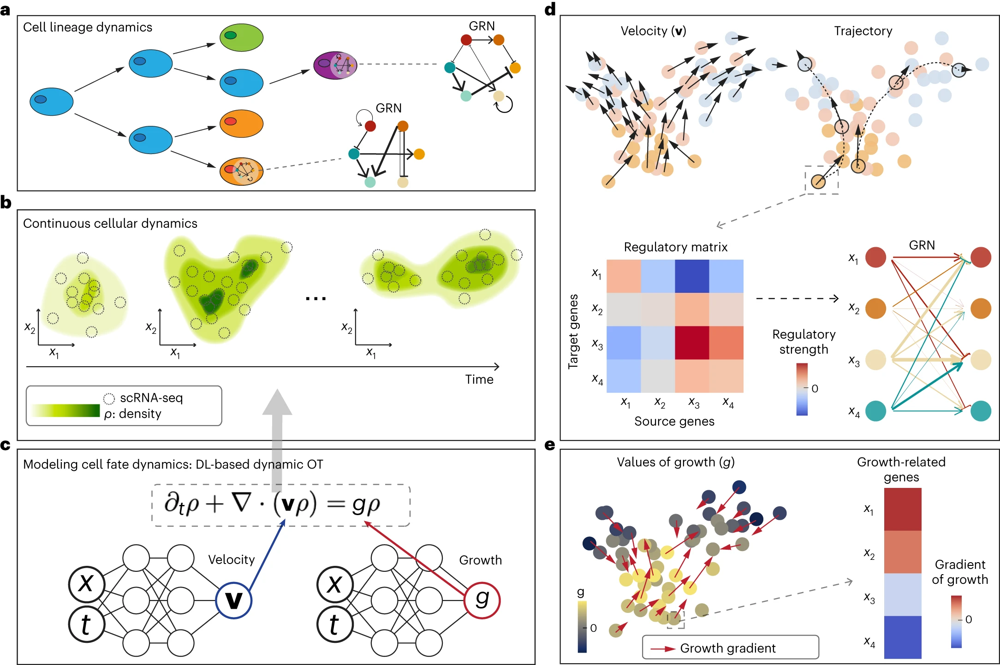

# Reconstructing growth and dynamic trajectories from single-cell transcriptomics data

Nature Machine Intelligence (2023 Nov) UCI

paper link:
https://www.nature.com/articles/s42256-023-00763-w

github link:
https://github.com/yutongo/TIGON 

## Summary
TIGON模型通过时间序列scRNA-seq数据来分析细胞谱系动力学，包括细胞生长、转变和基因调控网络。该模型使用两个神经网络来建模速度和生长，并通过偏微分方程控制密度变化。TIGON的输出包括速度矢量、细胞轨迹、基因调控矩阵和基因调控网络，同时还推断了与生长相关的基因及其对生长变化的贡献。这种方法能够详细描述细胞在发育过程中的动态行为和基因调控机制。

1. 基于Wasserstein-Fisher-Rao (WFR)距离的动态非平衡最优传输模型,可以同时捕捉单个细胞的基因表达速度和细胞群体生长。
#### Wasserstein-Fisher-Rao, WFR
    Wasserstein距离：
        Wasserstein距离源于运输理论,可视为将一个概率分布的"沙子"转移到另一概率分布的"沙子"的最小代价。它能很好地衡量分布之间的几何差异,但对概率质量的变化不太敏感
    Fisher-Rao距离：
        Fisher-Rao距离源于信息几何,衡量概率分布在统计流形上的距离。它对概率质量的变化很敏感,但对分布的几何变形不太敏感。描述了两个概率分布之间"生长"或改变形状所付出的代价。回到沙子的例子,如果除了运输,我们还允许增加或减少沙子的量,那费雷-拉奥距离就衡量了通过生长或侵蚀使A变形成B所需的最小代价。
    WFR距离：
        将这两种距离结合,即同时最小化运输代价和生长/侵蚀代价,使得一个概率分布完全转化为另一个。在TIGON中的应用是:Wasserstein部分描述了单个细胞基因表达的变化代价,而Fisher-Rao部分描述了整个细胞群体通过分裂/凋亡改变群体大小的代价。

2. 利用无网格、无量纲公式和神经常微分方程求解高维最优传输问题,计算高效。
3. 通过自编码器、主成分分析等可逆的降维方法,实现对单个基因动力学的分析和基因调控网络的推断。
4. 在三个时间序列单细胞数据集上的分析表明,TIGON在预测细胞状态转换和群体生长方面具有较高的稳健性和准确性,优于现有的多种轨迹推断方法。
5. 此外,TIGON还可以推断未测时间点的基因表达、时序基因调控网络以及细胞间通讯的动态变化,为深入理解细胞命运转变过程提供了新的视角。
    - 未测时间点基因表达的推断:
        a. 利用TIGON学习到的速度场函数v(x,t),对任意给定的细胞状态x和时间点t,都可以预测该状态下细胞的基因表达变化趋势dx/dt。
        b. 通过数值积分dx/dt=v(x,t),可以从测量时间点的细胞状态出发,推断出任意未测时间点的基因表达状态。
        c. 利用自编码器等可逆降维方法,可以将预测的低维状态映射回原始的高维基因表达空间,从而获得未测时间点完整的基因表达谱。
    - 时序基因调控网络的推断:
        a. 利用TIGON学习到的速度场函数v(x,t),对任意给定的细胞状态x和时间点t,计算雅可比矩阵J=∂v/∂x。
        b. 雅可比矩阵J度量了速度场对基因表达变化的敏感性,其中元素J_ij=∂v_i/∂x_j表示第j个基因对第i个基因的调控强度。
        c. 通过对不同时间点的雅可比矩阵进行分析,可以推断出基因调控网络的动态变化,鉴定出不同时期的关键调控因子和调控关系。
    - 细胞间通讯的动态变化推断:
        a. 利用TIGON重构的不同时间点的完整基因表达数据,结合CellChat等工具,可以推断出不同细胞类群之间的信号通路活性。
        b. 通过对比分析相邻时间点的细胞通讯网络差异,可以揭示细胞间信号传导的动态变化规律,发现不同时期的关键信号通路和配体-受体对。
        c. 整合细胞通讯网络与基因调控网络信息,有助于理解细胞间信号如何传导到下游效应基因,引起细胞状态和行为的改变。

## Structure
1. 引言
    - 概述时间序列单细胞RNA测序数据分析的挑战和现有方法的局限性
    - 阐述TIGON方法的动机和目标
2. 结果
    - 概述TIGON的输出和下游分析
    - 基于三基因模拟数据评估TIGON的性能,并与其他方法进行比较
    - 应用于小鼠造血系统的谱系追踪数据集,评估轨迹重建、生长率预测和命运概率等
    - 应用于EMT癌症细胞系数据集,重建基因表达动力学,推断生长模式、调控网络和细胞通讯
    - 应用于诱导多能干细胞分化为心肌细胞的数据集,捕捉分支分化过程和生长率变化
3. 方法
    - 数据预处理
    - TIGON模型形式化
        - 连续性方程和生长项
        - WFR距离代价函数
        - 无量纲公式推导
        - 重建误差
    - 深度学习求解器
    - 模拟数据生成细节
    - 其他分析细节(RNA速度、细胞通讯等)
4. 讨论
    - TIGON的优势
    - 与其他方法的比较
    - 局限性
    - 潜在扩展(维数、先验知识等)
5. 补充材料
    - 补充注释
    - 补充数据和代码可用性
## Workflow
1. 
## Algorithm Framework

a. 细胞谱系动力学的示意图，包括细胞生长、转变和基因调控网络（GRNs）。
b. 连续的细胞动力学由时间依赖的密度ρ(x,t)描述。时间序列scRNA-seq快照的输入在离散时间点生成密度ρ。
c. 密度ρ由涉及速度v和生长g的偏微分方程控制，这些速度和生长由两个神经网络建模。DL，深度学习。
d,e. TIGON的输出和下游分析。
d. 左上，速度，每个点表示一个细胞，颜色表示收集时间，箭头长度表示速度的大小。右上，细胞的轨迹。左下，选定细胞或细胞类型的基因调控矩阵。右下，基因调控网络（GRN），尖箭头（钝箭头）表示源基因对目标基因的正向（负向）调控，箭头宽度表示调控强度。
e. 左，推断的生长g值用颜色表示。红箭头表示g的梯度，其长度对应于梯度的大小。右，g的梯度决定了基因对生长变化的贡献。基于梯度最大的基因选择与生长相关的基因。

## Baseline Model, Evaluation Metrics, and Datasets
## Computing Language, Tools, Packages, and Resources
