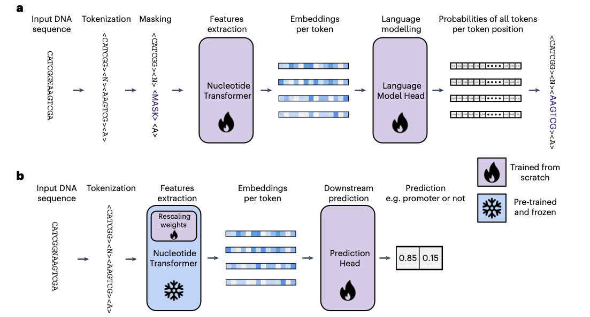

## 📊 Paper Metadata
- **Title**: Nucleotide Transformer: building and evaluating robust foundation models for human genomics
- **Authors**: Hugo Dalla-Torre, Liam Gonzalez, Javier Mendoza-Revilla, Nicolas Lopez Carranza, Adam Henryk Grzywaczewski, Francesco Oteri, Christian Dallago, Evan Trop, Bernardo P. de Almeida, Hassan Sirelkhatim, Guillaume Richard, Marcin Skwark, Karim Beguir, Marie Lopez, Thomas Pierrot
- **Publication**: Nature Methods
- **Institution**: InstaDeep, NVIDIA, Technical University of Munich
- **Paper Link**: https://doi.org/10.1038/s41592-024-02523-z
- **Code/Data**: https://github.com/instadeepai/nucleotide-transformer
- **Date Read**: 2025-02-18

## 🔄 Key Scientific Insights

### 1. Conceptual Innovation
- Development of transformer-based foundation models (Nucleotide Transformer) pre-trained on DNA sequences
- Models can learn context-specific representations of nucleotide sequences without task-specific supervision
- Models acquire knowledge about genomic elements and can predict variant effects
- Demonstrates that training on diverse species outperforms training on only human sequences

### 2. Methodological Framework
- Collection of models with varying parameters (50M to 2.5B) trained on different datasets:
  1. Human reference genome (500M parameters)
  2. 1000 Genomes Project - 3,202 diverse human genomes (500M and 2.5B parameters)
  3. Multispecies dataset - 850 diverse species (2.5B parameters)
- Two evaluation strategies:
  1. Probing: using embeddings as features for downstream models
  2. Parameter-efficient fine-tuning: adapting models for specific tasks

### 3. Validation Strategy
- Benchmarked on 18 diverse genomic prediction tasks:
  - Histone modifications
  - Enhancer/promoter prediction
  - Splice site prediction
- Compared against supervised baselines (BPNet) and other foundation models (DNABERT-2, HyenaDNA, Enformer)
- Additional evaluation on specialized tasks (DeepSEA, SpliceAI, DeepSTARR)
- Analysis of model attention to understand learned genomic patterns
- Zero-shot and fine-tuned prediction of variant effects

## 🔬 Critical Technical Details

### 1. Model Architecture and Training
- Encoder-only transformer architecture
- 6-mer tokenization (vocabulary of 4,104 tokens)
- Context length: 6kb for v1 models, 12kb for v2 models
- Pre-training using masked language modeling approach (BERT-style)
- Training infrastructure: 128 A100 GPUs across 16 nodes
- NT-v2 models incorporate architectural improvements:
  - Rotary embeddings instead of learned positional embeddings
  - SwiGLU activations
  - Removal of MLP biases and dropout mechanisms

### 2. Parameter-Efficient Fine-Tuning
- IA3 technique requiring only 0.1% of total parameters
- Introduces three learned vectors per transformer layer
- Allows fine-tuning on a single GPU in under 15 minutes
- Comparable performance to full model fine-tuning

### 3. Key Results Quantification
- NT-v2 250M model achieved best performance (MCC 0.769) across benchmark tasks
- Multispecies 2.5B model matched or exceeded BPNet baselines on 14/18 tasks
- Zero-shot variant effect prediction: AUC 0.7-0.8 for functional variants
- NT-v2 500M-parameter model with 12kb context matched/outperformed SpliceAI-10k
- NT-v2 models reduced parameters by 50x while maintaining/improving performance

## 🧪 Baseline Models, Evaluation Metrics, and Datasets

### Baseline Models
- BPNet: State-of-the-art convolutional architecture (original 121K and large 28M parameters)
- DNABERT-2: Pre-trained transformer for DNA
- HyenaDNA: Models with 1kb and 32kb context lengths
- Enformer: Architecture for long-range genomic interactions

### Evaluation Metrics
- Matthews Correlation Coefficient (MCC) for classification tasks
- Area Under Curve (AUC) for chromatin profiles
- Precision-Recall AUC and top-k accuracy for splice prediction
- Pearson correlation for enhancer activity prediction

### Datasets
- Pre-training:
  - Human reference genome: 3.2B nucleotides
  - 1000G: 3,202 human genomes (20.5T nucleotides)
  - Multispecies: 850 genomes across diverse phyla (174B nucleotides)
- Benchmark: 18 curated genomic datasets from:
  - ENCODE (histone marks, enhancers)
  - GENCODE (splice sites)
  - Eukaryotic Promoter Database
- Variant effect datasets:
  - eQTLs and meQTLs from GRASP
  - Pathogenic variants from ClinVar and HGMD

## 💭 Critical Research Implications

### 1. Methodological Impact
- Demonstrates viability of self-supervised learning for genomics
- Provides robust benchmark for evaluating genomic foundation models
- Shows scaling laws in genomics modeling similar to NLP
- Establishes parameter-efficient fine-tuning as effective approach
- Challenges need for supervised pre-training

### 2. Biological Insights
- Models learn biologically meaningful features without supervision
- Attention maps reveal focus on functional elements
- Framework for understanding variant effects beyond protein-coding regions
- Suggests multispecies training captures conserved regulatory elements

### 3. Practical Applications
- Efficient prediction of molecular phenotypes from DNA
- Variant prioritization for clinical interpretation
- Characterization of non-coding regulatory regions
- Cross-species genomic annotation transfer
- Model compression while maintaining performance

## 📊 Future Research Directions

### 1. Technical Extensions
- Extending context length beyond 12kb for capturing long-range interactions
- Specialized architectures for specific genomic tasks
- Integration with other omics data modalities
- Further architectural optimizations based on demonstrated scaling laws
- Exploration of different tokenization strategies

### 2. Biological Questions
- Characterization of novel regulatory elements
- Understanding species-specific vs. conserved genomic patterns
- Mechanistic interpretation of attention patterns
- Exploration of epigenetic marks and 3D chromatin structure

### 3. Application Areas
- Personalized genomic interpretation
- Disease risk prediction from genetic variants
- Cross-species comparative genomics
- Regulatory element discovery
- Synthetic genomics and genome engineering

## 💡 Implementation Notes

### 1. Key Requirements
- High-performance computing resources for larger models
- Jax/PyTorch environment for model training/inference
- Efficient data pipelines for processing genomic sequences
- Parameter-efficient fine-tuning implementation
- Evaluation framework for diverse downstream tasks

### 2. Critical Considerations
- Choice of tokenization strategy (6-mers vs alternatives)
- Balancing model size vs. performance requirements
- Managing genomic data heterogeneity
- Task-specific fine-tuning strategies
- Appropriately splitting genomic data to avoid contamination
- Interpreting model outputs in biologically meaningful ways
