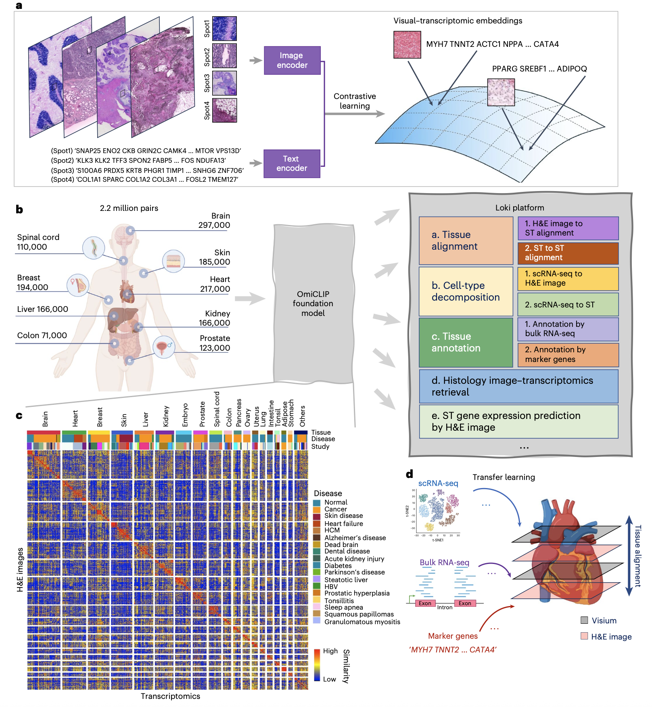
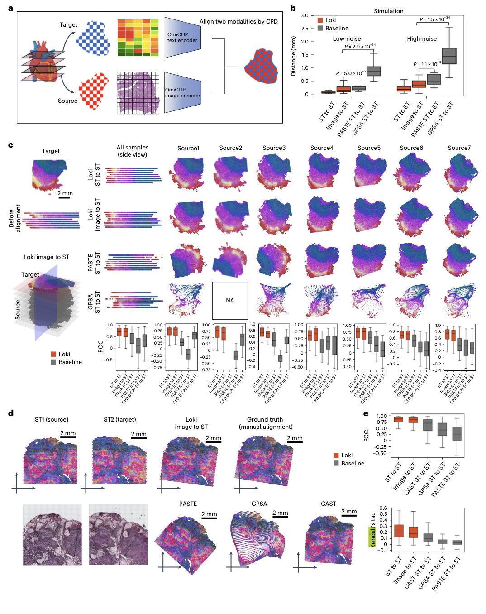

# OmiCLIP-NATURE-METHODS-2025.md

## 📊 Paper Metadata
- **Title:** A visual–omics foundation model to bridge histopathology with spatial transcriptomics
- **Authors:** Weiqing Chen, Pengzhi Zhang, Tu N Tran, Yiwei Xiao, Shengyu Li, et al.
- **Publication:** Nature Methods (2025)
- **Institution:** Houston Methodist Research Institute, Weill Cornell Medicine, The Ohio State University
- **Paper Link:** https://doi.org/10.1038/s41592-025-02707-1
- **Code/Data:** https://github.com/GuangyuWangLab2021/Loki/

## 🎨 Key Figures

### Figure 1: Study Overview and OmiCLIP Architecture


**Why this figure is exceptional:**
- **Comprehensive workflow visualization:** Shows the complete pipeline from data curation (2.2M pairs) to final applications with clear organ distribution
- **Dual-modality integration:** Elegantly demonstrates how H&E images and transcriptomics are converted to "sentences" and aligned via contrastive learning
- **Platform ecosystem:** Illustrates the five core Loki modules (alignment, annotation, decomposition, retrieval, prediction) in a unified framework
- **Scale demonstration:** Heat map effectively shows embedding similarities across 32 organs and diverse disease conditions

**Design principles to mimic:**
- Hierarchical workflow representation from data to applications
- Clear visual separation of input modalities and output capabilities
- Integration of quantitative data (sample sizes) with conceptual flow
- Color-coded similarity matrices for interpretability

### Figure 2: Tissue Alignment Performance


**Methodological excellence:**
- **Simulation validation:** Demonstrates robustness across noise levels with statistical significance testing
- **Real-world validation:** Shows performance on actual adjacent tissue sections with ground truth comparisons
- **Multi-method comparison:** Systematically compares against PASTE, GPSA, and CAST baselines
- **Quantitative metrics:** Uses both PCC and Kendall's tau for comprehensive performance assessment

**Template value for your studies:**
- Simulation-to-reality validation pipeline
- Multi-metric performance evaluation framework
- Visual before/after alignment comparisons with quantitative backing

## 🔄 Key Scientific Insights

```python
### 1. Conceptual Innovation
- **Visual-Omics Foundation Model:** First CLIP-based model to integrate H&E histology with spatial transcriptomics at scale
- **Text-based Transcriptomics:** Novel representation of gene expression as "sentences" enabling natural language processing techniques
- **Unified Multimodal Platform:** Single framework supporting alignment, annotation, decomposition, retrieval, and prediction

### 2. Methodological Framework
- **OmiCLIP Architecture:** Dual-encoder foundation model with image encoder, text encoder, and contrastive learning alignment
- **Training Strategy:** CoCa-based framework trained on 2.2M image-transcriptomics pairs for 20 epochs
- **Loki Platform Variants:**
  1. **Loki Align:** Coherent Point Drift-based tissue alignment (ST-to-ST and image-to-ST)
  2. **Loki Annotate:** Bulk RNA-seq and marker gene-based tissue annotation
  3. **Loki Decompose:** scRNA-seq reference-based cell-type decomposition using Tangram optimization
  4. **Loki Retrieve:** Image-to-transcriptomics retrieval in aligned embedding space
  5. **Loki PredEx:** Weighted similarity-based spatial gene expression prediction

### 3. Validation Strategy
**Comprehensive Evaluation Across:**
- **22 state-of-the-art models** spanning alignment, annotation, decomposition, and prediction tasks
- **28 datasets total** including 5 simulations, 19 public datasets, and 4 in-house experimental datasets
- **Multiple organs and conditions** covering 32 organ types from healthy to disease states
- **Cross-modal validation** with paired Visium, Xenium, and scRNA-seq technologies
```

## 🔬 Critical Technical Details
```python
### 1. ST-Bank Dataset Construction

# Data curation pipeline:
- Source: 113 public 10x Visium studies across 32 organs
- Processing: H&E images cropped to match ST spot sizes (224x224 pixels)
- Text generation: Top 50 expressed genes per spot concatenated into sentences
- Quality control: >2000x2000 pixel resolution requirement, >200 genes per spot
- Final dataset: 2,185,571 paired image-transcriptomics samples

### 2. OmiCLIP Training Architecture
- **Image Encoder:** Vision Transformer (ViT) with 224x224 input resolution
- **Text Encoder:** Causal masking transformer with 76-token input length
- **Embedding Dimension:** 768-dimensional aligned representation space
- **Training:** 20 epochs, batch size 64, contrastive loss optimization

### 3. Performance Improvements
- **Clustering Quality:** Significant Calinski-Harabasz score improvements (P < 0.001) across all organ types
- **Alignment Accuracy:** Median PCC 0.67-0.88 vs baseline methods 0.26-0.71
- **Annotation Performance:** F1 scores 0.59-0.96 vs OpenAI CLIP 0.03-0.34
- **Decomposition Accuracy:** Impact scores 1.11-1.32 vs SOTA methods -1.82-0.87
```

## Baseline Models, Evaluation Metrics, and Datasets
```python
### Baseline Models (22 methods total)
- **Alignment:** PASTE, GPSA, CAST, CPD with PCA embeddings
- **Annotation:** OpenAI CLIP, PLIP, CLAM attention models
- **Decomposition:** Tangram, RCTD, CARD, CytoSPACE, Cell2location, spatialDWLS, Spatial Seurat
- **Foundation Models:** scGPT, GeneFormer, scFoundation for embedding comparison
- **Prediction:** HisToGene, Hist2ST, BLEEP, mclSTExp

### Evaluation Metrics
- **Primary:** Pearson Correlation Coefficient (PCC), Calinski-Harabasz score, F1 score
- **Alignment-specific:** Kendall's tau coefficient, Euclidean distance measurements
- **Decomposition:** Jensen-Shannon divergence, Structural Similarity Index (SSIM), Impact score
- **Retrieval:** Recall@K (5%, 10%), cosine similarity scoring

### Datasets
- **Training Data:** ST-bank (2.2M pairs, 1,007 samples, 32 organs)
- **Validation Datasets:** Brain, heart, kidney, breast samples from ST-bank reserves
- **Test Datasets:** Desmoplastic small round cell tumor, colorectal cancer, vascular, colon samples
- **In-house Datasets:** TNBC Xenium, heart failure, Alzheimer's disease, metaplastic breast cancer
```

## 💭 Critical Research Implications
```python
### 1. Methodological Impact
- **Foundation Model Paradigm:** Establishes visual-omics foundation models as viable alternative to purely vision-language approaches
- **Cross-modal Transfer:** Demonstrates effective knowledge transfer between histology images and molecular data
- **Scalability Achievement:** Shows million-scale multimodal pretraining can achieve robust zero-shot and few-shot performance

### 2. Spatial Biology Relevance
- **3D Tissue Analysis:** Enables alignment of multiple tissue sections for comprehensive 3D reconstruction
- **Cost Reduction:** Allows prediction of spatial gene expression from H&E images, reducing sequencing requirements
- **Clinical Translation:** Provides pathway for integrating routine histology with molecular insights

### 3. Computational Biology Insights
- **Text-based Omics:** Validates representing transcriptomics as natural language for foundation model training
- **Multimodal Embeddings:** Demonstrates superior performance of joint image-transcriptomics embeddings over single modality
- **Generalization Capability:** Shows robust performance across diverse organs, diseases, and experimental conditions
```

## 🚀 Future Directions & Limitations
```python
### Potential Extensions
- **Multi-omics Integration:** Expansion to proteomics, metabolomics, and epigenomics data
- **Generative Capabilities:** Development of diffusion models for WSI reconstruction with ST details
- **Clinical Integration:** Fine-tuning for diagnostic and prognostic applications in clinical workflows

### Current Limitations
- **Training Scale:** Limited by available paired ST-histology data compared to billion-scale vision-language models
- **Retrieval-based:** Cannot generate novel transcriptomic profiles, only retrieves most similar existing data
- **Organ Coverage:** Rare conditions may be underrepresented despite 32 organ types in training data

### Open Questions
- How does performance scale with even larger multimodal datasets?
- Can the approach extend to other spatial omics technologies beyond Visium?
- What are the optimal strategies for incorporating multiple resolution scales?
```

## 📋 Implementation Checklist
```python
### For Reproducing Results
- [ ] Python 3.9+ environment with CUDA 12.2+ support
- [ ] NVIDIA A100 80GB GPU (minimum requirement for training)
- [ ] ST-bank dataset download and preprocessing pipeline
- [ ] OmiCLIP pretrained weights from HuggingFace

### For Adapting to New Domains
- [ ] Spatial transcriptomics data in 10x Visium format
- [ ] High-resolution H&E images (>2000x2000 pixels)
- [ ] Fine-tuning dataset preparation following ST-bank format
- [ ] Appropriate baseline model selection for comparison
```

## 🔗 Related Work & Context
- **CLIP Foundation:** Builds upon OpenAI CLIP and CoCa frameworks for contrastive multimodal learning
- **Spatial Biology Tools:** Advances beyond PASTE, GPSA for tissue alignment and Tangram for cell-type decomposition  
- **Foundation Models:** Complements scGPT, GeneFormer for single-cell analysis with spatial histology integration
- **Clinical Applications:** Provides infrastructure for integrating routine pathology with molecular diagnostics

---
*Note based on analysis of: Chen, W., Zhang, P., Tran, T.N. et al. A visual–omics foundation model to bridge histopathology with spatial transcriptomics. Nat Methods (2025). https://doi.org/10.1038/s41592-025-02707-1*
