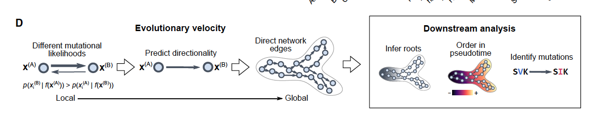

## 📊 Paper Metadata
- Title: Evolutionary velocity with protein language models predicts evolutionary dynamics of diverse proteins
- Authors: Brian L. Hie, Kevin K. Yang, Peter S. Kim
- Journal: Cell Systems
- Publication Date: April 20, 2022
- https://pubmed.ncbi.nlm.nih.gov/35120643/ 

## 🔄 Key Scientific Insights
### 1. Conceptual Innovation
- Introduces "evolutionary velocity" (evo-velocity) - a method using protein language models to predict evolutionary trajectories
- Shows a single language model can predict evolution across diverse proteins and timescales
- Demonstrates that local sequence predictions can reconstruct global evolutionary patterns
- Provides insights into viral immune escape, protein family evolution, and horizontal gene transfer

### 2. Methodological Framework


(D) Evo-velocity uses language model likelihoods to assign a directionality to edges in a sequence similarity network, enabling downstream analysis, such as
predicting root nodes, ordering nodes in pseudotime, and identifying the mutations associated with the largest changes in evo-velocity

左侧部分 - 从局部到全局的预测过程：

- 首先计算不同序列突变之间的似然度差异（Different mutational likelihoods）
- 根据似然度预测进化方向（Predict directionality）
- 将局部预测整合成一个有向网络结构（Direct network edges）

右侧部分 - 下游分析（Downstream analysis）包括三个关键步骤：

- 推断进化根源（Infer roots）：找到序列的起源点
- 计算伪时间排序（Order in pseudotime）：根据进化距离对序列进行时间上的排序
- 识别关键突变（Identify mutations）：例如图中展示的 S→I 突变

这个方法的创新之处在于它能够将局部的序列变化信息（Local）整合成全局的进化图景（Global），从而预测蛋白质的进化动态。通过语言模型计算的似然度作为指导，可以确定序列之间的进化方向和关系。

图中用蓝色圆圈代表不同的序列状态，箭头表示预测的进化方向，颜色梯度（从蓝到红）表示在伪时间上的进展。整体展示了从微观的序列变化到宏观的进化动态的分析过程。


- Uses ESM-1b language model trained on 27M UniRef50 sequences
- Constructs sequence similarity networks and assigns directional scores
- Applies diffusion analysis to identify evolutionary roots and order sequences
- Validates across multiple protein families and evolutionary timescales

### 3. Core Validation Examples
- Viral proteins: Influenza NP/HA, HIV-1 Gag, SARS-CoV-2 Spike
- Ancient proteins: Globins, Cytochrome c
- Highly conserved proteins: Serpins, Enolase, PGK

## 🔬 Critical Technical Details
### 1. Language Model Implementation
```python
# Core components
- Sequence embedding using ESM-1b
- KNN graph construction in embedding space
- Velocity score computation between sequences
- Diffusion pseudotime analysis for ordering
```

### 2. Validation Framework
- Correlation with known sampling dates for viral proteins
- Agreement with fossil record for ancient proteins
- Reproduction of known evolutionary relationships
- Robustness testing through multiple control experiments

### 3. Key Results Quantification
- Strong correlation between predicted order and sampling dates for viral sequences
- Accurate reconstruction of ancient protein evolution matching fossil record
- Successful prediction of convergent evolution and horizontal gene transfer events

## 💭 Critical Research Implications
### 1. Methodological Impact
- Demonstrates predictability of protein evolution using language models
- Provides framework for analyzing evolutionary trajectories without phylogenetic assumptions
- Enables study of convergent evolution and complex evolutionary patterns

### 2. Biological Insights
- Resolves conflicting theories about serpin evolution
- Reveals patterns of viral immune escape
- Identifies different evolutionary origins of glycolytic enzymes
- Shows common rules governing protein evolution across diverse families

### 3. Technical Advances
- Single model generalizes across diverse proteins
- Handles both rapid (viral) and ancient evolution
- Robust to missing evolutionary intermediates
- Compatible with convergent evolution patterns

## 📊 Future Research Directions
### 1. Technical Extensions
- Integration with additional evolutionary information
- Application to protein design
- Extension to larger protein families
- Improved modeling of insertions/deletions

### 2. Biological Applications
- Prediction of viral evolution
- Understanding protein family origins
- Study of horizontal gene transfer
- Analysis of protein adaptation mechanisms

### 3. Methodological Development
- Enhanced root finding algorithms
- Improved velocity scoring methods
- Integration with structural information
- Extension to other biomolecular systems

## 💡 Implementation Notes
### 1. Key Requirements
- ESM-1b language model
- Sequence processing pipeline
- Graph analysis tools
- Visualization capabilities

### 2. Critical Considerations
- Sequence alignment quality
- Network construction parameters
- Velocity score computation
- Validation metric selection

