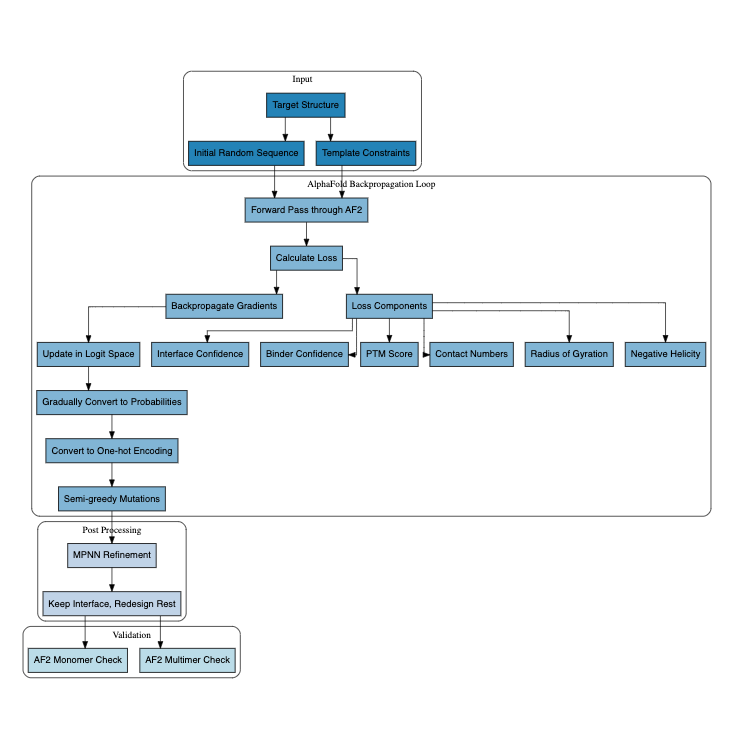

## 📊 Paper Metadata
- **Title:** BindCraft: one-shot design of functional protein binders
- **Authors:** Pacesa, Martin, et al.
- **Institution:** ETH Zurich
- **Code/Data:** [bindcraft](https://github.com/martinpacesa/BindCraft)
- **Tags:** #proteinDesign #AlphaFold #binders #structuralBiology

## 🎯 Core Contributions
1. Single-shot pipeline for protein binder design using AlphaFold2
2. Direct use of AlphaFold as design oracle rather than just filtering
3. Successful experimental validation across diverse targets
4. User-friendly implementation accessible to wet-lab scientists

## 📋 Paper Structure
### 1. Introduction
- Background: Need for simpler protein binder design methods
- Problem: Complex, multi-step pipelines with high failure rates
- Current Limitations: Reliance on scaffold databases, complex workflows
- Main Innovation: Direct use of AlphaFold for end-to-end design

### 2. Results/Methods
- Four-stage design protocol using AlphaFold backpropagation
- Testing on diverse targets including allergens and CRISPR-Cas9
- Experimental validation using surface plasmon resonance (SPR), competition assays
- Successful bacterial expression of designed binders

### 3. Discussion
- Demonstrates versatile binder design across different targets
- Limitations with transmembrane proteins and specificity testing
- Future need for systematic specificity screening
- Potential therapeutic applications

## 🔬 Technical Details
### Algorithm Framework
1. Core Components:
   - AlphaFold2 multimer for design
   - AlphaFold2 monomer for validation
   - MPNN for sequence refinement
   - Template-based target constraints

2. Workflow:
   - Design in logit space
   - Gradual conversion to probabilities
   - One-hot encoding
   - Semi-greedy mutations

3. Key Filters:
   - Interface PTM scores
   - Unsaturated hydrogen bonds
   - Predicted alignment error

### Implementation Details
1. Computing Stack:
   - Language: Python
   - Key Dependencies: AlphaFold2, MPNN
   - Available as Colab notebook and GitHub repository

## 📊 Evaluation
### Experimental Validation
- Surface Plasmon Resonance (SPR)
- Competition assays
- Functional validation (e.g., CRISPR inhibition)
- Patient serum studies for allergen binders

### Datasets
- Various protein targets including:
  - PDL1 (benchmark)
  - Birch allergen BV1
  - CRISPR-Cas9
  - De novo beta barrel

## 💭 Critical Analysis
### Strengths
1. Simple, unified pipeline
2. Good success rates
3. Experimentally validated
4. Accessible to non-experts

### Limitations
1. Struggles with transmembrane proteins
2. Limited specificity testing
3. Not optimized for antibody design
4. Memory constraints for large systems

### Future Directions
1. Systematic specificity screening
2. Improved handling of membrane proteins
3. Extension to antibody design
4. Better target flexibility modeling

## 📌 Key Takeaways
1. AlphaFold can directly guide protein design
2. Success depends heavily on target characteristics
3. Experimental validation is crucial
4. Accessibility to wet-lab scientists is important

## 💡 Personal Notes
### Implementation Suggestions
1. Start with:
   - Well-characterized soluble proteins
   - Targets with known structures
   - Non-membrane proteins
   
2. Validation Process:
   - Express in E. coli
   - Use SPR for binding validation
   - Include competition assays
   - Test multiple designs

3. Practical Tips:
   - Try both crystal structures and AlphaFold predictions
   - Run in single sequence mode
   - Use default parameters initially
   - Be prepared for multiple iterations
   - Document modifications needed
   - Verify structure quality before design

4. Common Pitfalls to Avoid:
   - Starting with transmembrane proteins
   - Targeting highly charged interfaces
   - Overlooking specificity testing

5. Resources to Have:
   - Good computing resources
   - Bacterial expression system
   - SPR access
   - Structure visualization tools 

*Figure: Self-created workflow according to my understanding of the paper*
