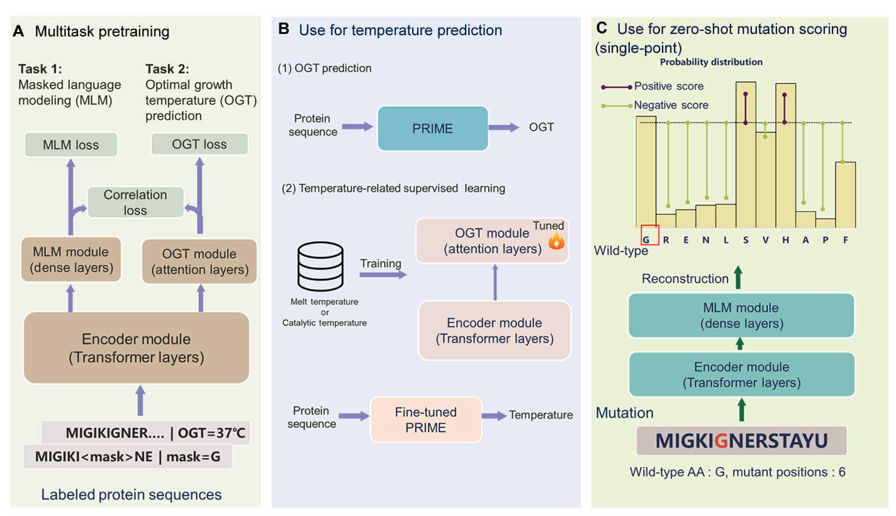
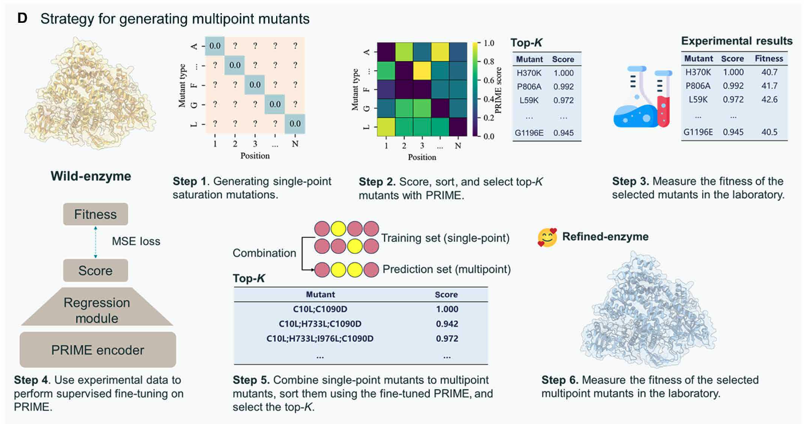

## 📊 Paper Metadata
- Title: A general temperature-guided language model to design proteins of enhanced stability and activity
- Authors: Fan Jiang, Mingchen Li, Jiajun Dong, Yuanxi Yu, et al.
- Publication: Science Advances, 27 November 2024
- Institution: Shanghai Jiao Tong University and collaborating institutions
- Code/Data: Available at https://github.com/ai4protein/Pro-Prime
- Paper Link: DOI: 10.1126/sciadv.adr2641
- Date: 2025-01-18

## 🔄 Key Scientific Insights
### 1. Conceptual Innovation
- Introduces PRIME (Protein language model for Intelligent Masked pretraining and Environment prediction)
- Novel approach combining masked language modeling with optimal growth temperature (OGT) prediction
- Demonstrates ability to improve protein properties without prior experimental mutagenesis data
- Successfully predicts beneficial mutations across diverse protein types

### 2. Methodological Framework
- Uses transformer-based architecture with three key components:
  - Encoder module for sequence features
  - MLM module for contextual amino acid representation
  - OGT prediction module for temperature traits
- Trained on 96 million protein sequences with bacterial strain OGT data
- Incorporates correlation objective to align MLM scores with OGT predictions

### 3. Validation Strategy
- Validated on five distinct proteins:
  - LbCas12a
  - T7 RNA polymerase
  - Creatinase
  - Nonnatural nucleic acid polymerase
  - VHH antibody
- >30% success rate in improving target properties across all proteins

## 🔬 Critical Technical Details
### 1. Model Architecture
- 33-layer transformer encoder
- 20 attention heads
- 650 million parameters
- 1280 embedding size
- Uses three distinct loss functions:
  - MLM loss
  - OGT prediction loss
  - Correlation loss

### 2. Experimental Validation
- Comprehensive wet-lab validation
- Thermal stability measurements
- Activity assays
- Binding affinity tests
- Extensive multisite mutation analysis

### 3. Key Results
- Outperformed existing state-of-the-art models in:
  - ProteinGym benchmark
  - ΔTm prediction
  - Fitness prediction
- Successfully engineered proteins with improved:
  - Thermostability
  - Catalytic activity
  - Binding affinity
  - Alkaline tolerance

## 💭 Critical Research Implications
### 1. Methodological Impact
- Demonstrates effective protein engineering without requiring experimental data
- Provides framework for combining temperature and sequence information
- Enables efficient multisite mutation design

### 2. Practical Applications
- Industrial enzyme optimization
- Therapeutic protein development
- Diagnostic tool improvement
- Protein stability enhancement

### 3. Biological Insights
- Shows value of incorporating environmental parameters
- Demonstrates importance of negative mutations in protein engineering
- Reveals complex relationships between sequence and stability
Let me break down the baseline models, evaluation metrics, and datasets used in this paper:

### 🔄 Baseline Models

1. Deep Learning Models:
- ESM-1v
- ESM-2
- MSA-transformer
- Tranception-EVE
- CARP
- MIF-ST
- SaProt

2. Traditional Computational Methods:
- GEMME
- Rosetta

### 📊 Evaluation Metrics

1. For Zero-shot Prediction:
- Spearman correlation
- Number of positive single-site mutations
- Maximum fitness
- Median fitness

2. For Temperature Prediction:
- RMSE (Root Mean Square Error)
- Pearson correlation
- R² (coefficient of determination)
- Spearman correlation

### 📚 Datasets

1. Primary Training Data:
- 96 million sequence-host bacterial strain optimal growth temperatures (OGTs)
- Curated from ProteomeAtlas (4.7 billion protein sequences)
- Filtered for full-length sequences
- Processed with MMseqs2 (50% sequence identity threshold)

2. Benchmark Datasets:
- ProteinGym (2.5 million missense variants across 217 DMS assays)
- MPTherm dataset
- FireProtDB
- ProThermDB
- Meltome dataset
- FLIP benchmark (12 tasks)

3. Experimental Validation Data:
- Five distinct proteins:
  * LbCas12a
  * T7 RNA polymerase
  * Creatinase
  * Nonnatural nucleic acid polymerase
  * VHH antibody
- Homologous sequences from Uniclust30 database (30,000 sequences per protein)

### 🔍 Key Results Comparison
- PRIME outperformed SaProt on ProteinGym (0.486 vs 0.457)
- Better than Stability Oracle on ΔTm dataset (0.437 vs 0.412)
- Achieved superior performance across all proteins and desired properties with >30% success rate in experimental validation

## 📊 Future Research Directions
### 1. Technical Extensions
- Integration with structural information
- Application to other environmental parameters
- Expansion to other protein families
- Further optimization of multisite mutation prediction

### 2. Biological Questions
- Understanding mechanism of temperature adaptation
- Role of negative mutations in protein evolution
- Relationship between stability and activity

### 3. Applications
- Industrial enzyme development
- Therapeutic protein optimization
- Diagnostic tool enhancement
- Protein engineering automation

## 💡 Implementation Notes
### 1. Key Requirements
- Access to computational resources
- Protein expression capabilities
- Thermal stability measurement equipment
- Activity assay infrastructure

### 2. Critical Considerations
- Careful selection of mutation sites
- Balance between stability and activity
- Proper experimental validation
- Statistical rigor in analysis

### A. The Basic Architecture 🏗️
Think of PRIME like a smart protein-reading machine with three main parts:

1. **Main Brain (BERT-oriented transformer encoder)**:
   - This is like the central processing unit
   - It learns to understand protein sequences, kind of like how we understand sentences

2. **Two Special Modules**:
   - **MLM Module**: Like a word prediction game - it learns to guess missing amino acids
   - **OGT Module**: Predicts the optimal temperature where the protein works best

3. **Three Ways of Learning**:
   - **MLM Loss**: Measures how good it is at predicting amino acids
   - **OGT Loss**: Checks how accurate its temperature predictions are
   - **Correlation Loss**: Makes sure its predictions make sense together

### B. Temperature Prediction 🌡️
Imagine you have a new protein sequence:
- PRIME can predict what temperature this protein likes best
- It can learn from different types of temperature data
- Useful for finding proteins that work well at high temperatures

### C. Mutation Scoring 🎯
This is like spell-checking for proteins:
1. Takes a normal (wild-type) protein sequence
2. When you want to change one amino acid (mutation)
3. PRIME calculates whether this change is likely to be good or bad
4. Uses math (log-odds ratio) to give each mutation a score

### D. Making Multiple Changes 🔄
This is like a step-by-step recipe:
1. First, try single changes and pick the best ones
2. Test these in the lab
3. Use these results to make PRIME even smarter
4. Then predict which combinations of changes might work best
5. Test the best combinations in the lab

Think of it like cooking:
- First, you try changing one ingredient at a time
- Learn what works
- Then try combining the successful changes
- Finally, test your best recipes

