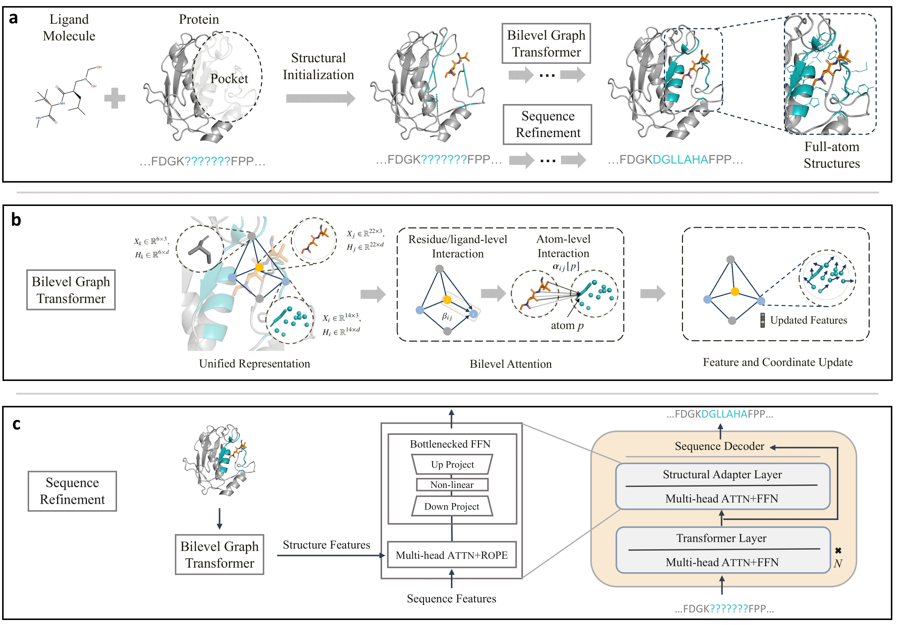

📊 Paper Metadata
* **Title:** Efficient generation of protein pockets with PocketGen
* **Publication:** Nature Machine Intelligence (2024)
* **Institution:** Harvard
* Paper Link: [https://doi.org/10.1038/s41586-024-08127-z](https://www.nature.com/articles/s42256-024-00920-9)
* Code/Data: [https://github.com/microsoft/AI2BMD](https://github.com/zaixizhang/PocketGen)
* **Tags:** #ProteinDesign #DeepLearning #DrugDiscovery #GenerativeModels

🎯 Core Contributions
1. Introduces PocketGen, a deep generative model for efficient protein pocket design
2. Novel bilevel graph transformer architecture capturing multi-scale interactions
3. Integration of protein language models with structural adapters for sequence-structure consistency
4. Demonstrates superior performance in generating high-fidelity binding pockets

📋 Paper Structure
1. Introduction
* Background: Protein-binding proteins critical for drug discovery
* Problem: Challenges in AI-based design due to complexity of interactions
* Innovation: End-to-end generative approach with multi-scale modeling

2. Results/Methods



* PocketGen Architecture: Bilevel graph transformer + sequence refinement
* Technical Validation: Benchmarking on CrossDocked and Binding MOAD datasets
* Applications: Case studies on therapeutic molecules (cortisol, apixaban, fentanyl)

3. Discussion
* Key Findings: Superior performance in affinity and structural validity
* Advantages: 10x faster than physics-based methods, 97% success rate
* Future Directions: Expanding to larger protein areas, incorporating biochemical priors

🔬 Technical Details
Algorithm Framework
1. Core Components:
   * Bilevel graph transformer
   * Sequence refinement module with protein language models
   * Structural adapter

2. Workflow:
   * Initial structure/sequence generation
   * Iterative refinement of both structure and sequence
   * Final pocket optimization

📊 Evaluation
Metrics
* Binding affinity (Vina score, MM-GBSA)
* Structural validity (scRMSD, scTM)
* Amino acid recovery rate (AAR)

Datasets
* CrossDocked: Protein-molecule pairs from cross-docking
* Binding MOAD: Experimentally determined complexes

💭 Critical Analysis
Strengths
1. End-to-end generative approach
2. Multi-scale interaction modeling
3. Computational efficiency
4. Strong empirical results

Limitations
1. Limited to pocket regions
2. Requires further validation through wet lab experiments
3. Computational resources needed for large-scale application

📌 Key Takeaways
1. First end-to-end generative model for protein pocket design
2. Significant improvements in speed and accuracy over existing methods
3. Practical applications in drug discovery and protein engineering
4. Demonstrates value of combining structural and sequence information

💡 Personal Notes
## A. Environment Setup
### Hardware Requirements
- NVIDIA GPU with CUDA support (11.6)
- Recommended:
  - Modern NVIDIA GPU (RTX 2080 or better)
  - 16GB+ RAM
  - Several GB storage for datasets/checkpoints

### Software Stack
  1. Core Requirements:
   - Python 3.8
   - PyTorch with CUDA
   - PyG (PyTorch Geometric)

  2. Key Dependencies:
   ```
   - RDKit
   - OpenBabel 
   - OpenMM
   - Meeko
   - AutoDockTools
   - Tensorboard
   - PyYAML
   - LMDB
   ```
## B. Explain the bilevel graph transformer
The bilevel graph transformer is a key architectural innovation in PocketGen designed to model complex protein-ligand interactions at multiple scales.

Key Concept:
The model represents the protein-ligand complex as a geometric graph of blocks (sets of atoms), allowing it to handle varying numbers of atoms across different residues and ligands.

Structure:
  1. Block Representation:

    a) Each residue or ligand is treated as a block containing multiple atoms
    b) Each block has:
      - Feature matrix Hi ∈ ℝni×dh (atom features)
      - Coordinate matrix Xi ∈ ℝni×3 (3D coordinates)
      - ni represents number of atoms in the block
      - dh is the feature dimension

  2. Attention Mechanisms The transformer operates at two levels simultaneously:
   
    a) Atom-level Attention
      - Captures detailed interactions between individual atoms
      - Computes attention weights αij between atoms in different blocks
      - Uses distance and coordinate information
      - Formula: Rij = (1/√dr)(QiKj^T) + σD(RBF(Dij))
      - Sparse attention is used to focus on most relevant interactions

    b) Residue/Ligand-level Attention
      - Models higher-level interactions between entire residues or ligands
      - Aggregates atom-level interactions to block level
      - Uses βij attention weights between blocks
      - Formula: rij = (1^T Rij 1)/(ninj)

  3. The model updates both:
     
    a) Atom features (Hi)
    b) 3D coordinates (Xi)
    c) Only updates coordinates for pocket residues and ligand, keeping other protein parts fixed

  Key Features:
  
    a) E(3) Equivariance
      - Maintains geometric consistency under rotations and translations
      - Critical for handling 3D molecular structures
    b) Multi-scale Processing
      - Simultaneously processes atomic and residue-level information
      - Helps capture both local and global interaction patterns
    c) Flexible Architecture
      - Can handle varying numbers of atoms
      - Adaptable to different types of residues and ligands

## C. Example: Designing Protein Pocket for Apixaban (APX)
  1. Background：

    - APX is used to reduce stroke risk in patients with atrial fibrillation
    - Target: Factor Xa (PDB ID: 2P16) - an enzyme crucial in blood clotting
    - Goal: Design optimized binding pockets for APX

  2. Process & Results

Initial Setup:

    - Used the reference protein-ligand complex (Factor Xa)
    - PocketGen was pretrained on Binding MOAD dataset
    - Excluded target complex from training data

Interactions Generated:
  
    - Maintained key original interactions:
      - Hydrophobic contacts
      - Hydrogen bonds
      - π-π stacking

    - Added new favorable interactions:
      - π-cation interaction with LYS192
      - Additional hydrogen bonds

    - Total interactions: 9 hydrophobic contacts, 5 hydrogen bonds, 2 π-interactions


Performance Metrics:

    - Success Rate: 40% of generated pockets showed higher affinity than reference
    - Outperformed baseline methods (RFAA achieved only 10% success rate)
    - Maintained structural stability (ΔΔG value of 0.92)


Key Improvements:

    - Enhanced binding affinity
    - Maintained protein stability
    - Added novel beneficial interactions
    - Preserved critical binding features


