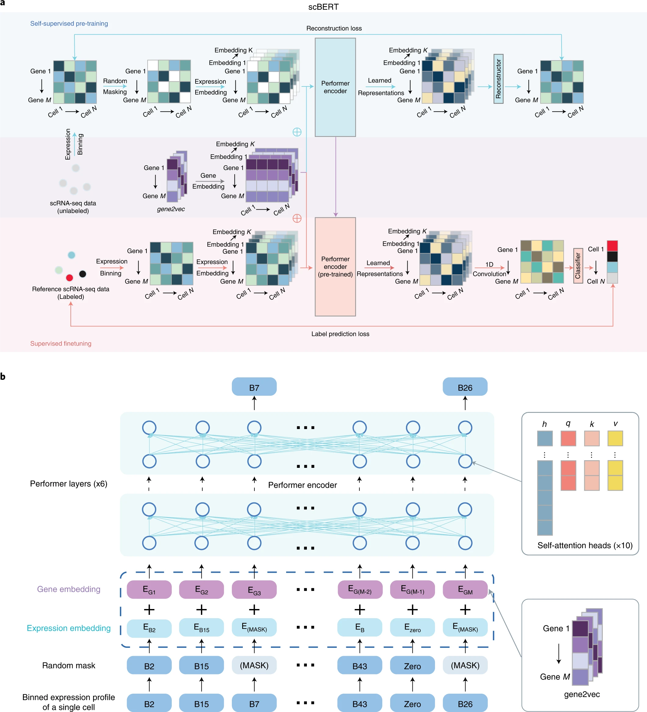
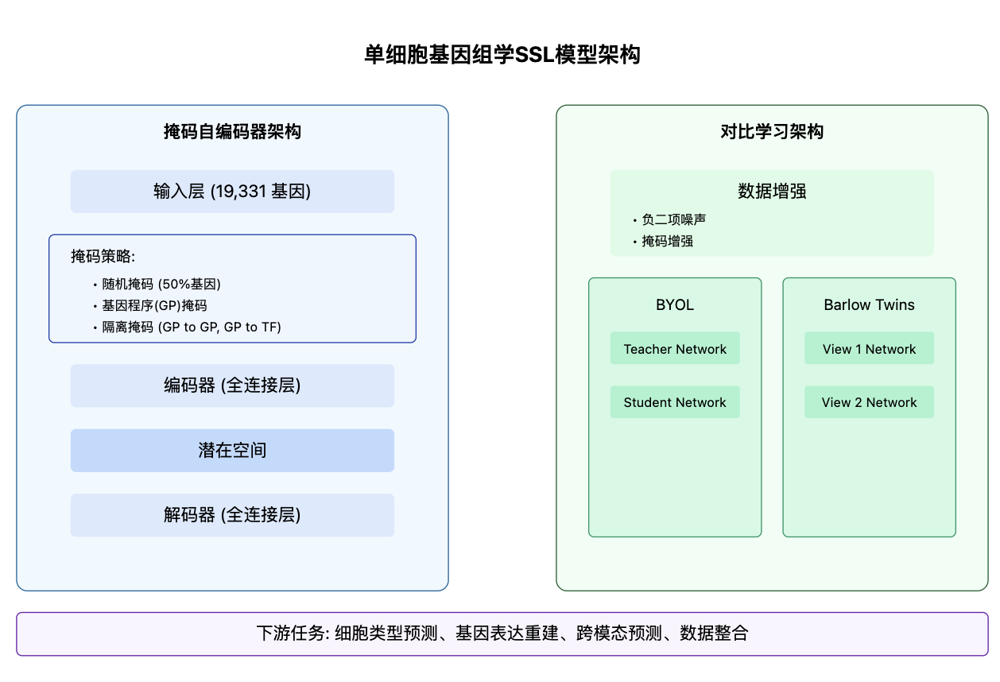

# scBERT: A Large-scale Pretrained Deep Language Model for Cell Type Annotation of Single-cell RNA-seq Data

## 📊 Paper Metadata
- **Title:** scBERT as a large-scale pretrained deep language model for cell type annotation of single-cell RNA-seq data
- **Authors:** [Author Names]
- **Publication:** Nature Machine Intelligence (October 2022)
- **Institution:** Tencent
- **Links:** 
  - Paper: https://www.nature.com/articles/s42256-022-00534-z
  - GitHub: https://github.com/TencentAILabHealthcare/scBERT
- **Tags:** #deep-learning #BERT #single-cell #cell-annotation #transformer

## 🎯 Core Contributions
1. Novel BERT-based model adapted for single-cell RNA sequencing data analysis
2. Two-stage training paradigm with domain-specific improvements in input representation and encoder structure
3. Superior performance in cell type annotation across multiple metrics
4. Robust performance across different datasets and organs with strong batch effect resistance
5. Interpretable attention mechanism for discovering new cell-type-specific genes

## 📋 Paper Structure
### 1. Introduction
- Importance of cell type annotation in scRNA-seq
- Limitations of current methods
- Key innovations of scBERT

### 2. Methods
- Model Architecture
  * Expression embedding and input representation
  * Performer-based encoder
  * Pre-training and fine-tuning strategies
- Data Processing
  * Dataset selection
  * Preprocessing steps

### 3. Results
- Multi-dataset Performance Evaluation
  * Cross-validation within datasets
  * Cross-dataset batch effect analysis
  * Impact of class imbalance
  * Novel cell type discovery
- Model Interpretability Analysis
  * Attention weight visualization
  * Enrichment analysis

### 4. Discussion
- Model Advantages
  * Strong modeling capability
  * Robustness to batch effects
  * Interpretability
- Limitations and Future Directions

## 🔬 Technical Details
### Algorithm Framework
1. Input Representation
   - Gene expression vector discretization
   - Gene embedding using pre-trained gene2vec
   - Expression embedding integration

2. Model Architecture
   - Performer-based encoder
   - Multi-head self-attention mechanism
   - Task-specific output layers

3. Training Strategy
   - Pre-training Phase:
     * Self-supervised learning on unlabeled data
     * Masked expression value prediction
   - Fine-tuning Phase:
     * Supervised learning for cell type annotation
     * End-to-end training with classification objective

### Implementation Details
- Language: Python
- Framework: PyTorch
- Key Packages:
  * Performer
  * scanpy
  * anndata
  * gene2vec

## 📊 Evaluation
### Baseline Models
1. Marker-based Methods:
   - SCINA
   - Garnett
   - scSorter

2. Correlation-based Methods:
   - Seurat
   - SingleR
   - CellID
   - scmap

3. Supervised Learning Methods:
   - scNym
   - SciBet

### Evaluation Metrics
- Accuracy
- Macro F1-score
- Confusion matrix

### Datasets
1. Zheng68K: Human PBMC cells
2. Pancreas datasets: Baron, Muraro, Segerstolpe, Xin
3. MacParland: Human liver tissue
4. Heart dataset
5. Lung dataset
6. Human Cell Atlas

## 💭 Critical Analysis
### Strengths
1. Strong performance across diverse datasets
2. Robust to batch effects and class imbalance
3. Interpretable attention mechanism
4. Efficient computation with Performer architecture

### Limitations
1. Expression embedding methodology
2. Gene interaction modeling
3. Pre-training masking strategy

### Future Directions
1. Improved expression embedding methods
2. Enhanced gene interaction modeling
3. Optimized pre-training strategies
4. Extension to other downstream tasks

## 📌 Key Takeaways
1. Transformer architecture can be effectively adapted for scRNA-seq analysis
2. Pre-training on large-scale data improves cell type annotation
3. Attention mechanism provides biological interpretability
4. Model shows strong generalization across different tissues

## 💡 Implementation Insights
1. Data Processing:
   - Discretization of gene expression values
   - Integration of gene embeddings
   - Batch effect handling

2. Training Tips:
   - Pre-training data selection
   - Fine-tuning strategies
   - Hyperparameter optimization

## Algorithm Framework

## 📋 Model Overview

a. 无标签数据的自监督学习和特定任务数据的微调。在自监督预训练阶段，从PanglaoDB收集无标签数据。掩码表达嵌入和基因嵌入作为输入被添加，然后输入到Performer块中。重构器用于生成输出。用于掩码基因的输出用于计算重构损失。在监督微调阶段，特定任务的scRNA-seq数据被输入到预训练的编码器中。输出表示随后通过一维卷积层和分类器生成细胞类型预测。
代表元素逐一相加。Performer编码器是预训练和微调阶段模型共享的组件。重构器和分类器在预训练和微调过程中分别独立使用。

b. scBERT嵌入的示意图。预处理的scRNA-seq数据首先转换为离散化表达，然后随机掩码非零表达。以第一个基因为例，基因嵌入EG1（来自gene2vec的基因身份嵌入落在第一个箱中）和表达嵌入EB2（基因表达落在第二个箱中并转换为与EG1相同的维度）相加并输入到scBERT中以生成基因的表示。这些表示然后用于预训练或微调。

根据论文的方法部分,可以总结出scBERT的算法框架如下:

1. 输入表示
- 基因表达向量:将每个细胞的原始基因表达量映射为一个离散的表达向量,类似于NLP中的词袋模型
- 基因嵌入向量:利用预训练的gene2vec模型获得每个基因的分布式表示,捕捉基因间的语义相似性
2. 模型结构
- 编码器:使用多层Transformer的变体Performer作为主要的编码器结构,可以处理超过16,000个基因的输入
- 注意力机制:使用多头自注意力机制来学习基因之间的交互模式和依赖关系
- 输出层:根据下游任务的不同,使用不同的输出层和损失函数(如分类层和交叉熵损失)
3. 预训练阶段
- 数据:使用大规模无标签的单细胞转录组数据进行预训练
- 目标:通过自监督的掩码语言建模任务,让模型学习到通用的基因表达模式和调控关系
- 过程:随机遮挡部分非零表达值,然后训练模型根据其他基因的表达来预测被遮挡的表达值
4. 微调阶段
- 数据:在具有细胞类型注释的数据集上进行微调
- 目标:通过有监督的细胞类型分类任务,让模型适应特定的细胞类型注释问题
- 过程:将预训练得到的模型参数作为初始化,然后根据细胞类型标签进行端到端的微调
5. 推理阶段
- 数据:在新的测试数据上进行细胞类型注释
- 过程:将细胞的基因表达输入到训练好的scBERT模型中,得到每个类别的概率分布
- 后处理:根据预测概率对细胞进行注释,并可以设置阈值以识别新的未知细胞类型

总的来说,scBERT的算法框架继承了BERT的预训练-微调范式,并在输入表示和编码器结构上进行了针对性的改进,以适应单细胞转录组数据的特点。同时,scBERT充分利用了自监督学习和迁移学习的思想,通过在大规模数据上的预训练来学习通用的基因表达模式,再通过在特定任务上的微调来提取任务相关的特征表示,从而实现了高效、准确、稳健的细胞类型注释。

#### 将每个细胞的原始基因表达量映射为一个离散的表达向量
    想象你是一个厨师,正在分析不同菜品的配方。每个菜品就相当于一个细胞,而每种配料就相当于一个基因。配料的用量就相当于基因的表达量。

    原始数据:
    假设你有三道菜,每道菜有四种主要配料(盐、糖、醋、辣椒)的用量(单位:克):

    1. 菜A: 盐(2.3), 糖(15.7), 醋(8.1), 辣椒(0.5)
    2. 菜B: 盐(1.8), 糖(5.2), 醋(12.4), 辣椒(3.7)
    3. 菜C: 盐(3.1), 糖(0.3), 醋(6.9), 辣椒(0)

    将原始用量映射为离散的表达向量:
    为了简化分析,你决定将用量分为四个等级:无(0)、少量(1)、中等(2)、大量(3)。具体的映射规则如下:

    - 0克: 0 (无)
    - 0.1-2克: 1 (少量)
    - 2.1-10克: 2 (中等)
    - 10克以上: 3 (大量)

    应用这个规则后,你得到了离散化的表达向量:

    1. 菜A: [2, 3, 2, 1]
    2. 菜B: [1, 2, 3, 2]
    3. 菜C: [2, 1, 2, 0]

    这样,你就将每道菜(细胞)的原始配料用量(基因表达量)映射为了一个离散的表达向量。

    这种离散化的好处是:

    1. 简化数据: 不再需要处理精确的小数值,使分析更加高效。
    2. 降低噪声: 小的测量误差不会影响最终的分类。
    3. 突出差异: 更容易看出配料使用量的主要区别。
    4. 标准化: 不同菜品之间更容易比较。

    在实际的单细胞RNA测序数据中,这个过程会应用到成千上万的基因,但原理是相同的。scBERT通过这种方式将连续的基因表达数据转换为离散的表达向量,为后续的分析提供了一个更加结构化和易于处理的输入格式。
   
## Baseline Model, Evaluation Metrics, and Datasets

1. Baseline models
文章将scBERT与以下几类细胞类型注释方法进行了比较:
    1). 基于marker基因的方法:SCINA、Garnett、scSorter
    2). 基于相关性的方法:Seurat、SingleR、CellID、scmap
    3). 基于监督学习的方法:scNym、SciBet

2. Evaluation metrics
为了全面评估各种方法在细胞类型注释任务上的性能,文章使用了以下评估指标:
    1). Accuracy:衡量整体注释准确率
    2). Macro F1-score:衡量在不同类别上的平均性能,对类别不平衡更为稳健
    3). Confusion matrix:展示不同类别之间的错误分类情况,有助于分析模型的错误模式

3. Datasets
文章使用了多个公开的单细胞RNA测序数据集来评估scBERT和其他方法,主要包括:
    1). Zheng68K数据集:人类外周血单个核细胞(PBMC)数据,包含11种细胞类型,广泛用于细胞类型注释任务的基准测试
    2). 胰腺数据集:Baron、Muraro、Segerstolpe和Xin,来自人类胰腺的不同单细胞测序平台的数据
    3). MacParland数据集:来自人肝脏组织的单细胞转录组数据
    4). 心脏数据集:一个大规模的心脏单细胞数据集用于预训练,Tucker数据集用于微调和测试
    5). 肺数据集:来自新冠肺炎相关的人类肺组织的单细胞转录组数据
    6). 人类细胞图谱数据集:覆盖15个主要器官的人体单细胞数据集

这些数据集涵盖了不同物种、组织器官、测序平台和细胞类型,有助于全面评估scBERT在各种场景下的性能和稳健性。
## Computing Language, Tools, Packages, and Resources
1. Computing language
- Python

2. Tools and packages
    - PyTorch:一个流行的深度学习框架,用于实现scBERT模型的主要架构和训练过程。
    - Performer:Transformer的一个变体,用于处理长序列输入,提高scBERT在处理大规模单细胞数据时的计算效率。
    - scanpy:一个用于单细胞RNA测序数据分析的Python工具包,文章使用其进行数据预处理和质量控制。
    - anndata:一个用于存储和操作带注释的多维数组的Python包,常用于单细胞数据分析。
    - gene2vec:一个预训练的基因嵌入模型,用于捕捉基因之间的功能相似性。
    - SCINA、Garnett、scSorter、Seurat、SingleR、CellID、scmap、scNym、SciBet等:文章中用于比较的其他细胞类型注释方法,这些方法的代码大多是通过R或Python包的形式提供的。

3. Resources
    - PanglaoDB数据库:一个大规模的单细胞RNA测序数据集合,用于scBERT模型的预训练阶段。
    - 其他公开数据集:如Zheng68K、胰腺数据集、MacParland等,主要来自GEO、ArrayExpress等公共数据库,用于模型的微调和测试。
    - CellMarker数据库:一个手工注释的细胞类型标记基因数据库,部分实验中用于提供marker基因的信息。
    - Enrichr:一个基因富集分析的在线工具,用于对scBERT关注的基因进行功能解释。

