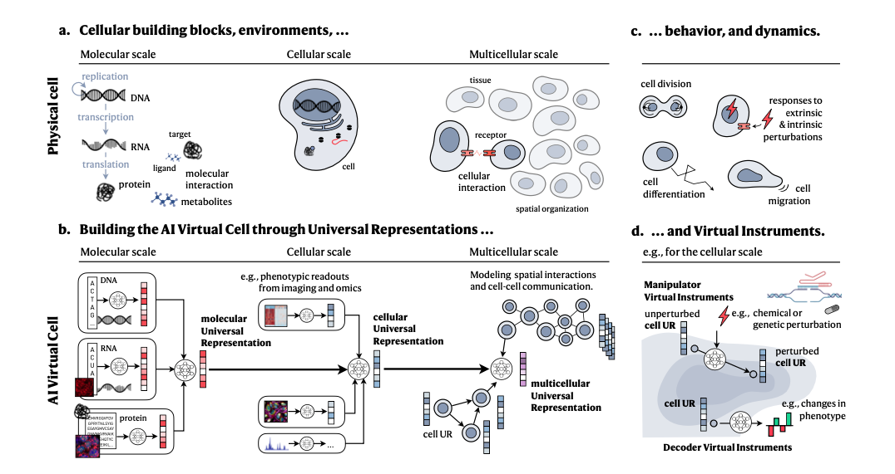

## 📊 Paper Metadata
- **Title:** How to Build the Virtual Cell with Artificial Intelligence: Priorities and Opportunities
- **Authors:** Charlotte Bunne, Yusuf Roohani, Yanay Rosen, et al.
- **Publication:** arXiv (2024, September) https://arxiv.org/abs/2409.11654 
- **Institution:** Multiple institutions including Stanford University, Chan Zuckerberg Initiative
- **Tags:** #AIVirtualCell #CellBiology #ArtificialIntelligence #BiologicalModeling

## 🎯 Core Contributions
1. Proposes a vision for AI Virtual Cells (AIVC) that can learn and represent cellular systems under different conditions
2. Introduces a framework for universal representations across molecular, cellular, and multicellular scales
3. Presents the concept of Virtual Instruments for interpreting and manipulating cellular representations
4. Outlines key challenges and requirements for developing AIVCs, including data needs and evaluation strategies

## 📋 Paper Structure
### 1. Introduction
- Background: Cells are complex systems with behaviors that challenge current modeling approaches
- Problem Statement: Need for accurate cell modeling to understand biology and disease
- Current Limitations: Traditional models are rule-based and limited in handling complexity
- Main Innovations: Proposes AI-based approach leveraging large-scale experimental data

### 2. Results/Methods
- Universal Representations (URs) across three scales:
  - Molecular scale (DNA, RNA, proteins)
  - Cellular scale (single cell states)
  - Multicellular scale (cell-cell interactions)
- Virtual Instruments:
  - Decoder VIs: Convert representations to human-understandable output
  - Manipulator VIs: Transform between different cellular states

### 3. Discussion
- Key Applications:
  - Drug target identification
  - Cellular response prediction
  - Hypothesis exploration
- Implementation Requirements:
  - Large-scale data collection
  - Evaluation frameworks
  - Community engagement

## 🔬 Technical Details
### Algorithm Framework
1. Core Components:
   - Multi-modal foundation models
   - Universal representation layers
   - Virtual Instruments for manipulation and analysis
2. Key Technologies:
   - Transformers for sequence data
   - CNNs for imaging data
   - Graph Neural Networks for spatial relationships
   - Diffusion models for state transitions

## 💭 Critical Analysis
### Strengths
1. Comprehensive vision for integrating AI with cell biology
2. Multi-scale approach addressing different levels of biological organization
3. Focus on practical applications and implementation requirements

### Limitations
1. Requires massive amounts of biological data
2. Computational complexity and resource requirements
3. Challenges in ensuring biological accuracy and interpretation

### Future Directions
1. Development of standardized evaluation frameworks
2. Creation of collaborative platforms for model development
3. Integration with experimental biology workflows

## 📌 Key Takeaways
1. AI Virtual Cells represent a transformative approach to understanding cellular biology
2. Success requires open collaboration across academia, industry, and philanthropy
3. Universal representations and Virtual Instruments provide a framework for implementation
4. Emphasis on responsible development and ethical considerations

