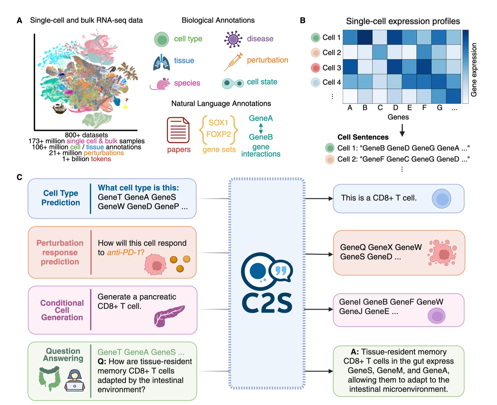

## 📊 Paper Metadata
- **Title**: Scaling Large Language Models for Next-Generation Single-Cell Analysis
- **Authors**: Syed Asad Rizvi, Daniel Levine, Aakash Patel, Shiyang Zhang, Eric Wang, et al.
- **Institution**: Yale University, Google Research, Google DeepMind
- **Publication**: bioRxiv preprint (April 17, 2025)
- **Paper Link**: https://doi.org/10.1101/2025.04.14.648850

## 🔄 Key Scientific Insights

### 1. Cell2Sentence Framework Enhancement
- The paper scales up the Cell2Sentence (C2S) framework to create C2S-Scale, using large language models (LLMs) for single-cell RNA sequencing (scRNA-seq) analysis
- Key innovation: Representing scRNA-seq profiles as textual "cell sentences" (sequences of gene names ordered by expression level)
- Demonstrates that LLMs can model complex biological relationships when scaled to 27 billion parameters

### 2. Multimodal Integration Capabilities
- Integrates transcriptomic data with biological text, metadata, and annotations
- Trains on a corpus of over 1 billion tokens from 50+ million human and mouse cells
- Creates a unified platform bridging gene expression data and natural language

### 3. Demonstrated Scaling Laws
- Shows consistent performance improvements across model sizes (410M to 27B parameters)
- Establishes performance scaling laws for LLMs in single-cell analysis
- Improvements hold across both fully fine-tuned and parameter-efficient regimes

## 🔬 Critical Technical Details

### 1. Model Architecture and Training
- Uses Gemma-2 and Pythia LLM architectures (410M, 1B, 2B, 9B, and 27B parameters)
- Trains on 150 million multi-task training samples from 50 million cells
- Supports extended context lengths up to 8192 tokens for multi-cell analysis

### 2. Single-Cell Fréchet Inception Distance (scFID)
- Novel metric adapting FID for evaluating single-cell generative models
- Uses foundation model embedding space rather than raw expression values
- Provides more biologically meaningful assessment of generated cells

### 3. Reinforcement Learning Enhancement
- Implements Group Relative Policy Optimization (GRPO) for further refinement
- Targets specific gene programs for perturbation response prediction
- Improves performance on complex biological reasoning tasks

## 💭 Critical Research Implications

### 1. Natural Language Interpretation of scRNA-seq
- Enables interpretation at multiple biological scales (cell, cluster, dataset)
- Outperforms specialized single-cell models and general-purpose LLMs
- Creates a more accessible and intuitive interface for biologists

### 2. Spatial Analysis and Multi-cell Context
- Learns spatial reasoning from multi-cell neighborhoods without architectural modifications
- Integrates gene interaction data from BioGRID and CellPhoneDB
- Models complex cell-cell interactions and niche environments

### 3. Perturbation Response Prediction
- Accurately predicts cellular responses to unseen perturbations
- Generalizes to novel combinations of cell type, perturbations, and exposure
- Captures nonlinear synergistic effects better than existing methods

## 💡 Implementation Notes

### 1. Cell Sentence Transformation
- Rank-orders genes by expression level and concatenates their names
- Preserves relative expression information with minimal information loss
- Reversible transformation allows conversion back to expression values

### 2. Multi-Task Training Framework
- Diverse tasks including cell type annotation, tissue inference, perturbation prediction
- Natural language prompts for conditioning generation tasks
- Question-answering capabilities for complex biological reasoning

C2S-Scale（Cell2Sentence Scale）与其他单细胞基础模型（scFMs）的主要区别在于:

1. **数据表示方法**：C2S将基因表达数据转换为"细胞句子"（cell sentences）- 按表达水平排序的基因名称序列，而不是使用原始表达矩阵。这使得它可以直接利用LLM架构，无需自定义修改。

2. **模型架构**：C2S-Scale使用通用LLM架构（如Gemma-2和Pythia），而不是设计专门的单细胞架构。其他scFMs如scGPT、Geneformer、scFoundation等通常使用定制架构。

3. **模型规模**：C2S-Scale探索了大规模模型（最大到27B参数），展示了规模扩展的好处。相比之下，其他scFMs通常规模较小。

4. **多模态整合**：C2S-Scale将转录组数据与自然语言文本（论文摘要、基因集、疾病标签等）无缝整合，创建了连接基因表达和自然语言的桥梁。

5. **任务多样性**：C2S能够处理多种任务类型，包括预测性任务（细胞类型注释）和生成性任务（扰动响应预测、条件细胞生成），而许多专门的scFMs通常聚焦于特定类型的任务。

6. **自然语言解释**：C2S-Scale在生物学不同尺度（单细胞、聚类、数据集）提供自然语言解释，创建了更直观的生物学数据交互方式。

7. **多细胞上下文**：C2S-Scale支持多细胞分析和空间推理，能够同时处理和生成多个细胞的数据，使其能分析细胞间相互作用。

8. **强化学习优化**：使用GRPO（Group Relative Policy Optimization）进一步优化模型性能，特别是在复杂的生物学推理任务上。

