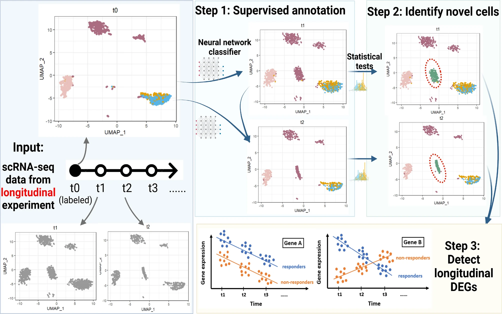

# CASi: A framework for cross-timepoint analysis of single-cell RNA sequencing data 
Scientific Reports (2024 May)

The University of Texas MD Anderson Cancer Center 

文章link：
https://www.nature.com/articles/s41598-024-58566-x 

Github link：
https://github.com/yizhuo-wang/CASi 

## Summary
This paper presents CASi, a comprehensive framework for analyzing single-cell RNA seq data from multi-timepoint experiments.
The key aspects of CASi are:
1. 跨时间点细胞注释：使用人工神经网络分类器，借用跨时间点的信息来准确注释细胞。
2. 检测潜在的新细胞类型：CASi使用基于相关性和t检验的管道来可靠地区分仅在后期时间点出现的新细胞类型。
3. 细胞群体演变的可视化：结合使用UMAP图和鱼图来可视化细胞群体随时间的演变。
4. 识别时间差异表达基因（tDEGs）：通过结合广义线性模型和迭代特征选择，识别在不同组/条件之间随时间显著变化并具有不同模式的基因。

## Structure
1. Introduction
- Background on scRNA and its analysis pipeline
- Challenges in analyzing multi-timepoin scRNA-seq data
- Lack of comprehensive computational tools for multi-timepoint scRNA-seq analysis
2. Methods and Materials
- Overview of the CASi framework
- Description of the neural networks used for cross-timepoint cell annotation
- Pipeline for identifying novel cell types that emerge over time
- Identification of temporal tDEGs
- Evaluation metrics used to assess CASi's performance
3. Results
- Simulation study
    - A. CASi's accuracy in cross-timepoint cell annotation
    - B. CASi's ability to address the possibility of novel cell types
    - C. Visualization of cell type evolution using fish plots
    - D. CASi's performance in identifying tDEGs
- Application to a real-world multi-timepoint dataset (mantle cell lymphoma)
    - A. Cross timepoint annotation results
    - B. Identification of tDEGs and enrichment analysis
4. Discussion
- Summary of CASi's advantages and innovations
- Potential limitations and future extensions of the framework

## Algorithm Framework

An overview of the CASi framework. The input is scRNA-seq data from different timepoints’ experiments. CASi mainly consists of three steps: (1) cross-time points cell annotation, (2) detection of potential novel cell types, (3) identification of temporal differentially expressed genes.

在这篇论文中，作者使用人工神经网络(Artificial Neural Networks, ANNs)来完成跨时间点的细胞注释任务。我们可以将神经网络看作是一个模仿人脑学习过程的计算模型。它由大量的互联节点（神经云）组成，通过调整节点之间的连接权重，不断从数据中学习特征，最终建立起输入数据和输出结果之间的复杂映射关系。

在跨时间点细胞注释的场景下：
1. 输入数据：来自初始时间点(t0)的细胞的基因表达数据及其对应的细胞类型标签，以及来自后续时间点(t1, t2)的细胞的基因表达数据。
2. 网络结构:作者设计了一个包含输入层、三个隐藏层和输出层的全连接神经网络。每层之间通过权重矩阵连接,并使用ReLU激活函数引入非线性变换。
3. 训练过程:使用t0时间点的数据对网络进行训练,通过前向传播计算预测输出,再通过反向传播算法更新权重以最小化预测标签与真实标签之间的差异。这个过程不断迭代,直到网络收敛或达到预设的停止条件。
4. 推断过程:将训练好的网络应用于t1和t2时间点的数据,根据细胞的基因表达谱预测其对应的细胞类型。
5. 优化策略:为了提高训练效率和模型性能,作者采用了一些优化策略,如使用Adam优化器、小批量训练、早停法和Dropout正则化等。

## Workflow
1. 数据输入:
    - 来自多个时间点(如t0、t1和t2)的单细胞RNA测序数据。
    - t0数据需要预先标记细胞类型,可以使用现有的无监督或有监督方法进行标记。
2. 跨时间点细胞注释:
    - 使用t0数据训练人工神经网络分类器。
    - 将训练好的分类器应用于t1和t2数据,对细胞进行注释。
    - 如果t0数据没有预先标记,CASi会首先对t0数据进行无监督聚类,然后将聚类结果作为细胞类型标签,再训练分类器。
3. 新细胞类型识别:
    - 通过特征选择和降维方法提取信息。
    - 使用Louvain算法对每种细胞类型进行聚类,将其分为两个亚群。
    - 使用t检验比较两个亚群与已知细胞类型的相关性,确定可能的新细胞类型。
    - 结合外部生物学知识和专家意见,确认新细胞类型的身份。
4. 细胞群体演变可视化:
    - 使用UMAP降维方法对细胞进行可视化。
    - 绘制鱼骨图(Fishplot)展示不同时间点细胞群体的演变。
5. 时序差异表达基因(tDEG)识别:
    - 对每个基因拟合广义线性模型(GLM),将时间变量、分组变量及其交互项作为自变量,基因表达量作为因变量。
    - 使用迭代特征选择方法筛选出随时间显著变化且在不同组间变化模式不同的基因,即tDEG。
6. 结果评估与比较:
    - 在模拟数据和真实数据上评估CASi的性能,并与其他现有方法进行比较。
    - 使用准确率和ARI指标评估细胞注释性能。
    - 使用TDR指标评估tDEG识别性能。
7. 结果解释与讨论:
    - 对CASi的优势和创新点进行总结。
    - 讨论当前方法的局限性以及未来可能的改进方向。

## Baseline Model, Evaluation Metrics, and Datasets

1. Baseline models for cell annotation:
    1. scmap
    2. CHETAH
    3. scPred
2. Baseline models for detecting differentially expressed genes (DEGs):
    1. DESeq2
    2. MAST
    3. Wilcoxon Rank Sum test (as implemented in the FindMarker() function of the Seurat package)

3. Model evaluation metrics:
    - For cell annotation:
        a. Accuracy: The proportion of correctly labeled cells in the t1 and t2 datasets.
        b. Adjusted Rand Index (ARI): A measure of clustering similarity that compares the predicted cell labels with the ground truth labels. ARI accounts for chance agreements and is more suitable for imbalanced datasets.
    - For detecting novel cell types:
        They visually compared the UMAP plots of the ground truth and the predicted cell types to assess the ability of CASi to identify novel cell types.
    - For identifying temporal differentially expressed genes (tDEGs):
        True Discovery Rate (TDR): The proportion of true positives among all the genes identified as tDEGs. TDR is equivalent to 1 - False Discovery Rate (FDR).
4. 数据集：
    - 模拟数据集， 作者生成了模拟单细胞RNA-seq数据集，以模拟在现实世界研究中可能遇到的各种情景。他们使用10X Genomics公开的外周血单核细胞（PBMCs）数据集作为模拟的基础。生成了三种不同情景的模拟数据集：
        a. 情景1：t0、t1和t2数据包含相同的细胞类型，但细胞类型的组成不同。
        b. 情景2：在t0中存在的一种细胞类型在t1和t2数据中消失。
        c. 情景3：在t1和t2数据中出现了一种新的细胞类型，而在t0数据中不存在。
        
        对于每个情景，作者进行了200次蒙特卡罗模拟，以评估CASi的性能，并使用细胞注释的准确性和ARI指标以及识别tDEGs的TDR指标，将其与基准模型进行比较。
    - 真实数据集，作者将CASi应用于一组来自套细胞淋巴瘤（MCL）患者的真实单细胞RNA-seq数据集。该数据集从欧洲基因-表型档案（EGA）数据库中获取，登录号为EGAS00001005019。MCL数据集包括从5位患者（3位对伊布替尼有反应，2位无反应）在不同时间点（治疗前和治疗后）收集的样本。

## Computing Language, Tools, Packages, and Resources
1. 计算机语言:
    - Python:主要用于实现神经网络模型和数据分析管道。
    - R:用于部分数据分析和可视化任务。
2. Python软件包:
    - Keras:一个高层神经网络API,用于构建和训练神经网络模型。
    - UMAP (Uniform Manifold Approximation and Projection):用于数据降维和可视化。
    - Louvain algorithm:用于细胞聚类和社区检测。
3. R软件包:
    - Seurat:用于单细胞数据分析和可视化。
    - scran:单细胞数据分析工具包。
    - SINCERA:单细胞RNA测序数据分析流程。
    - scmap:跨数据集投影单细胞RNA测序数据。
    - CHETAH:层次化的细胞类型鉴定方法。
    - DESeq2:差异表达分析工具。
    - MAST:单细胞差异表达分析工具。

