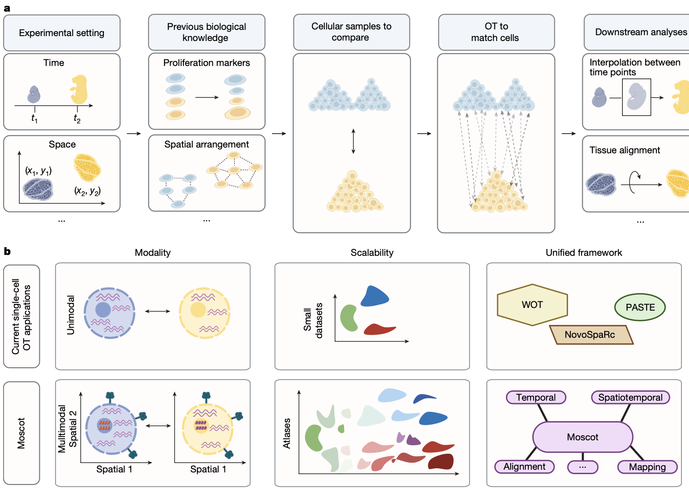
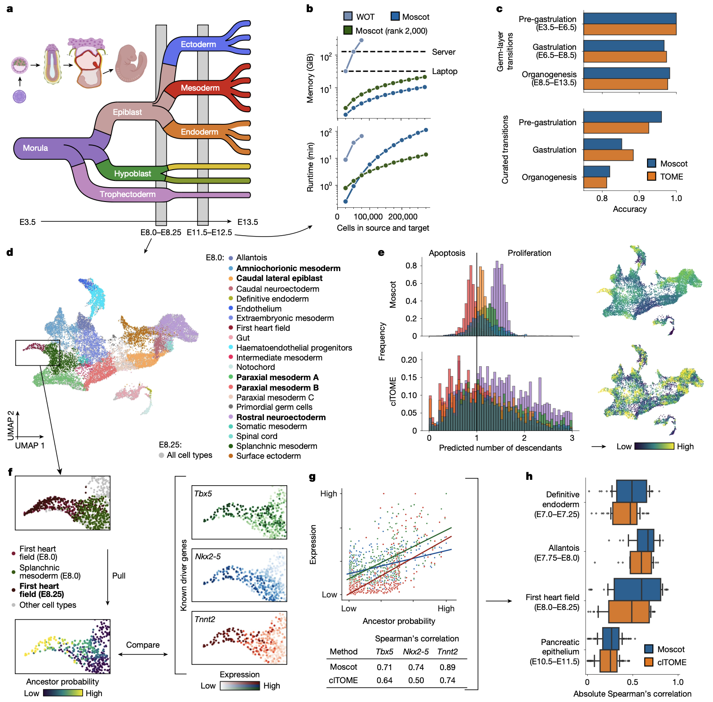

# MOSCOT-Nature-2025.md

## 📊 Paper Metadata
- **Title:** Mapping cells through time and space with moscot
- **Authors:** Dominik Klein, Giovanni Palla, Marius Lange, Michal Klein, Zoe Piran, et al.
- **Publication:** Nature (2025)
- **Institution:** Helmholtz Center Munich, Technical University of Munich, Apple, Hebrew University of Jerusalem, Google DeepMind
- **Paper Link:** https://doi.org/10.1038/s41586-024-08453-2
- **Code/Data:** https://moscot-tools.org, https://github.com/theislab/moscot-framework_reproducibility

## 🎨 Key Figures

### Figure 1: moscot-framework-overview.png


**Why this figure is exceptional:**
- **Unified conceptual design:** Clearly illustrates how moscot unifies temporal, spatial, and spatiotemporal optimal transport applications under a single framework
- **Technical innovation showcase:** Demonstrates three key advances - multimodality support, atlas-scale scalability, and consistent API design
- **Implementation clarity:** Shows the generic OT pipeline from experimental design to downstream analysis with concrete biological examples
- **Methodological positioning:** Effectively contrasts current fragmented approaches (WOT, NovoSpaRc, PASTE) with moscot's unified solution

**Design principles to mimic:**
- Hierarchical panel layout showing progression from problem to solution
- Integration of biological context with technical methodology
- Clear visual distinction between existing limitations and new capabilities
- Quantitative scalability comparisons (small datasets → atlases)

### Figure 2: developmental-trajectories-benchmark.png


**Scalability and accuracy excellence:**
- **Atlas-scale demonstration:** Successfully processes 1.7 million cells across 20 time points where competing methods fail
- **Biological validation:** Achieves comparable accuracy to TOME despite massive scale difference
- **Technical superiority:** Linear memory complexity enables laptop processing vs. server requirements for alternatives
- **Growth rate realism:** Produces biologically plausible apoptosis rates (2-4%) vs. unrealistic predictions (>19%) from alternatives

**Template value for your studies:**
- Memory and runtime benchmarking methodology
- Biological accuracy metrics (germ-layer and cell-type transitions)
- Growth rate validation against known developmental biology
- Driver gene correlation analysis framework

## 🔄 Key Scientific Insights

```python
### 1. Conceptual Innovation
- **Unified OT Framework:** First scalable framework supporting multimodal data across temporal, spatial, and spatiotemporal applications
- **Three OT Formulations:** Wasserstein (W-type), Gromov-Wasserstein (GW-type), and Fused Gromov-Wasserstein (FGW-type) for different biological scenarios
- **Spatiotemporal Mapping:** Novel approach leveraging both gene expression and spatial information for trajectory inference

### 2. Methodological Framework
- **Scalable Architecture:** Linear time/memory complexity through low-rank approximations and online cost evaluation
- **Multimodal Integration:** Supports CITE-seq, multiome (RNA+ATAC), and spatial transcriptomics simultaneously
- **Technical Variants:**
  1. **moscot.time:** Temporal cell mapping with growth/death modeling (1.7M cells)
  2. **moscot.space:** Spatial reference mapping with multimodal transfer (367K cells)  
  3. **moscot.alignment:** Multi-slide alignment for common coordinate frameworks
  4. **moscot.spatiotemporal:** Joint spatial-temporal trajectory inference

### 3. Validation Strategy
**Comprehensive Evaluation Across:**
- **1.7 million cells** spanning mouse embryogenesis (E3.5-E13.5)
- **500,000 spatial locations** from MERSCOPE liver and brain datasets
- **Multimodal applications** including CITE-seq protein mapping and ATAC-seq accessibility
- **Experimental validation** of NEUROD2 as epsilon cell regulator in human iPSC-derived islets
```

## 🔬 Critical Technical Details
```python
### 1. Optimal Transport Formulations

# Core mathematical framework:
- W-type: Compares cells with same features across time/conditions
- GW-type: Compares cells in different feature spaces (spatial mapping)
- FGW-type: Combines expression similarity + spatial correspondence

### 2. Scalability Innovations
- **Linear Memory:** Online cost evaluation reduces O(n²) to O(n) memory
- **GPU Acceleration:** JAX-based implementation with just-in-time compilation  
- **Low-rank Approximation:** Constrains coupling matrices for linear time complexity
- **Entropic Regularization:** Sinkhorn algorithm for efficient optimization

### 3. Performance Metrics
- **10-100x faster** than existing methods on equivalent datasets
- **1000x larger** datasets processable (1.7M vs 75K cells for WOT)
- **Linear scaling** vs quadratic/cubic for competing approaches
- **Biological accuracy** maintained across scale increases
```

## Baseline Models, Evaluation Metrics, and Datasets
```python
### Baseline Models (8 methods)
- **Temporal:** WOT, TOME, clTOME (cell-level extension)
- **Spatial:** NovoSpaRc, Tangram, gimVI  
- **Alignment:** PASTE, PASTE2, GPSA

### Evaluation Metrics
- **Primary:** Germ-layer transition accuracy, curated cell-type transitions, driver gene correlations
- **Spatial Quality:** Spatial correspondence, held-out gene imputation accuracy
- **Scalability:** Memory consumption, runtime scaling, maximum dataset size

### Datasets
- **Temporal:** Mouse embryogenesis atlas (1.7M cells, 20 timepoints)
- **Spatial:** Mouse liver CITE-seq + MERSCOPE, mouse brain coronal sections
- **Spatiotemporal:** MOSTA embryogenesis (500K spatial locations, 8 timepoints)
- **Multimodal:** Mouse pancreas development (22K nuclei, RNA+ATAC)
```

## 💭 Critical Research Implications
```python
### 1. Methodological Impact
- **Scale Barrier Removal:** Enables atlas-level temporal trajectory inference previously impossible
- **Multimodal Integration:** First framework to natively support multiple molecular modalities in OT
- **Unified Implementation:** Consolidates fragmented tool landscape under consistent API

### 2. Biological Discovery Potential
- **Developmental Biology:** Detailed lineage tracing at unprecedented scale and resolution
- **Spatial Biology:** Enhanced spatial transcriptomics through multimodal reference mapping
- **Disease Studies:** Spatiotemporal analysis of pathological processes and therapeutic responses

### 3. Computational Biology Insights
- **OT Versatility:** Demonstrates optimal transport as universal framework for single-cell alignment problems
- **Engineering Principles:** Shows how algorithmic advances + engineering optimization enable biological discovery
- **Software Sustainability:** Provides extensible platform for future single-cell alignment challenges
```

## 🚀 Future Directions & Limitations
```python
### Potential Extensions
- **Neural OT Integration:** Combining discrete OT with continuous neural transport for out-of-sample prediction
- **Perturbation Analysis:** Extending to cellular response mapping and drug mechanism studies  
- **3D Tissue Reconstruction:** Full 3D spatiotemporal modeling from serial sections
- **Multi-condition Alignment:** Simultaneous mapping across multiple experimental conditions

### Current Limitations
- **Discrete OT Constraint:** Limited to within-sample mappings, no out-of-sample prediction capability
- **Computational Requirements:** Still requires substantial memory for very large datasets (>5M cells)
- **Spatial Resolution:** Dependent on underlying spatial technology resolution limits
- **Parameter Sensitivity:** Requires careful tuning of regularization parameters for optimal performance

### Open Questions
- How to optimally integrate more than two modalities simultaneously?
- Can spatiotemporal priors be learned from data rather than manually specified?
- What are the theoretical limits of OT accuracy for biological trajectory inference?
```

## 📋 Implementation Checklist
```python
### For Reproducing Results
- [ ] Install moscot package with GPU support (JAX backend)
- [ ] Download mouse embryogenesis atlas (1.7M cells, ~50GB)
- [ ] Configure computing environment (>32GB RAM recommended for large datasets)
- [ ] Set up spatial transcriptomics analysis dependencies (squidpy, scanpy)

### For Adapting to New Domains
- [ ] Define appropriate cost functions for your biological system
- [ ] Determine optimal OT formulation (W-type, GW-type, or FGW-type)
- [ ] Establish biological validation metrics relevant to your questions
- [ ] Implement domain-specific preprocessing and quality control
- [ ] Tune regularization parameters for your data characteristics
```

## 🔗 Related Work & Context
- **Predecessor Methods:** Builds upon WOT for temporal inference and NovoSpaRc for spatial mapping, unifying approaches
- **Competing Frameworks:** Advances beyond Tangram, PASTE, and gimVI through scalability and multimodal support  
- **Complementary Tools:** Integrates with CellRank for downstream trajectory analysis and squidpy for spatial statistics
- **Technical Foundation:** Leverages optimal transport theory advances in machine learning (Sinkhorn, low-rank approximations)

---
*Note based on analysis of: Klein et al. "Mapping cells through time and space with moscot." Nature (2025)*
