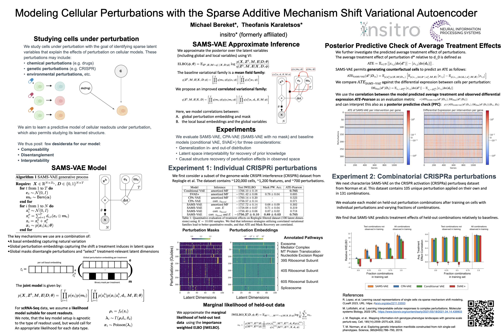

## 📊 Paper Metadata
- **Title:** Modeling Cellular Perturbations with the Sparse Additive Mechanism Shift Variational Autoencoder
- **Authors:** Michael Bereket, Theofanis Karaletsos
- **Publication:** 37th Conference on Neural Information Processing Systems (NeurIPS 2023) https://arxiv.org/abs/2311.02794 
- **Institution:** insitro (formerly affiliated)
- **Code:** https://github.com/insitro/sams-vae
- **Tags:** #VAE #CellularPerturbation #DeepLearning #Bioinformatics #SingleCell

## 🎯 Core Contributions
1. Introduction of SAMS-VAE, a novel generative model that combines sparse perturbation-specific latent effects with natural cell variation
2. Development of sophisticated inference strategies for improved model fitting
3. Introduction of evaluation framework based on average treatment effects for perturbation models
4. Demonstration of superior performance in generalization and biological pathway recovery

## 📋 Paper Structure

### 1. Introduction
- Background: Need for modeling cellular responses to diverse interventions in drug discovery
- Problem: Existing models lack effective combination of compositionality, disentanglement, and interpretability
- Innovation: SAMS-VAE combines these elements through sparse additive mechanism shifts

### 2. Methods/Results
- SAMS-VAE Architecture
  - Models latent state as sum of basal state and perturbation effects
  - Uses sparse binary masks for feature selection
  - Employs correlated variational families for inference
- Evaluation Framework
  - Marginal likelihood estimation
  - Average treatment effects with posterior predictive checks
- Experimental Validation
  - Performance on single-cell RNA sequencing datasets
  - Comparison with baseline models

### 3. Discussion
- SAMS-VAE outperforms baselines in generalization tasks
- Shows improved ability to recover known biological mechanisms
- Provides interpretable latent structures
- Enables better prediction of combination effects

## 🔬 Technical Details

### Algorithm Framework
1. Core Components:
   - Latent basal state embedding
   - Global perturbation embeddings
   - Binary masks for sparsity
   - Variational inference scheme

2. Key Innovations:
   - Additive composition of perturbation effects
   - Sparse mechanism shifts
   - Correlated variational families

## 📊 Evaluation

### Baseline Models
- CPA-VAE
- SVAE+
- Conditional VAE

### Evaluation Metrics
1. Test IWELBO (Importance Weighted ELBO)
2. ATE-Pearson correlation
3. Mask pathway prediction accuracy

### Datasets
1. Replogle-filtered dataset:
   - ~118,461 cells
   - 1,187 gene features
   - 722 unique CRISPR guides

2. Norman et al. CRISPRa dataset:
   - 111,255 cells
   - 5,000 gene features
   - 105 unique perturbations

## 💭 Critical Analysis

### Strengths
1. Strong theoretical foundation combining multiple valuable properties
2. Comprehensive evaluation framework
3. Superior performance on real biological datasets
4. Interpretable results aligning with known biology

### Limitations
1. Requires careful tuning of sparsity parameters
2. Computational complexity of inference
3. Limited to binary dosage scenarios

## 📌 Key Takeaways
1. SAMS-VAE effectively combines compositionality, disentanglement, and interpretability
2. Shows superior performance in both predictive and interpretative tasks
3. Provides a valuable tool for understanding cellular responses to perturbations
4. Advances the field of machine learning-driven scientific discovery

## 💡 Personal Notes
- The paper represents a significant advance in modeling cellular perturbations
- The combination of sparsity and additive effects is particularly elegant
- The evaluation framework could be valuable for other biological machine learning applications
