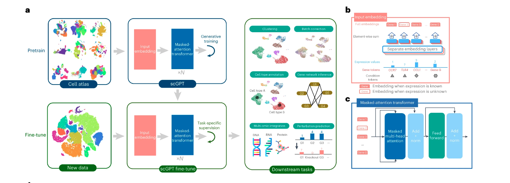

# scGPT: Toward Building a Foundation Model for Single-cell Multi-omics using Generative AI

## 📊 Paper Metadata
- **Title:** scGPT: Toward Building a Foundation Model for Single-cell Multi-omics using Generative AI
- **Authors:** [Author Names]
- **Publication:** Nature Methods (February 2024)
- **Institution:** University of Toronto
- **Paper Link:** https://www.nature.com/articles/s41592-024-02201-0
- **Code:** https://github.com/bowang-lab/scGPT
- **Tags:** #foundation-model #deep-learning #single-cell #multi-omics #transformer

## 🎯 Core Contributions
1. Large-scale foundation model trained on 33 million human cells using transformer architecture
2. Simultaneous learning of cell and gene representations capturing complex interactions
3. Demonstrated versatility across multiple downstream tasks through fine-tuning
4. Superior performance compared to task-specific models
5. Ability to extract biologically meaningful gene programs and cell-state-specific networks

## Summary
这篇文章介绍了一个名为scGPT的单细胞基因组学基础模型。以下是文章的主要内容概述:
1. scGPT是一个基于transformer架构的大规模预训练模型,在3300万个人类细胞的数据上进行了训练。
2. 该模型可以同时学习细胞和基因的表示,捕捉复杂的基因-基因和基因-细胞相互作用。
3. scGPT展示了强大的泛化能力,可以通过微调适应多种下游任务,包括:
   - 细胞类型注释
   - 基因扰动响应预测  
   - 多批次数据整合
   - 多组学数据整合
   - 基因调控网络推断
4. 在这些任务上,scGPT的性能优于专门为单一任务设计的模型。
5. 模型可以提取生物学上有意义的基因程序和细胞状态特异的基因网络激活模式。
6. 研究发现预训练数据量越大,下游任务性能越好,表明该方法有潜力随着测序数据的增长而不断改进。
7. 作者认为scGPT为单细胞基因组学研究提供了一个通用的基础,可以加速这一领域的发现。

## 📋 Paper Structure
### 1. Introduction
- Evolution and challenges in single-cell sequencing
- Potential of foundation models in single-cell analysis
- Overview of scGPT's features and contributions

### 2. Results
#### 2.1 Model Overview
- Architecture design
- Pretraining dataset description
- Initial visualization results

#### 2.2 Cell Type Annotation
- Multi-dataset experiments
- Performance comparisons
- Validation results

#### 2.3 Perturbation Response Prediction
- Task setup and experiments
- Comparison with existing methods
- Reverse perturbation exploration

#### 2.4 Multi-modal Integration
- scRNA-seq batch integration
- Multi-omics data integration
- Comparative analysis

#### 2.5 Gene Network Analysis
- Gene embedding-based network analysis
- Attention-based interaction analysis
- Biological validation

#### 2.6 Transfer Learning Analysis
- Scale effects on performance
- Context influence on downstream tasks


#### 迁移学习中的缩放效应和上下文效应：
    想象你是一个厨师，正在学习烹饪各种菜肴。
    1. 缩放效应：
    这就像你学习烹饪的经验越多，你就越擅长。
    - 如果你只学过做10道菜，你可能只能应付简单的家常菜。
    - 但如果你学过1000道菜，你可能就能应付各种复杂的菜肴和不同的烹饪风格。
    在机器学习中：
    - 更多的训练数据（更多的"菜谱"）通常会让模型（"厨师"）在各种任务上表现得更好。
    - 文章发现，预训练时使用的细胞数量越多，模型在各种下游任务上的表现就越好。
    2. 上下文效应：
    这就像你在意大利餐厅工作多年后，突然被要求做中餐。
    - 如果你要做意大利面，你会表现得很好。
    - 但如果要你做麻婆豆腐，你可能就会有些困难。
    在机器学习中：
    - 模型在与其预训练数据相似的任务上表现更好。
    - 例如，在血液细胞数据上预训练的模型在处理血液相关任务时表现更好，但在处理脑细胞数据时可能就不那么出色。
    实际应用：
    - 缩放效应告诉我们，收集更多diverse的数据通常是有益的。
    - 上下文效应提醒我们，为特定任务选择相关的预训练数据很重要。
    - 但是，像"全人类"模型这样在非常diverse的大数据集上训练的模型，可能在各种任务上都有不错的表现。
    总之，这两种效应帮助我们理解如何更好地利用预训练模型，以及如何为特定任务选择或准备最合适的模型。
3. 讨论
   - 总结scGPT的主要贡献和优势
   - 讨论模型的生物学解释性
   - 探讨未来研究方向和潜在应用
4. 方法
   - 详细描述模型架构、预训练和微调策略
   - 介绍各种下游任务的具体实现
   - 描述评估指标和基准测试设置
5. 数据可用性和代码可用性
6. 参考文献
7. 致谢、作者贡献和利益冲突声明
8. 补充材料（在线版本中提供）

## Workflow
1. 数据预处理：
   - 将单细胞测序数据处理成细胞-基因矩阵
   - 对基因表达值进行归一化和分箱处理
   - 为基因、表达值和条件（如批次、模态）创建输入嵌入
2. 预训练：
   - 在大规模单细胞数据集（3300万个人类细胞）上进行自监督预训练
   - 使用特殊的注意力掩码机制进行生成式预训练
   - 同时学习细胞和基因的表示
3. 微调：
   - 根据特定的下游任务对预训练模型进行微调
   - 使用各种目标函数，如基因表达预测(GEP)、细胞相似性(ECS)等
   - 可以针对不同任务（如细胞类型注释、批次整合等）进行优化
4. 下游任务应用：
   - 细胞类型注释：使用微调后的模型预测细胞类型
   - 扰动响应预测：预测基因扰动后的表达变化
   - 批次整合：去除批次效应，保留生物学变异
   - 多组学整合：整合来自不同组学的数据
   - 基因调控网络推断：利用注意力机制分析基因间相互作用
5. 评估与验证：
   - 与现有方法进行基准测试比较
   - 使用各种指标评估模型性能
   - 通过已知生物学知识验证模型发现的基因网络和通路
6. 模型分析：
   - 探索预训练数据规模对性能的影响
   - 分析预训练上下文（如特定器官）对下游任务的影响

这个工作流程体现了"普遍预训练，按需微调"的方法，使scGPT能够适应各种单细胞基因组学分析任务。
## Algorithm Framework
## 📋 Model Overview

a. scGPT的工作流程。该模型在来自细胞图谱的大规模scRNA-seq数据上进行生成式预训练。scGPT的核心组件包含堆叠的Transformer块，带有专门的注意力掩码用于生成式训练。对于下游应用，预训练模型参数可以在新数据上进行微调。我们将scGPT应用于各种任务，包括细胞类型注释、批次校正、多组学整合、基因扰动预测和基因网络推断。

b. 输入数据嵌入的详细视图。输入包含三层信息：基因标记、表达值和条件标记（模态、批次、扰动条件等）。

c. scGPT Transformer层的详细视图。我们在掩码多头注意力块中引入了专门设计的注意力掩码，以在单细胞测序数据上进行生成式预训练。Norm表示层归一化操作。

这篇文章描述的scGPT的算法框架主要包括以下几个关键组成部分：

1. 输入嵌入层 Input embedding layer：
   - 基因令牌嵌入 Gene token embedding：将基因名转换为唯一的整数标识符
   - 表达值嵌入 Expression value embedding：对基因表达值进行分箱处理并嵌入
   - 条件令牌嵌入 Condition token embedding：编码批次、模态等元信息

2. Transformer架构：
   - 多层堆叠的transformer块
   - 每个transformer块包含多头自注意力机制和前馈神经网络
   - 使用FlashAttention实现高效的自注意力计算

3. 特殊的注意力掩码机制：
   - 设计用于非顺序的单细胞数据生成式预训练
   - 支持基于基因提示和细胞提示的生成

4. 细胞表示：
   - 使用特殊的<cls>令牌聚合基因级表示为细胞级表示。 Using a special <cls> token to aggregate gene-level representations into cell-level representations.

5. 预训练目标：
   - 基于掩码的基因表达预测
   - 同时支持基因提示和细胞提示的生成

6. 微调目标：
   - 基因表达预测（GEP）
   - 细胞建模的基因表达预测（GEPC）
   - 弹性细胞相似性（ECS）
   - 反向传播的域适应（DAR）
   - 细胞类型分类

7. 下游任务适配：
   - 细胞类型注释：添加分类器层
   - 扰动预测：修改输入以包含扰动信息
   - 批次整合：加入批次和模态令牌
   - 多组学整合：处理不同类型的组学数据

8. 基因调控网络推断：
   - 基于基因嵌入的相似性网络构建
   - 利用注意力权重分析细胞状态特异的基因交互

这个算法框架展示了scGPT如何将transformer架构适配到单细胞基因组学领域，实现了从大规模数据预训练到多样化下游任务的全面应用。框架的灵活性使其能够处理各种单细胞分析任务，同时保持了对生物学解释的关注。

### 使用特殊的<cls>令牌聚合基因级表示为细胞级表示 
使用特殊的<cls>令牌聚合基因级表示为细胞级表示是一种从单个基因的表示转换到整个细胞表示的技术。这个方法借鉴了BERT等自然语言处理模型中的做法。以下是详细解释：
1. <cls>令牌的引入：
   - 在输入序列的开始添加一个特殊的<cls>（classification）令牌。
   - 这个令牌不对应任何实际的基因，而是作为一个"汇总"点。
2. 位置：
   - <cls>令牌通常放在输入序列的最开始，即第一个位置。
3. 初始化：
   - <cls>令牌像其他令牌一样被随机初始化，然后在训练过程中学习其表示。
4. 注意力机制的作用：
   - 在transformer的自注意力层中，<cls>令牌能够"关注"所有其他基因的表示。
   - 通过多层transformer处理，<cls>令牌逐渐accumulate整个序列的信息。
5. 信息聚合：
   - 随着模型的深入，<cls>令牌的表示逐渐包含了整个细胞的概括性信息。
   - 它学会了如何最佳地总结所有基因的表达模式。
6. 最终表示：
   - 在最后一层transformer之后，<cls>令牌的输出被视为整个细胞的表示。
7. 下游任务使用：
   - 对于细胞级任务（如细胞类型分类），直接使用<cls>令牌的最终表示。
   - 这个表示可以输入到后续的分类器或其他模型组件中。
8. 优势：
   - 允许模型自主学习如何最佳地聚合信息。
   - 提供了一种简单有效的方法来获得固定维度的细胞表示，无论输入的基因数量如何。
9. 实现细节：
   - 在代码中，通常是从最后一层transformer输出中提取<cls>位置的向量。
   - 例如：cell_representation = final_layer_output[:, 0, :]（假设<cls>在第一个位置）
这种方法允许模型在训练过程中学习如何最有效地总结细胞的整体特征，为下游任务提供了一个强大的细胞级表示。

```python
import torch
import torch.nn as nn

class scGPTModel(nn.Module):
    def __init__(self, vocab_size, d_model, nhead, num_layers):
        super().__init__()
        self.d_model = d_model
        
        # 基因嵌入层
        self.gene_embedding = nn.Embedding(vocab_size, d_model)
        
        # 位置编码（简化版，实际可能更复杂）
        self.pos_encoding = nn.Parameter(torch.randn(1, 5000, d_model))
        
        # Transformer编码器
        encoder_layers = nn.TransformerEncoderLayer(d_model, nhead)
        self.transformer_encoder = nn.TransformerEncoder(encoder_layers, num_layers)
        
        # <cls>令牌的嵌入
        self.cls_token = nn.Parameter(torch.randn(1, 1, d_model))

    def forward(self, x):
        # x的形状: [batch_size, seq_len]
        
        # 添加<cls>令牌到序列开头
        cls_tokens = self.cls_token.repeat(x.shape[0], 1, 1)
        x = self.gene_embedding(x)  # [batch_size, seq_len, d_model]
        x = torch.cat([cls_tokens, x], dim=1)  # [batch_size, seq_len+1, d_model]
        
        # 添加位置编码
        x = x + self.pos_encoding[:, :x.size(1), :]
        
        # 通过Transformer编码器
        x = self.transformer_encoder(x)
        
        # 提取<cls>令牌的最终表示作为细胞表示
        cell_representation = x[:, 0, :]  # [batch_size, d_model]
        
        return cell_representation

# 使用示例
vocab_size = 10000  # 假设我们有10000个唯一的基因
d_model = 256
nhead = 8
num_layers = 6

model = scGPTModel(vocab_size, d_model, nhead, num_layers)

# 模拟输入数据
batch_size = 32
seq_len = 100
input_data = torch.randint(0, vocab_size, (batch_size, seq_len))

# 获取细胞表示
cell_representations = model(input_data)

print(f"Cell representations shape: {cell_representations.shape}")
# 输出: Cell representations shape: torch.Size([32, 256])
```
1. 模型定义：
- 创建一个包含基因嵌入层、位置编码和Transformer编码器的模型。
- 定义一个可学习的<cls>令牌嵌入。
2. 输入处理：
- 在forward方法中，首先将输入的基因ID转换为嵌入。
- 然后，将<cls>令牌添加到每个序列的开头。
3. <cls>令牌的添加：
- 使用self.cls_token.repeat()来为每个批次的样本添加<cls>令牌。
- 通过torch.cat()将<cls>令牌与基因嵌入连接起来。
4. Transformer处理：
- 整个序列（包括<cls>令牌）通过Transformer编码器。
- 在这个过程中，<cls>令牌能够通过自注意力机制与所有基因交互。
5. 提取细胞表示：
- 在Transformer处理后，我们提取<cls>令牌的最终状态作为细胞表示。
- 这通过x[:, 0, :]实现，它选择每个样本序列的第一个位置（即<cls>令牌的位置）。
6. 输出：
- 最终的cell_representations包含了每个细胞的向量表示。
- 这个表示可以用于下游任务，如细胞类型分类。

## Baseline Model, Evaluation Metrics, and Datasets
Baseline Models:
1. 细胞类型注释：
   - TOSICA
   - scBERT
2. 扰动响应预测：
   - GEARS
   - 线性回归模型
3. scRNA-seq批次整合：
   - Seurat
   - Harmony
   - scVI
4. 多组学整合：
   - Seurat (v.4)
   - scGLUE
   - scMoMat

Evaluation Metrics:
1. 细胞类型注释：
   - 准确率 (Accuracy)
   - 精确率 (Precision)
   - 召回率 (Recall)
   - 宏平均F1分数 (Macro F1)
2. 扰动响应预测：
   - Pearson相关系数 (Pearson delta)
   - 差异表达基因的Pearson相关系数 (Pearson delta on differentially expressed genes)
3. 批次整合和多组学整合：
   - 生物学保守性指标：NMIcell, ARIcell, ASWcell, AvgBIO
   - 批次混合指标：ASWbatch, GraphConn, AvgBATCH
   - 综合得分
4. 基因调控网络推断：
   - 与ChIP-Atlas数据库的基因靶标验证
   - Reactome通路富集分析
Datasets:
1. 预训练数据：
   - CELLxGENE scRNA-seq集合（3300万个人类细胞）
2. 细胞类型注释：
   - 多发性硬化症(MS)数据集
   - 骨髓样细胞(Myeloid)数据集
   - 人类胰腺(Human pancreas)数据集
3. 扰动响应预测：
   - Adamson数据集
   - Norman数据集
   - Replogle数据集
4. scRNA-seq批次整合：
   - COVID-19数据集
   - PBMC 10k数据集
   - 脑皮质(Perirhinal cortex)数据集
5. 多组学整合：
   - 10x Multiome PBMC数据集（RNA + ATAC-seq）
   - BMMC数据集（RNA + 蛋白质）
   - ASAP PBMC数据集（RNA + ATAC-seq + 蛋白质）
6. 基因调控网络推断：
   - 免疫人类(Immune human)数据集
## Computing Language, Tools, Packages, and Resources

计算语言：
- Python（主要编程语言）

主要工具和框架：
1. PyTorch：用于实现scGPT神经网络模型
2. Scanpy：用于基因表达数据预处理，包括归一化、对数转换和高变异基因选择
3. EpiScanpy：用于染色质可及性数据的高变异峰选择

软件包和库：
1. torchtext (0.14.0)
2. torch-geometric (2.3.0)
3. flash-attn (1.0.1)：用于高效的自注意力计算
4. pandas (1.3.5)
5. cell-gears (0.0.1)
6. umap-learn (0.5.3)
7. leidenalg (0.8.10)
8. wandb (0.12.3)
9. scikit-learn：用于细胞注释任务中的评估指标计算
10. GSEApy：用于通路富集分析

数据资源：
1. CELLxGENE census：用于获取预训练数据
2. Gene Expression Omnibus (GEO)数据库
3. EMBL-EBI（欧洲生物信息学研究所）数据库
4. Curated Cancer Cell Atlas
5. Reactome数据库：用于通路分析
6. ChIP-Atlas数据库：用于转录因子靶标验证

其他资源：
1. BioRender：用于创建图1d的插图
2. CELLxGENE Annotate：用于创建图1a的UMAP插图

计算资源：
文章没有明确提到使用的具体计算资源，但考虑到模型的规模和数据量，很可能使用了高性能计算集群或GPU加速。

版本控制和代码共享：
- GitHub：用于公开发布scGPT的代码库
- Zenodo：用于代码存档和DOI分配

