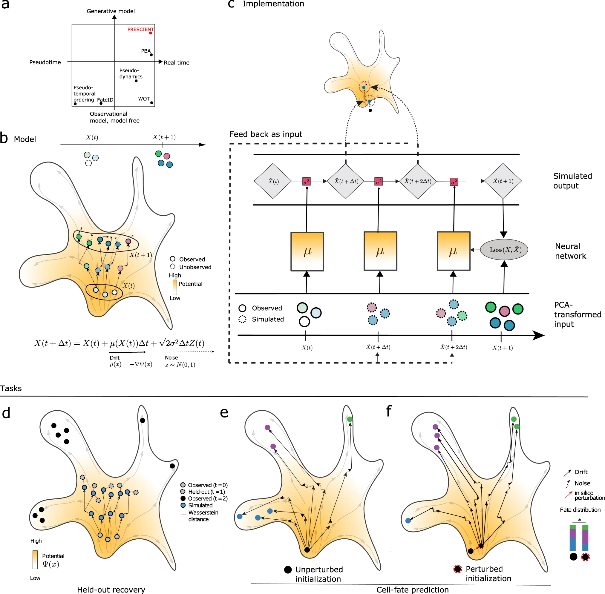

# Generative modeling of single-cell time series with PRESCIENT enables prediction of cell trajectories with interventions

Nature communications (2021 May), MIT

paper link:
https://www.nature.com/articles/s41467-021-23518-w

github link:
https://github.com/gifford-lab/prescient 

## Summary
这篇文章介绍了PRESCIENT（潜在能量基础上的单细胞梯度），这是一个生成建模框架，从时间序列单细胞RNA测序（scRNA-seq）数据中学习潜在的分化景观。
1. PRESCIENT模型：
    - 将细胞分化建模为基因表达景观上的扩散过程，该景观由一个势函数参数化，该势函数引导细胞向低潜能区域移动。
    - 通俗解释：
        站在山顶，底下的山峦就是基因表达景观，每个位置的高度代表了细胞在该状态下的“势能”。“势能”越高，细胞越不稳定；“势能”越低，细胞越稳定。
        现在，假设你是一个细胞，正在这个景观中旅行，在分化过程中，会自然从高势能滚落到低势能。这个”滚落“就是”扩散过程“。
        但是，这个过程是不完全确定的，会偶尔跳跃到一个意想不到的状态，这就像球在滚落的过程中偶尔会碰撞并偏离轨道。这种随机过程就是代表了分化过程的噪声和不确定性。
        势函数的作用就像是一张地图，告诉细胞在景观中的每个位置应该朝哪个方向滚落，引导细胞向着更稳定、更成熟的状态发展。
2. 模型拟合：
    - 通过最小化经验和预测细胞群体在观察到的时间点上的正则化Wasserstein损失来拟合模型。
    - 通俗解释：
        假设我们有一群细胞在基因表达景观中"旅行"。我们在不同的时间点对这群细胞进行快照,记录下它们的位置。这就是我们的"经验"数据。
        现在,我们要建立一个模型来模拟这个过程。这个模型就像一个虚拟的景观,我们希望它能尽可能地反映真实的情况。我们可以在模型中放置一群虚拟的细胞,让它们在这个虚拟的景观中"旅行",并在相同的时间点记录它们的位置。这就是我们的"预测"数据。
        如何判断我们的模型是否足够好呢?一个直观的方法是比较每个时间点上真实细胞和虚拟细胞的位置。如果它们非常接近,那么我们的模型就是一个好的模型。这就是"最小化经验和预测细胞群体之间的损失"的意思。
        但是,仅仅比较位置还不够。我们还需要考虑细胞的分布。如果真实细胞和虚拟细胞的位置很接近,但它们的分布却很不一样(例如,真实细胞聚集在一起,而虚拟细胞分散开来),那么我们的模型仍然不够好。Wasserstein距离就是一种能够同时考虑位置和分布的度量方法。
        "正则化"是一种防止模型过于复杂的技术。如果我们的模型太复杂,它可能会过度拟合数据中的噪声,反而失去了对真实过程的洞察。正则化就像是一个惩罚项,鼓励模型保持简单。
    #### Wasserstein距离 :
        Wasserstein距离(也称为推土机距离或Earth Mover's Distance)是一种衡量两个概率分布之间差异的指标.
    #### 正则化Wasserstein损失:
        在训练生成模型(如GAN)时,我们希望生成的分布尽可能接近真实数据分布。传统的损失函数如JS散度存在不连续和模式丢失等问题。正则化Wasserstein损失通过以下方式改进:
        使用Wasserstein距离作为衡量生成分布和真实分布差异的指标,利用其良好的数学性质。
        在损失函数中加入正则化项,鼓励生成分布在样本空间中更加平滑和连续。
        具体来说,正则化Wasserstein损失可以表示为:
            oss = Wasserstein距离(生成分布,真实分布) + λ * 正则化项
        其中正则化项可以是生成样本之间的Wasserstein距离、梯度惩罚项等,用于约束生成分布的平滑性和连续性。
3. 细胞增殖的纳入：
    - PRESCIENT通过根据每个细胞的预期后代数量对源细胞群中的每个细胞进行加权，纳入了细胞增殖的影响。
4. 性能表现：
    - 在谱系追踪数据集中，当考虑细胞增殖时，PRESCIENT在预测祖细胞的命运偏向方面优于现有方法。
5. 生成模型能力：
    - 作为生成模型，PRESCIENT可以模拟训练过程中未观察到的细胞的轨迹，包括基因表达谱被计算扰动的细胞。
6. 计算扰动实验：
    - 对参与造血和胰腺β细胞分化的转录因子进行计算扰动，重现了预期的细胞命运分布变化。
    - 通俗解释：
       在计算机模型中模拟了特定转录因子活性的改变,并观察到了与实际生物学知识相符的细胞命运变化。这表明模型准确地捕捉了这些转录因子在细胞分化过程中的作用,并可以用于预测未知的扰动的效果。
7. 大规模组合计算扰动实验：
    - PRESCIENT能够进行大规模组合计算扰动实验，以帮助设计分化协议和基因筛选。
    - 通俗解释：
        在模型中系统地测试大量不同的开关组合,看看哪些组合可以产生我们想要的细胞命运分布。
        这就像在虚拟的山峦景观中尝试了许多不同的开关组合,看看哪些组合可以使更多的小球滚落到我们想要的山谷中。
        一旦我们在模型中找到了有前景的开关组合,我们就可以在实际的生物学实验中重点测试这些组合。这可以大大缩小实验的范围,节省时间和资源。
## Structure
1. Introduction
    - Motivation and background on modeling developmental landscapes from scRNA-seq data
    - Limitations of existing computational approaches (pseudo-time ordering, fate prediction methods)
    - Overview of PRESCIENT framework and its advantages
2. Results
    - Learning a generative model of cellular differentiation from high-dimensional scRNA-seq data
        - Modeling differentiation as a diffusion process over a potential landscape
        - Fitting the model by minimizing regularized Wasserstein loss
        - Incorporating cell proliferation by weighting cells based on expected descendants
    - Validation on experimental lineage tracing dataset
        - Recovery of held-out timepoint
        - Predicting clonal fate bias, outperforming existing methods when accounting for cell proliferation
    - Simulating trajectories for cells not observed during training
        - Generative nature allows simulating trajectories for unobserved or perturbed cells
    - In silico perturbation experiments
        - Recapitulating expected outcomes of perturbing transcription factors in hematopoiesis and pancreatic β cell differentiation
        - Introducing perturbations at different timepoints and developmental stages
        - Enabling large-scale combinatorial perturbation screens
3. Discussion
    - Significance of generative modeling for studying differentiation landscapes
    - Comparison to existing methods and advantages of PRESCIENT
    - Limitations and assumptions of the model
    - Potential future extensions (e.g., incorporating lineage tracing data, RNA velocity)
    - Applications in designing differentiation protocols and genetic screens
4. Methods
    - Mathematical formulation of the diffusion process and potential landscape
    - Model implementation and optimization
    - Preprocessing of scRNA-seq datasets
    - Experimental details and evaluation metrics for various analyses
## Workflow
1. 数据预处理
    - 下载并预处理Weinreb等人和Veres等人的单细胞RNA测序数据集
    - 特征选择: 识别高变基因,去除与细胞周期相关的基因
    - 数据标准化、缩放和主成分分析(PCA)降维
2. 训练PRESCIENT模型
    - 将细胞分化建模为基因表达景观上的扩散过程,由势函数参数化
    - 通过最小化经验分布和预测分布之间的正则化Wasserstein损失来拟合模型
    - 根据每个细胞的预期后代数量为其加权,以考虑细胞增殖的影响
    - 使用深度学习方法学习势函数的参数
3. 模型验证
    - 在留出的时间点上评估模型的恢复能力
    - 预测克隆命运偏差,在考虑细胞增殖时优于现有方法
    - 对未在训练中观察到的细胞模拟轨迹
4. 体外扰动实验
    - 对造血和胰腺β细胞分化中的转录因子进行扰动,重现预期的细胞命运变化
    - 在不同时间点和发育阶段引入扰动
    - 进行大规模组合扰动筛选
5. 分析和解释结果
    - 与现有方法比较,展示PRESCIENT的优势
    - 讨论模型的局限性和假设
    - 提出未来的拓展方向,如整合谱系示踪数据和RNA速度信息
    - 在设计分化方案和遗传筛选中的应用
## Algorithm framework 

a. 现有的单细胞发育模型可以描述为在伪时间或实际时间（x轴）中运行，并根据它们对基础分化过程的建模程度（y轴）进行分类。PRESCIENT用红色突出显示。

b. 人口水平时间序列数据的观测值用于一个生成框架，该框架在物理时间中建模基础动态过程。细胞状态的演变由漂移项和噪声项控制。漂移（实线箭头表示）定义为势函数的负梯度（背景中的颜色梯度表示）。虚线表示噪声。模型使用人口水平时间序列数据的观测值（实心圆表示）进行拟合。细胞状态的模拟（虚线圆表示）。

c. 模型拟合过程的示意图。参数化基础漂移函数μ的神经网络以观察到的时间点的基因表达数据的PCA投影作为输入（同样用实线表示）。然后通过一阶时间离散化模拟随机过程，以生成下一个时间步的群体，依此类推。直到下一个观察到的时间点，此时最小化模拟和预测群体之间的损失。模型通过两项任务进行验证。

d. 留出恢复，模型被要求预测留出时间点的边际分布。

e–f. 命运预测，模型被要求预测给定祖细胞的命运分布结果。命运预测可以应用于数据集中观察到的细胞（e）或通过计算机模拟施加了一些扰动的细胞状态（f）。如图所示，扰动导致命运分布结果的显著变化。

PRESCIENT算法框架巧妙地将细胞分化建模为扩散过程,通过最小化正则化Wasserstein损失学习势函数参数,同时考虑了细胞增殖的影响。这种方法能够生成未观察到的细胞轨迹,并模拟体外扰动实验,为理解细胞分化机制和优化分化方案提供了强大的工具。
1. 细胞分化的扩散过程建模
    - 将细胞分化建模为基因表达景观上的扩散过程，由势函数Ψ(x)参数化
    - 细胞状态的演变由漂移项(drift term)和噪声项(noise term)控制
    - 漂移项定义为势函数的负梯度,μ(x)=-∇Ψ(x),表示驱动细胞向低势能区域移动的力
2. 势函数的参数学习
    - 通过最小化经验分布和预测分布之间的正则化Wasserstein损失来学习势函数的参数
    - 使用深度神经网络来参数化势函数,允许复杂的景观表示
    - 通过自动微分计算势函数的梯度,实现漂移函数的灵活参数化
    - 通俗解释：
        - 将细胞分化看作是一个小球在山峦景观中的运动。山峦的高度代表了细胞状态的势能,山峦的坡度(梯度)决定了小球运动的方向和速度。在数学模型中,这个坡度就是我们所说的"漂移函数"。
        - 在计算机模型中表示这个山峦景观. 一种直观的方法是使用一个数学函数(我们称之为"势函数")来表示山峦的高度。一旦我们有了这个函数,我们就可以通过计算这个函数的梯度(对每个位置求偏导数)来得到山峦的坡度,也就是漂移函数。
        - 然而,在传统的数值计算中,计算一个复杂函数的梯度可能是很困难的。我们通常需要手动推导出函数的偏导数表达式,然后编写代码来计算这些表达式。这不仅耗时,而且容易出错。此外,如果我们想要改变势函数的形式(例如,使用一个更复杂的函数来得到一个更精细的景观),我们就需要重新推导和编写梯度计算的代码。
        - 这就是"自动微分"技术的用武之地。自动微分是一种让计算机自动计算函数梯度的方法。我们只需要定义势函数的形式,计算机就可以自动计算出它的梯度,而无需我们手动推导和编码。
        - 这意味着我们可以非常灵活地定义势函数。我们可以使用各种复杂的函数形式,例如神经网络,来表示复杂的景观,而不用担心梯度计算的问题。计算机会为我们自动计算出漂移函数。
3. 细胞增殖的建模
    - 通过根据每个细胞的预期后代数量为其加权,将细胞增殖纳入模型
    - 当谱系示踪数据可用时,直接估计每个细胞的后代数量
    - 当谱系示踪数据不可用时,使用基因表达估计细胞增殖率
    - 通俗解释：
        - 在我们之前的比喻中,我们将细胞分化看作是小球在山峦景观中的运动。然而,在实际的生物学过程中,细胞不仅会分化,还会增殖(分裂产生更多的细胞)。如果我们想要准确地模拟细胞分化过程,我们就需要在模型中考虑细胞增殖的影响。
        - 想象一下,如果在我们的比喻中,每个小球在运动的过程中会分裂成两个小球,并且每个新的小球都会继续运动。很明显,这将导致更多的小球到达山谷。
        - 在PRESCIENT模型中,我们通过给每个细胞分配一个权重来表示细胞增殖的影响。这个权重代表了这个细胞在未来会产生多少后代细胞。权重越大,说明这个细胞的增殖能力越强,它对未来细胞群体的贡献就越大。
        - 那么,我们如何确定每个细胞的权重呢?一种方法是使用"谱系示踪"数据。在谱系示踪实验中,科学家们会用特殊的标记来标记个别细胞,然后跟踪这些细胞的后代。通过统计每个原始细胞产生了多少后代,我们可以直接估计每个细胞的增殖能力。
        - 然而,谱系示踪实验通常很难进行,而且并不是所有的数据集都包含谱系示踪信息。在这种情况下,我们可以使用另一种方法:从细胞的基因表达模式中估计其增殖能力。
        - 我们知道,某些基因的表达水平与细胞的增殖能力密切相关。例如,一些促进细胞分裂的基因在高度增殖的细胞中会高表达,而一些抑制细胞分裂的基因在这些细胞中会低表达。通过分析每个细胞的基因表达模式,我们可以估计它的增殖能力,并据此分配权重。
        - 一旦我们为每个细胞分配了权重,我们就可以在模型中使用这些权重来模拟细胞增殖的影响。具体来说,我们在计算模型的损失函数时,会给每个预测的细胞分配一个权重,使得增殖能力强的细胞对损失函数的贡献更大。这就相当于在我们的山峦比喻中,给每个小球分配一个权重,使得更可能分裂的小球对最终结果的影响更大。
        - 通过这种方式,我们可以在模型中考虑细胞增殖的影响,使我们的模型更准确地反映实际的生物学过程。
4. 模型训练和优化
    - 使用Adam优化器和批量随机梯度下降法训练模型
    - 采用预训练策略,先优化熵正则化项,再优化整个损失函数
    - 使用多尺度Sinkhorn算法近似计算Wasserstein距离
    - 通俗解释：
        - 在我们之前的比喻中,我们将细胞分化模型比作一个虚拟的山峦景观。建立这个模型的过程,就是调整这个虚拟景观的过程,使其尽可能地匹配真实的细胞分化数据。这个调整的过程,在机器学习中被称为"模型训练"或"模型优化"。
        - 在PRESCIENT中,我们使用一种叫做"Adam"的优化算法来进行模型训练。Adam就像一个智能的工程师,它会根据当前的模型误差(即模型的预测与真实数据之间的差异)来调整模型的参数(即虚拟景观的形状)。
        - 具体来说,Adam使用了一种叫做"批量随机梯度下降"的方法。这意味着,在每一步调整中,Adam不会使用所有的数据,而是随机选择一部分数据(一个"批次")来计算模型误差和参数调整的方向。这就像我们的工程师每次只检查景观的一部分,而不是整个景观。这种方法可以加速训练过程,并帮助模型避免被局部的不规则性所困扰。
        - 在训练的初始阶段,我们采用了一种叫做"预训练"的策略。这就像我们的工程师在正式开始调整景观之前,先做了一些准备工作。具体来说,我们先单独优化模型的一部分,叫做"熵正则化项"。这一项的作用是确保我们的虚拟景观足够平滑,没有太多的尖峰和陡坡。这个过程有助于我们的工程师更容易地塑造整个景观。
        - 在主要的训练过程中,我们需要反复计算模型预测和真实数据之间的差异,也就是"Wasserstein距离"。然而,精确计算这个距离可能非常耗时。因此,我们使用了一种叫做"多尺度Sinkhorn算法"的技术来近似计算这个距离。这就像我们的工程师使用一种快速但并不完全精确的方法来测量景观的误差,而不是进行精确但耗时的测量。
5. 扰动实验的体外模拟
    - 通过设定目标基因的表达水平(z-score),引入体外扰动
    - 将扰动后的基因表达谱转换到PCA空间,用于初始化训练好的模型
    - 模拟扰动后细胞的轨迹,并评估其对最终细胞命运分布的影响
    - 通俗解释：
        - 在PRESCIENT中,我们使用一个叫做"z-score"的指标来表示基因表达水平的变化。一个正的z-score表示我们要增加这个基因的表达,而一个负的z-score表示我们要减少这个基因的表达。
        - 一旦我们决定了要进行的扰动,我们就要将这些扰动应用到我们的模型中。然而,我们的模型通常不直接处理原始的基因表达数据,而是在降维后的空间中进行模拟(在我们的例子中,这个降维后的空间是PCA空间)。因此,我们需要将扰动后的基因表达谱先转换到PCA空间,然后再输入到我们的模型中。
        - 有了扰动后的初始状态,我们的模型就可以模拟这些扰动细胞的分化轨迹了。这就像在我们的虚拟景观中放置了一些小球,但这些小球的起始位置与正常情况下略有不同(因为我们改变了一些开关的位置)。我们让这些小球在景观中运动,直到它们到达最终状态。
        - 最后,我们统计这些模拟轨迹的结果,看看最终有多少小球到达了各种不同的细胞命运(就像数有多少小球最终滚到了每个山谷)。我们将这个结果与正常情况下的结果进行比较,就可以看出我们的扰动对细胞命运分布的影响。
        - 例如,如果我们发现,增加某个基因的表达导致更多的小球最终到达了表示神经元的山谷,我们就可以推测,这个基因可能在促进神经元的分化中起到了重要作用。

## Baseline Model, Evaluation Metrics, and Datasets

1. Baseline models:
    - Waddington-OT (WOT): 使用最优传输(optimal transport)方法推断细胞间的长程耦合概率。
    - FateID: 通过迭代构建集成的细胞类型分类器来预测细胞命运。
    - Population Balance Analysis (PBA): 求解描述分化的反应扩散偏微分方程,但由于计算限制,只能使用非参数解。
    - Pseudodynamics: 在一维细胞状态下对扩散过程进行建模。
2. Evaluation metrics:
    - Wasserstein distance: 用于评估模型在留出时间点上恢复细胞群分布的能力。距离越小,表示恢复能力越强。
    - Pearson correlation coefficient: 用于评估模型预测的克隆命运偏差与实际偏差之间的相关性。相关系数越高,表示预测能力越强。
    - Area Under the Receiver Operating Characteristic curve (AUROC): 用于评估模型将克隆命运偏差分类为大于0.5的能力。AUROC越高,表示分类能力越强。
3. Datasets
    - Weinreb et al.数据集:
        - 小鼠造血谱系示踪的单细胞RNA测序时间序列数据
        - 用于验证PRESCIENT在预测克隆命运偏差方面的性能
        - 用于评估PRESCIENT在留出时间点(第4天)上恢复细胞群分布的能力
    - Veres et al.数据集:
        - 体外人类胰腺β细胞分化的单细胞RNA测序时间序列数据
        - 用于演示PRESCIENT在模拟体外扰动实验中的应用
        - 通过扰动内分泌诱导和细胞命运特异性转录因子,验证PRESCIENT预测的细胞命运变化

## Computing language, tools, packages and resources
1. Computing language:
    - Python
2. Tools and packages:
    - PyTorch: 用于实现和训练深度神经网络模型。
    - Adam optimizer: 用于优化模型参数。
    - GeomLoss library (v0.2.3): 用于高效、稳定地计算Wasserstein距离及其梯度。
    - Seurat (v3.1.5): 用于预处理Veres et al.数据集,包括标准化、缩放和PCA降维。
    - SPRING: 用于在Weinreb et al.数据集中确定高变基因,并排除与细胞周期相关的基因。
    - annoy (Approximate Nearest Neighbors Oh Yeah): 用于快速近似最近邻搜索,如细胞类型分类。
3. Resources:
    - Weinreb et al.数据集: 从GitHub仓库下载并预处理(https://github.com/AllonKleinLab/paper-data/blob/master/Lineage_tracing_on_transcriptional_landscapes_links_state_to_fate_during_differentiation/README.md, commit: d8f0969)。
    - Veres et al.数据集: 从Gene Expression Omnibus (GEO)下载(GSE114412)。
    - KEGG_CELL_CYCLE和KEGG_APOPTOSIS基因集: 用于估计细胞增殖率。
    - PRESCIENT的开源实现、文档和教程: 可在https://cgs.csail.mit.edu/prescient/获取。
    - 用于再现图表和分析的Jupyter notebooks: 可在https://github.com/gifford-lab/prescient-analysis获取。
4. 计算资源:
    - NVIDIA Titan RTX GPU (24GB RAM): 用于训练所有模型和运行部分前向模拟。
    - NVIDIA GeForce GTX 1080 Ti GPU (11GB RAM): 用于运行部分前向模拟。

