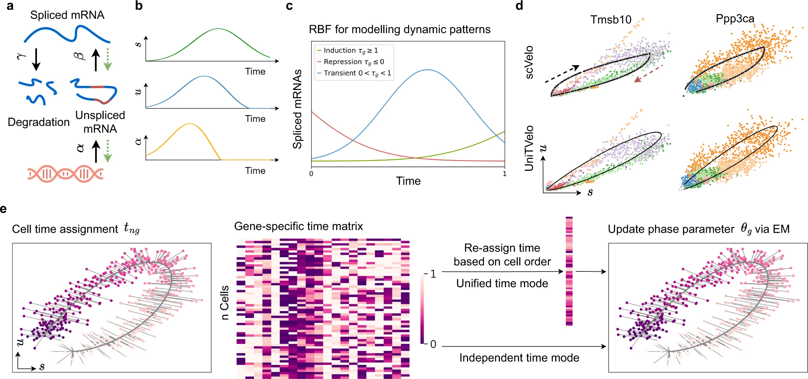

# UniTVelo: temporally unified RNA velocity reinforces single-cell trajectory inference

nature communications (2022 Nov), University of Hong Kong

paper link:
https://www.nature.com/articles/s41467-022-34188-7 

github link:
https://github.com/StatBiomed/UniTVelo

## Summary
提出了一种新的用于推断单细胞轨迹的RNA velocity计算方法UniTVelo。其主要贡献和结论如下:

1. UniTVelo采用了一种自顶向下的设计,首先对成熟RNA(spliced mRNA)进行建模,再通过线性动力学系统推导未成熟RNA(unspliced mRNA)的动态变化,可以更灵活地刻画转录动力学。
2. UniTVelo引入了一个统一的潜在时间(unified latent time)概念,将全转录组的动力学信息整合在一起,可以消除不同基因之间方向性的差异,增强轨迹推断的准确性。
3. 在小鼠和人类红细胞发育、骨髓造血、肠道类器官分化等10个数据集上的测试表明,即使在存在violated基因、弱动力学信号或复杂分支的情况下,UniTVelo也能很好地恢复发育轨迹,表现优于现有方法如scVelo。
4. UniTVelo提供了两种模式:unified-time模式适用于动力学信号较弱的情形;independent模式适用于技术噪声小但轨迹较复杂(如包含细胞周期)的情形。
5. UniTVelo通过基因拟合优度R2可以识别与推断轨迹相关的关键基因,对理解细胞命运决定过程有帮助。
总之,UniTVelo是一种全面增强RNA velocity计算和单细胞轨迹推断的新方法,有望在复杂的细胞分化和发育过程研究中发挥重要作用。

#### 统一潜在时间(unified latent time)：
想象一下，我们在观察一群学生从小学到大学的成长过程。每个学生都有自己的成长轨迹，有的人在某些方面发展得快，有的慢，就像基因在细胞分化过程中的表达变化。

1. 传统方法（如scVelo）的做法：
   - 相当于分别看每个学生的各项技能（如数学、语文、体育等）的发展，然后猜测他们在教育阶段的位置。
   - 这可能导致矛盾的结果，比如根据数学成绩判断一个学生像高中生，但根据体育成绩又觉得他像小学生。
2. UniTVelo的统一潜在时间概念：
   - 相当于综合考虑所有学生的所有技能发展，创造一个"统一的成长时间线"。
   - 这个时间线能同时反映大多数学生在大多数技能上的整体发展趋势。
   - 每个学生都会被安排在这个统一时间线上的某个位置，代表他们的整体发展阶段。
3. 优势：
   - 避免了单独看某个技能（基因）可能带来的误判。
   - 能更好地反映学生（细胞）的整体发展状态。
   - 即使某些技能（基因）的发展模式不太明显或有偏差，也能通过其他技能（基因）的信息来校正。
4. 在生物学上的意义：
   - 帮助我们更准确地推断细胞在分化过程中的位置。
   - 即使某些基因的表达模式不符合预期，也能得到相对准确的细胞状态估计。
   - 有助于发现和理解细胞分化过程中的关键转变点和重要基因。
总的来说，统一潜在时间就像是为细胞分化过程创造了一个"主时间线"，让我们能更全面、准确地理解细胞的发展轨迹。

#### 基因拟合优度R2：
想象你在一个游乐园里观察人们玩过山车的情况。
1. 过山车轨道:
   这就像是UniTVelo预测的基因表达变化趋势。它是一条平滑的曲线,代表模型认为基因表达应该如何随时间变化。
2. 实际乘客位置:
   这相当于实际观察到的基因表达数据点。每个乘客(数据点)可能会因为各种原因(如测序误差、生物学噪音)而偏离轨道一些。
3. R2的含义:
   R2就是用来衡量实际乘客位置有多接近理想轨道的指标。
   - R2 = 1: 完美拟合
     所有乘客都精确地在轨道上,这在现实中几乎不可能。
   - R2接近1: 很好的拟合
     大多数乘客都非常接近轨道,可能有些微小偏差。这表示模型很好地捕捉到了基因表达的变化趋势。
   - R2接近0: 糟糕的拟合
     乘客四处散布,与轨道关系不大。这意味着模型未能准确描述基因表达的变化模式。
   - R2为负值: 非常糟糕的拟合
     这种情况比随机猜测还要糟,可能意味着模型或数据有严重问题。
4. 在UniTVelo中的应用:
   - 高R2的基因:
     这些基因的表达变化模式清晰,可能在细胞分化过程中起重要作用。就像是过山车的主要轨道部分。
   - 低R2的基因:
     这些基因的表达变化不符合预期模式,可能是背景噪音或在特定条件下才有作用的基因。类似于过山车旁边的装饰设施。
通过分析不同基因的R2值,研究人员可以识别出哪些基因最能反映细胞分化的整体趋势,从而更好地理解细胞命运决定的分子机制。这就像是通过观察哪些部分的过山车轨道最能代表整个游乐项目的刺激性和趣味性。

## Structure
1. 引言(Introduction)
- 介绍单细胞测序和轨迹推断的研究背景
- 指出现有RNA velocity方法的局限性 
- 简要介绍UniTVelo的原理和优势
2. 结果(Results)
- 描述UniTVelo模型的总体设计,包括自顶向下的建模策略和统一潜在时间的概念
- 在小鼠和人类红细胞发育数据集上展示UniTVelo恢复轨迹方向的性能优势  
- 在骨髓造血数据集上展示UniTVelo应对复杂分支的能力
- 在肠道类器官分化数据集上展示UniTVelo解析细胞命运转变的效果
- 介绍适用于复杂数据集的independent模式
- 在其他特色数据集上进一步验证UniTVelo的普适性
3. 讨论(Discussion)
- 总结UniTVelo的技术特点和方法优势
- 讨论RNA velocity分析中仍待解决的问题,如信息基因的鉴定等
- 展望未来UniTVelo在技术细节上的改进方向
4. 方法(Methods)
- 数据的预处理流程
- UniTVelo模型的参数推断算法
- 统一潜在时间和独立时间的设置细节
- 下采样策略以应对大数据集
- 模型评估指标的定义
5. 补充材料(Supplementary Information) 
- 包括补充图、表格等其他支持性结果
通过以上布局,作者循序渐进地介绍了新方法的动机、原理、性能表现以及进一步的改进方向,是一种比较常见的计算生物学方法论文的写作结构。

#### 自顶向下的建模策略
1. 传统方法（自底向上）：
   - 这就像是从准备原料开始做蛋糕。你先准备面粉、鸡蛋、糖等（对应unspliced RNA），然后按照食谱一步步操作，最后得到蛋糕（spliced RNA）。
   - 在RNA velocity分析中，这相当于先定义转录率，然后推导unspliced RNA的变化，最后得到spliced RNA的表达模式。
2. UniTVelo的自顶向下策略：
   - 这像是反向工程一个蛋糕。你先有了一个完整的蛋糕（spliced RNA），然后根据蛋糕的样子和味道，推测它是怎么做出来的，用了哪些原料（unspliced RNA）。
   - UniTVelo首先对成熟的RNA（spliced RNA）进行建模，然后反推未成熟RNA（unspliced RNA）的动态变化和转录率。
3. 这种策略的优势：
   - 灵活性：就像你可以想象出各种各样的蛋糕，而不局限于固定的食谱。UniTVelo可以适应更多样的基因表达模式。
   - 准确性：因为你是根据最终产品来推测过程，所以更容易捕捉到关键的特征。在RNA分析中，这意味着可以更准确地描述基因表达的动态变化。
   - 处理复杂情况：如果蛋糕（基因表达）的形状很不寻常，传统方法可能难以解释，但自顶向下的方法可以更好地适应这种复杂性。
4. 实际应用：
   - 处理多动力学基因：一些基因在不同阶段可能有不同的表达模式，就像一个蛋糕可能有多层不同的口味。自顶向下的方法能更好地描述这种复杂性。
   - 适应技术限制：测序技术通常对成熟RNA（spliced）的测量更准确。所以从更可靠的数据开始建模，再推导其他部分，可以得到更稳定的结果。
总的来说，UniTVelo的自顶向下策略就像是从成品蛋糕反推制作过程，这种方法更灵活，能处理更复杂的情况，并且可能得到更准确的结果，特别是在处理复杂的生物学过程时。

## Workflow

1. 数据预处理
- 对单细胞RNA测序数据进行标准化处理,获得每个细胞的spliced和unspliced RNA reads计数
- 进行质控,选择在至少20个细胞中同时检测到spliced和unspliced reads的高质量基因  
- 使用PCA和KNN图构建细胞之间的邻接关系
- 对reads计数进行平滑处理以降低技术噪声

2. 挑选速度基因
- 筛选具有显著动力学特征的基因作为速度基因,用于后续的RNA velocity计算
- 可选择scVelo的标准方法,或使用拟合优度R2在迭代优化过程中动态添加速度基因

3. 模型参数初始化  
- 初始化基因特异性参数和细胞特异性潜在时间

4. 最大似然估计
- 通过EM算法交替更新基因参数和潜在时间以最大化似然函数
- E步:固定基因参数,通过网格搜索找到每个细胞的最优潜在时间
- M步:固定细胞潜在时间,用梯度下降优化每个基因的动力学参数
- 对于unified-time模式,额外引入一个跨基因的时间统一步骤
- 迭代直到收敛

5. 速度计算和轨迹推断
- 根据估计得到的基因动力学参数,对每个基因的RNA velocity进行解析计算
- 综合各基因的velocity信息,推断整体的细胞轨迹 

6. 可视化和下游分析
- 在低维嵌入空间(如UMAP)中可视化细胞状态转移轨迹 
- 分析不同基因在拟合优度、表达动力学上的差异,解读其生物学意义

7. 模型评估
- 使用CBDir和ICCoh等指标定量评估推断轨迹的准确性和一致性

以上是UniTVelo方法的基本流程。根据具体数据集的特点,用户可以选择不同的速度基因筛选标准、unified或independent模式等。对于大规模数据集,还提供了一个下采样和预测的策略以降低计算资源需求。

#### CBDir (Cross-boundary Direction Correctness) & ICCoh (In-cluster Coherence)：
    想象我们在观察一群候鸟的迁徙:
    1. CBDir (跨边界方向正确性):
       想象候鸟从一个地区飞到另一个地区:
       - 地区边界就像是细胞类型之间的界限。
       - 候鸟的飞行方向就像是RNA velocity预测的细胞变化方向。
       CBDir 衡量的是:
       - 有多少候鸟(细胞)正确地从一个预期的地区(细胞类型)飞向另一个预期的地区。
       - 高CBDir意味着大多数候鸟都按照预期路线迁徙,表明模型很好地预测了细胞的分化方向。
       - 低CBDir则意味着很多候鸟偏离了预期路线,说明模型的预测可能不准确。
    2. ICCoh (簇内一致性):
       想象候鸟在一个地区内的活动:
       - 每个地区就像是一个细胞类型或状态。
       - 候鸟在地区内的飞行方向就像是同类细胞的RNA velocity方向。
       ICCoh 衡量的是:
       - 同一地区内的候鸟飞行方向有多一致。
       - 高ICCoh意味着一个地区内的候鸟都朝着相似的方向飞,表明同类型细胞的变化趋势一致。
       - 低ICCoh则意味着候鸟四散飞行,方向各异,说明模型在描述同类型细胞的变化时不够连贯。
    3. 为什么需要这两个指标:
       - CBDir告诉我们模型是否正确预测了细胞的整体分化方向,就像是否正确预测了候鸟的迁徙路线。
       - ICCoh告诉我们模型在描述同类细胞变化时是否一致,就像是否准确描述了候鸟在一个地区内的活动模式。
       - 结合使用这两个指标,可以全面评估模型在大尺度(跨细胞类型)和小尺度(单一细胞类型内)上的表现。
    4. 在UniTVelo中的应用:
       - 高CBDir和高ICCoh意味着UniTVelo不仅正确预测了细胞如何从一种类型转变为另一种类型,而且在描述每种细胞类型内部的变化时也很连贯。
       - 这有助于研究人员确信模型捕捉到了真实的生物学过程,而不是产生了随机或矛盾的结果。
    通过这种方式,CBDir和ICCoh共同提供了一个全面的框架来评估RNA velocity模型的性能,就像我们通过观察候鸟的大规模迁徙和局部活动来理解它们的行为模式一样。

## Algorithm Framework

a. 转录过程的示意图，包括转录速率α、剪接速率β和降解速率γ。绿色虚线表示参数是反向推断的。
b. 以时间为自变量的模型范式，显示了预测的α随测量表达谱的变化。
c. 用于建模每个基因的诱导、抑制和瞬态动力学模式的RBF（径向基函数），其中τg表示峰值时间。该模型的潜在时间被重新缩放并截断在0和1之间。
d. 相位图示例（可以从中间分为诱导和抑制阶段，分别用黑色和红色箭头表示），两个动态基因（Tmsb10和Ppp3ca）由scVelo和UniTVelo建模，显示RBF核具有类似的恢复基因动态信息的能力。颜色表示不同的细胞类型。
e. UniTVelo的推断，通过两组参数尝试恢复基因的动态过程：（1）基因特异性参数θg，定义了每个基因的转录组如何随时间变化以及未剪接/剪接mRNA在进程中的关系。（2）细胞特异性时间点tng。通过使用梯度下降迭代更新基因特异性参数，细胞时间点通过最小化到相位轨迹的欧几里得距离进行分配。具体来说，除了直接在优化中使用基因特异性时间矩阵，UniTVelo还支持基于细胞排序的统一时间分配。这使得基因方向性之间的差异最小化。

UniTVelo模型的工作原理及其在单细胞转录动力学中的应用。模型通过反向推断转录速率、剪接速率和降解速率来描绘转录过程，并使用径向基函数（RBF）来建模基因的动态模式。UniTVelo通过迭代更新基因特异性参数和分配细胞特异性时间点来恢复基因的动态过程，展示了其在识别和分析基因动态信息方面的有效性。模型还支持统一时间分配，从而最小化基因方向性之间的差异。

UniTVelo的算法框架可以概括为以下几个关键组成部分:

1. 动力学模型
- 使用常微分方程描述spliced mRNA (s)和unspliced mRNA (u)的动力学过程
- 引入转录速率(α)、剪接速率(β)和降解速率(γ)作为动力学参数
- 创新性地采用自顶向下的建模策略,即先对s进行参数化建模,再通过方程约束推导出u的表达式

2. 基因表达趋势的参数化
- 使用径向基函数(radial basis function, RBF)对每个基因的s的表达趋势进行参数化刻画
- RBF通过调节基因特异性参数(h, a, τ, o),可以灵活地拟合不同基因在不同时间点的表达量
- 参数τ具有明确的生物学解释,即基因表达量达到最高点的时间

3. 细胞潜在时间的分配
- 为每个细胞分配一个潜在的时间戳t,代表其在拟合的发育轨迹中的位置
- 对于unified-time模式,所有基因共享一个跨转录组统一的t
- 对于independent模式,每个基因独立地估计细胞的t

4. 最大似然估计
- 构建基于负二项分布的似然函数,刻画测序reads数据的离散性
- 通过EM算法交替优化基因动力学参数(E步)和细胞潜在时间(M步)
- 在统一模式下,额外引入一个基于有序时间的高斯过程来平滑不同基因的时间分配

5. RNA velocity计算
- 利用估计出的基因动力学参数,通过对s求导数解析地计算每个基因在每个细胞的RNA velocity
- 一个正的velocity值表示该基因处于上调阶段,负值表示下调阶段

6. 模型选择和评估
- 使用贝叶斯信息准则(BIC)在不同的基因子集和模型超参数配置下进行模型选择
- 使用交叉验证的思想,通过留一法(leave-one-out)评估模型的泛化性能

以上框架涵盖了UniTVelo的核心思想,包括自顶向下的动力学建模、统一潜在时间、灵活的基因趋势刻画函数以及稳健的参数学习策略。通过巧妙地结合了统计建模和优化算法,UniTVelo可以充分利用时序RNA测序数据中蕴含的丰富动力学信息,从而更准确地推断细胞的状态转移轨迹。

#### 径向基函数(RBF)：
    想象你在观察一座山的形状：
    1. 山的形状就像基因表达随时间的变化趋势。
    2. RBF就像是一个特殊的"山形模板"：
       - 这个模板非常灵活，可以通过调整几个参数来改变其形状。
       - 基本形状是一个钟形曲线，但可以变宽、变窄、变高、变低。
    3. 参数化刻画过程：
       - 高度(h)：决定山峰有多高，对应基因表达的最大值。
       - 宽度(a)：决定山有多宽，对应基因表达变化的速度。
       - 位置(τ)：决定山峰在哪里，对应基因表达达到最高点的时间。
       - 基线(o)：决定山脚的高度，对应基因的基础表达水平。
    4. 拟合过程：
       - UniTVelo会尝试调整这些参数，让"山形模板"尽可能地贴合实际观察到的基因表达数据点。
       - 就像你试图用这个灵活的模板去描绘不同山峰的形状。
    5. 优势：
       - 灵活性：RBF可以描述各种形状的"山"，对应各种基因表达模式（上升、下降、先升后降等）。
       - 简洁性：只需几个参数就能描述复杂的表达趋势。
       - 可解释性：每个参数都有明确的生物学含义，如τ表示基因表达高峰时间。
    6. 实际应用：
       - 对于一个上调的基因：可能会得到一个向右偏的"山"形状。
       - 对于一个下调的基因：可能会得到一个向左偏的"山"形状。
       - 对于一个瞬时表达的基因：可能会得到一个居中的、较窄的"山"形状。
    通过这种方式，UniTVelo可以用一种统一且灵活的方法来描述各种基因的表达趋势，就像用一个可调整的"山形模板"来描绘各种不同形状的山峰。这种方法既能捕捉复杂的表达模式，又保持了模型的简洁性和可解释性。

#### 贝叶斯信息准则(BIC):
    想象你是一个侦探,试图解开一个复杂的案件:
    1. 案件的细节就像是你的数据。
    2. 你提出的解释方案就像是统计模型。
    3. BIC就像是一个帮你评估不同解释方案的评分系统。
    现在,让我们详细解释BIC的工作原理:
    1. 拟合优度:
       - 这就像你的解释方案能解释多少案件细节。
       - 在BIC中,这部分用似然函数来表示。
       - 解释得越多(拟合得越好),这部分分数越高。
    2. 模型复杂度惩罚:
       - 这就像是对过于复杂的解释方案的一种警惕。
       - 在BIC中,这部分与模型参数数量和样本大小有关。
       - 解释越复杂(参数越多),这部分惩罚越大。
    3. BIC的计算:
       BIC = -2 * ln(似然函数) + ln(n) * k
       其中n是样本大小,k是参数数量。
       - 第一项(-2 * ln(似然函数))越小越好,表示模型拟合得越好。
       - 第二项(ln(n) * k)越小越好,表示模型越简单。
    4. BIC的使用:
       - 你会为每个解释方案(模型)计算一个BIC值。
       - BIC值越低,表示这个解释方案越好。
       - 最低BIC的方案被认为是最佳平衡点。
    5. BIC的优势:
       - 平衡性: 既考虑解释的全面性,又防止过度解释。
       - 惩罚复杂性: 比一些其他准则(如AIC)更强烈地惩罚复杂模型。
       - 一致性: 在样本量足够大时,能够选择真实的模型。
    6. 在UniTVelo中的应用:
       - 可能用于选择最合适的基因子集或模型超参数。
       - 帮助在模型复杂度和拟合优度之间找到最佳平衡点。
总的来说,BIC就像是一个智能助手,帮助你在解释案件(拟合数据)的全面性和简洁性之间找到最佳平衡。它鼓励你提出既能解释大部分现象,又不会过于复杂的解释方案,这在分析复杂的生物学数据时特别有用。

## Baseline Model, Evaluation Metrics, and Datasets
1. 基线模型(Baseline models)
- scVelo: 目前广泛使用的RNA velocity计算工具,包括stochastic和dynamical两种模式
- 文中重点比较了UniTVelo与scVelo dynamical模式的性能差异

2. 评估指标(Evaluation metrics)
- 跨边界方向正确性(Cross-boundary Directionality, CBDir): 衡量推断的RNA velocity方向与参考轨迹方向的一致性,需要提供先验的发育时间信息
- 簇内一致性(In-cluster Coherence, ICCoh): 衡量同一个细胞簇内RNA velocity向量的一致性,反映推断轨迹的连续性和平滑性
- 基因拟合优度(Coefficient of determination, R2): 衡量每个基因的表达趋势与模型拟合曲线的吻合程度

3. 数据集(Datasets)
- 小鼠和人类红细胞发育(Mouse and human erythroid differentiation): 分别包含9000个小鼠细胞和30000个人类细胞的红细胞发育轨迹
- 人类骨髓造血(Human bone marrow hematopoieses): 从造血干细胞到红细胞、单核细胞和淋巴细胞的分化过程 
- 肠道类器官分化(Intestinal organoid differentiation): 模拟肠道上皮细胞分化为吸收型和分泌型细胞的过程
- 小鼠牙状回神经发生(Dentate gyrus neurogenesis): 包含两个时间点(P12和P35)的小鼠颗粒神经元发育过程
- 小鼠视网膜发育(Mouse developing retina): 视网膜前体细胞分化为光感受器细胞、视网膜神经节细胞等的过程
- 神经元KCl刺激(Neuron genesis with KCI stimulation): 体外神经元培养物经KCl处理后的基因表达动力学变化
- 青少年小鼠脑桥(Hindbrain (pons) of adolescent mice): 少突胶质前体细胞分化为成熟少突胶质细胞的过程 
- 胰腺内分泌发生(Pancreatic endocrinogenesis): 胰腺上皮细胞分化为内分泌细胞的过程,包含两个不同时间点的数据集

通过在这些具有不同生物学特征和技术挑战的数据集上进行系统评估,作者展示了UniTVelo在准确性、稳健性、适用范围等方面相比现有方法的优越表现。同时通过与scVelo等基线模型的直接比较,突出了UniTVelo在细胞轨迹推断领域的方法创新和性能提升。
## Computing Language, Tools, Packages, and Resources
1. 编程语言(Computing language)
- Python: UniTVelo的核心算法和分析流程都是用Python实现的
2. 工具和软件包(Tools and packages)
- scVelo: 文中使用scVelo作为主要的比较方法,也利用了其中的一些数据预处理和可视化函数
- BRIE2: 一种贝叶斯方法,用于从单细胞测序数据中识别可变剪接事件,文中用其检测的可变剪接基因作为下游分析的输入
- scanpy: 单细胞数据分析的常用Python包,文中可能用到其中的数据结构、预处理和可视化等函数
- anndata: 单细胞数据的标准存储格式,UniTVelo内置支持读写anndata对象
- numpy, scipy: Python的数值计算和科学计算基础包,UniTVelo中的矩阵运算、统计分布、优化算法等都依赖于它们
- matplotlib, seaborn: Python常用的可视化包,文中的各种图表可能用到了其中的函数
- pyTorch: 一种深度学习框架,文中提到UniTVelo的统一时间模式用到了pyTorch实现的带约束的优化算法
3. 计算资源(Computing resources) 
- CPU和GPU: UniTVelo的算法推断涉及大量的矩阵运算,因此需要较高的计算资源。文中提供了在CPU和GPU上的推荐配置
- 内存: 对于大规模的单细胞数据集,UniTVelo需要消耗较大的内存。作者提供了一些降采样和分批处理的策略以减少内存压力
