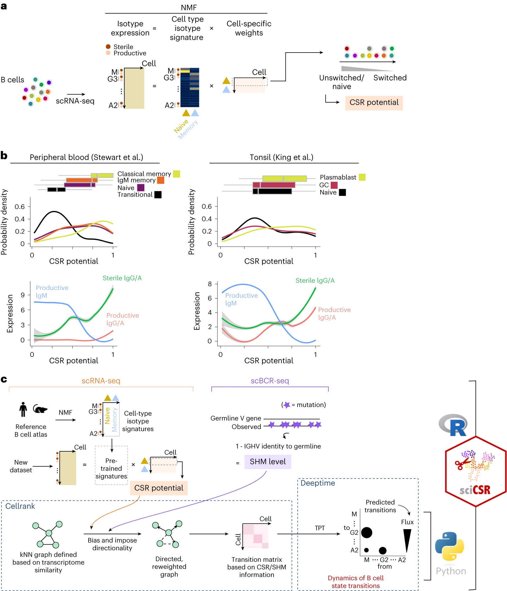
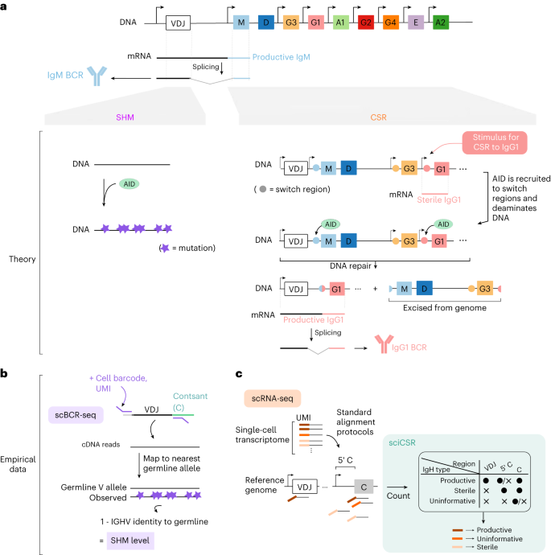

# sciCSR infers B cell state transition and predicts class-switch recombination dynamics using single-cell transcriptomic data

nature methods (2013 Nov), University College London

paper link:
https://www.nature.com/articles/s41592-023-02060-1

github link:
https://github.com/Fraternalilab/sciCSR

## Summary
这篇文章介绍了一个名为sciCSR的计算工具,用于从单细胞RNA测序数据中推断B细胞的状态转变和类别转换重组动力学。sciCSR的主要特点包括:
1. 从单细胞RNA测序比对结果中区分生产性重链免疫球蛋白转录本和胚系"无功"转录本。
    1). 背景知识:
       - B细胞产生抗体(免疫球蛋白)来对抗病原体。
       - 免疫球蛋白由重链和轻链组成,我们这里关注的是重链。
       - B细胞可以通过"类别转换"来改变它们产生的抗体类型,以适应不同的免疫挑战。
    2). 两种转录本:
       - "生产性"转录本: 这是可以直接翻译成完整抗体重链的RNA。
       - "无功"转录本: 这种RNA不能直接产生抗体,但它的存在表明细胞正准备进行类别转换。
    3). 区分方法:
       - 科学家们利用单细胞RNA测序技术,可以看到每个B细胞内的RNA情况。
       - 通过分析RNA片段来源于免疫球蛋白基因的哪个部分,可以判断它是"生产性"还是"无功"的。
    4). 为什么这很重要:
       - 识别"无功"转录本可以让我们预测哪些B细胞正准备改变它们产生的抗体类型。
       - 这有助于我们更好地理解免疫系统如何应对不同的挑战,比如感染或疫苗接种。
    5). 简单类比:
       想象B细胞是一个工厂,生产性转录本就像正在生产的产品的蓝图,而无功转录本则像是为新产品线做准备的草图。通过观察这两种"图纸",我们可以了解工厂(B细胞)当前的生产状态和未来的生产计划。

2. 基于单细胞RNA测序数据的快照,构建马尔可夫状态模型来推断B细胞的类别转换动力学和方向。
    - sciCSR利用单一时间点的单细胞RNA测序数据。这意味着你只需要在一个特定时刻对B细胞群体进行采样。
    - 从这个单一时间点的数据中，sciCSR提取了两类关键信息：
        a) 生产性和无功IgH转录本的表达水平
        b) 体细胞高频突变（SHM）的程度（如果有配对的BCR测序数据）
    - 利用这些信息，sciCSR构建了一个马尔可夫状态模型。这个模型假设细胞的未来状态只依赖于其当前状态，而不依赖于过去的状态。
    - 通过分析不同状态的B细胞在群体中的分布，以及它们的转录本表达模式，模型可以推断出细胞状态转换的可能路径和概率。
3. 应用到SARS-CoV-2疫苗接种的时间序列单细胞RNA测序数据中,sciCSR可以使用早期时间点的数据准确预测后续时间点B细胞受体库的亚型分布(余弦相似度约0.9)。
4. 使用B细胞特异的过程,sciCSR可以识别常规RNA速度分析容易遗漏的转变,揭示B细胞类别转换重组动力学的新见解。
5. 经实验验证,包括模拟数据、真实数据以及免疫、体外培养和基因敲除研究,表明sciCSR可以推断常规方法难以捕捉的B细胞转变。

 
The sciCSR pipeline to infer B cell state transitions. 
本文通过非负矩阵分解（NMF）从小鼠和人类的参考B细胞图谱中提取描述初始和记忆B细胞亚群的同种型特征，并使用这些特征生成了一个称为“CSR潜力”的得分，用于衡量细胞的成熟状态。研究显示了不同数据集中B细胞亚群的CSR潜力得分分布和沿推测的CSR潜力轴的IgH转录本表达水平。最后，说明了sciCSR工作流程如何用于推断B细胞的状态转换。

## Structure
1. 介绍 (Introduction)
- B细胞成熟过程及其重要性
- 现有的从单细胞RNA测序数据推断细胞状态转变的计算方法及其局限性
- 提出利用B细胞特异过程(类别转换重组和体细胞高频突变)来推断B细胞状态转变的思路

2. 结果 (Results)
- 从单细胞RNA测序数据中提取类别转换重组的信号
- sciCSR表征表达特定无功转录本的B细胞
- sciCSR预测时间序列单细胞RNA测序数据中类别转换重组的方向性
- sciCSR展示基因敲除引入的类别转换重组差异

3. 讨论 (Discussion) 
- sciCSR的优势:利用B细胞特异信息推断状态转变
- 无功转录本分析的意义和展望
- sciCSR的局限性和未来改进方向

4. 在线内容 (Online content)

5. 方法 (Methods)
- sciCSR算法的详细流程
- 数据集的处理方法
- 统计和数据可视化方法

6. 补充信息 (Supplementary information)

#### 类别转换重组（CSR）：
    - 这是B细胞独有的过程。
    - CSR允许B细胞改变它们产生的抗体类型（如从IgM转换到IgG、IgA或IgE），而不改变抗体的抗原特异性。
    - 没有其他类型的细胞会进行这种特定的基因重组过程。
#### 体细胞高频突变（SHM）：
    - SHM主要发生在B细胞中，特别是在生发中心的B细胞中。
    - 这个过程通过引入突变来增加抗体与抗原结合的亲和力。
    - 虽然SHM主要与B细胞相关，但有一些研究表明某些T细胞亚群（如滤泡辅助T细胞）也可能经历类似的过程，尽管程度较轻。

CSR和SHM是适应性体液免疫反应的关键组成部分。它们允许免疫系统产生多样化的、高亲和力的抗体，以更有效地对抗各种病原体。

## Workflow
1. 数据输入:
- 单细胞RNA测序的BAM格式比对结果文件
- 单细胞RNA测序的细胞-基因表达矩阵
- (可选)同批次细胞的单细胞BCR测序数据

2. 识别生产性和无功IgH转录本:
- 扫描比对到IgH基因座V、D、J、C和C区上游的reads
- 基于reads的覆盖模式区分每个细胞每条IgH转录本属于生产性、无功还是无法判断
- 生成细胞-IgH转录本表达矩阵

3. 推断B细胞状态转变:
- (可选)从scBCR-seq数据计算每个细胞BCR的突变水平
- 用非负矩阵分解从参考数据集提取天真/记忆B细胞的IgH表达特征
- 基于每个细胞IgH表达剖面相对参考特征的偏bias程度,计算一个表征类别转换重组进度的CSR potential分数
- 将CSR potential分数(如有scBCR-seq数据则也包括突变水平)输入CellRank工具,构建细胞状态转移矩阵
- 应用Transition Path Theory分析转移矩阵,推断不同细胞状态或BCR亚型间的转化强度和方向

4. 结果解释和可视化:
- 估计每种状态/亚型的稳态分布概率及置信区间
- 状态间转化用箭头或流线投射到细胞聚类或降维图上展示
- 亚型间转化用气泡图展示,气泡大小表示转化的显著性
- 比较不同生物信息(RNA速度、CSR、SHM)推断的转化模式异同

综上,sciCSR利用单细胞转录组和BCR测序数据,通过定量表征每个B细胞的类别转换重组和体细胞高频突变,构建马尔可夫模型来推断B细胞在不同状态和BCR亚型间的转化概率和方向。整个过程充分利用了B细胞特异的生物学过程信息。
## Algorithm Framework

1. 从单细胞RNA测序比对结果中提取生产性和无功IgH转录本的表达量
- 根据reads比对到IgH基因座的V、D、J、C和C上游区域的模式,判断每条转录本属于生产性、无功或无法确定
- 对每个细胞统计各亚型生产性和无功转录本的表达量,生成一个2S×N的"同型矩阵"(isotype matrix),其中S为亚型数,N为细胞数

2. 计算每个细胞的CSR potential分数,表征其类别转换重组进展程度
- 在参考数据集上用非负矩阵分解(NMF)提取S个同型特征(isotype signature),代表天真/记忆B细胞的典型同型转录本表达模式 
- 用参考数据集训练的特征矩阵分解新数据的同型矩阵,得到每个细胞的特征权重
- 将天真B细胞特征的权重归一化到0-1范围得到CSR potential分数,值越大表示类别转换重组程度越高

3. (如有scBCR-seq数据)计算每个细胞BCR的体细胞突变(SHM)水平
- 基于BCR序列相对最近胚系V基因的碱基差异,计算突变频率作为SHM水平

4. 应用CellRank工具推断细胞状态转移图
- 基于CSR potential分数(如有则也包括SHM水平)构建细胞-细胞转移概率矩阵
- 将该矩阵与基于RNA表达相似性的矩阵加权整合为最终的转移概率矩阵

5. 应用Transition Path Theory (TPT)分析细胞状态或BCR亚型间的转化动力学
- 根据用户定义的初始态和终末态,计算TPT下状态间的平均转移通量(flux)
- 评估通量相对随机置换的转移矩阵的显著性
- 计算系统最终达到稳态时各状态的出现概率分布(stationary distribution)
- 给出从初始态到终末态的most probable paths及其概率

6. 模拟和比较不同生物信号导出的转移模型
- 基于转移矩阵构建马尔可夫链,模拟状态转移路径
- 比较不同信号(RNA velocity、CSR、SHM)导出的马尔可夫链在各状态上的采样频率分布

sciCSR提供了一套统一的算法框架,将多组学数据整合用于刻画B细胞状态转化图景。其创新点在于巧妙利用了反映B细胞生物学特性的CSR和SHM信息,结合先进的计算方法如NMF和TPT,从单细胞组学数据入手就能对B细胞群体异质性和连续动力学给出合理推断和解释。

## Baseline Model, Evaluation Metrics, and Datasets
1. Baseline models:
- RNA velocity: 现有常用于推断细胞状态转变的方法,通过比较unspliced和spliced reads的比例估计转录本的表达速率。本文在Il23基因敲除小鼠数据上将sciCSR结果与RNA velocity结果进行了比较。
- Pseudotime ordering: 现有根据基因表达相似性将细胞排成拟时间轴的方法。本文用CellRank整合了sciCSR计算的CSR/SHM分数和基于表达相似性的细胞邻接图,将二者共同用于推断细胞状态转移。

2. Evaluation metrics:
- 正余弦相似性:比较sciCSR预测的BCR亚型分布与实际scBCR-seq测到的分布的一致性,取值在0-1之间,越接近1表示二者越吻合。这一指标用于评估sciCSR在SARS-CoV-2疫苗接种的时间序列数据上对后续时间点BCR库亚型组成的预测能力。
- 通量显著性:基于TPT算出的状态间通量与随机置换状态标签后的通量进行单尾假设检验,得到p值用于评估通量显著高于随机水平的程度。
- 稳态分布置信区间:对每组细胞的稳态分布概率进行bootstrap重采样估计95%置信区间。

3. Datasets:
- Stewart et al.: 人外周血FACS分选的成熟B细胞亚群的scRNA-seq数据
- King et al.: 人扁桃体B细胞亚群的scRNA-seq数据
- Mathew et al.: 小鼠流感病毒感染后淋巴结、肺和脾脏B细胞的scRNA-seq和scBCR-seq数据
- Luo et al.: 小鼠腹腔B-1细胞在不同发育阶段的scRNA-seq和scBCR-seq数据
- 本研究产生的IFNγ诱导人初始B细胞体外分化的时间序列scRNA-seq和scBCR-seq数据 
- Kim et al.: 人PBMC接种SARS-CoV-2 mRNA疫苗后生发中心B细胞的时间序列scRNA-seq和scBCR-seq数据
- Gómez‐Escolar et al.: Aicda基因敲除小鼠的B细胞scRNA-seq和scBCR-seq数据
- Hong et al.: Il23基因敲除小鼠B细胞的scRNA-seq数据

以上数据集涵盖了外周血、淋巴组织、体外分化、疫苗接种等多个场景下人和小鼠B细胞不同分化阶段的单细胞多组学数据,用于验证sciCSR方法的有效性和广泛适用性。
## Computing Language, Tools, Packages, and Resources
1. Computing language:
- R (v4.2.2): sciCSR软件包的主要开发语言,用于数据处理、分析和可视化
- Python (v3.9.12): 用于整合CellRank和velocyto等工具

2. Tools and packages:
- sciCSR R包:本文开发的主要工具,提供了从scRNA-seq数据识别IgH转录本、计算CSR/SHM分数、整合CellRank推断状态转移和应用TPT分析动力学等一整套分析流程
- CellRank (v1.5.1): 基于RNA velocity或其他假时间轴推断细胞状态转移图的工具
- Seurat (v4.2.2): 处理单细胞RNA测序数据的R包,用于数据质控、标准化、降维、聚类等
- Seurat disk (v0.0.0.9020): 将Seurat对象在R和Python之间互转的工具
- scVelo (v0.2.4): 估计RNA velocity的Python包
- velocyto (v0.17.17): 从BAM文件定量unspliced和spliced reads的Python包
- scanpy (v1.9.1): 单细胞RNA测序数据分析的Python包
- STAR (v2.5.1.b): 将reads比对到参考基因组的RNA-seq比对器
- CellRanger (v7.0.0): 10x Genomics单细胞RNA测序和VDJ测序数据的处理流程
- IgBLAST (v1.19.0): 从BCR序列注释V、D、J基因和突变的工具

3. Resources:
- GRCh38 (hg38): 人参考基因组
- mm10: 小鼠参考基因组
- Ensembl参考基因组注释
- IMGT参考胚系BCR序列数据库
- UCSC genome browser的重复序列注释
- NCBI SRA和EBI ArrayExpress等公共数据库

综合利用以上计算语言、工具包和资源,sciCSR实现了从原始测序数据到B细胞发育状态推断的全流程分析。整个工作以R语言为主,同时调用了Python生态中的先进工具,做到了两种语言的无缝衔接。此外,sciCSR充分利用了高质量的公共数据资源如参考基因组、基因注释、胚系BCR序列数据库等,保证了分析结果的准确性和可重复性。

