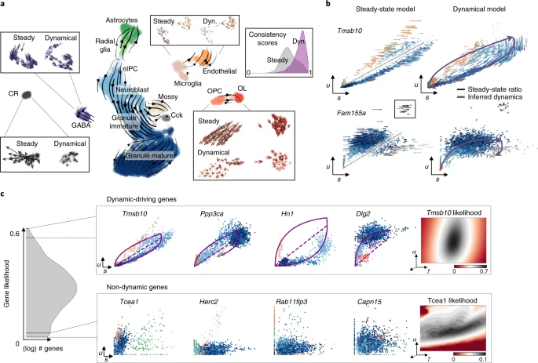

https://www.nature.com/articles/s41587-020-0591-3 

# Generalizing RNA velocity to transient cell states through dynamical modeling

RNA速率是一种创新的技术，用于通过测量未成熟和成熟的mRNA水平来预测细胞的未来状态。随着时间的推移，这项技术不断发展，以更好第捕捉细胞发育过程中的动态变化。
1. 稳态