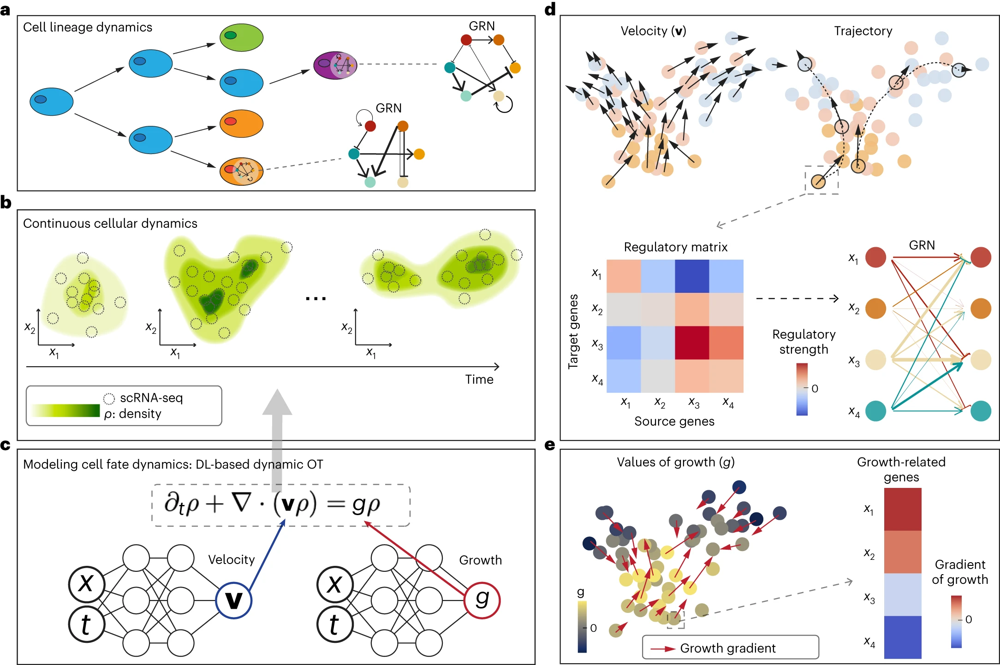

# Reconstructing growth and dynamic trajectories from single-cell transcriptomics data

Nature Machine Intelligence (2023 Nov) UCI

paper link:
https://www.nature.com/articles/s42256-023-00763-w

github link:
https://github.com/yutongo/TIGON 

## Summary
TIGON模型通过时间序列scRNA-seq数据来分析细胞谱系动力学，包括细胞生长、转变和基因调控网络。该模型使用两个神经网络来建模速度和生长，并通过偏微分方程控制密度变化。TIGON的输出包括速度矢量、细胞轨迹、基因调控矩阵和基因调控网络，同时还推断了与生长相关的基因及其对生长变化的贡献。这种方法能够详细描述细胞在发育过程中的动态行为和基因调控机制。

1. 基于Wasserstein-Fisher-Rao (WFR)距离的动态非平衡最优传输模型,可以同时捕捉单个细胞的基因表达速度和细胞群体生长。
#### Wasserstein-Fisher-Rao, WFR
    Wasserstein距离：
        Wasserstein距离源于运输理论,可视为将一个概率分布的"沙子"转移到另一概率分布的"沙子"的最小代价。它能很好地衡量分布之间的几何差异,但对概率质量的变化不太敏感
    Fisher-Rao距离：
        Fisher-Rao距离源于信息几何,衡量概率分布在统计流形上的距离。它对概率质量的变化很敏感,但对分布的几何变形不太敏感。描述了两个概率分布之间"生长"或改变形状所付出的代价。回到沙子的例子,如果除了运输,我们还允许增加或减少沙子的量,那费雷-拉奥距离就衡量了通过生长或侵蚀使A变形成B所需的最小代价。
    WFR距离：
        将这两种距离结合,即同时最小化运输代价和生长/侵蚀代价,使得一个概率分布完全转化为另一个。在TIGON中的应用是:Wasserstein部分描述了单个细胞基因表达的变化代价,而Fisher-Rao部分描述了整个细胞群体通过分裂/凋亡改变群体大小的代价。

2. 利用无网格、无量纲公式和神经常微分方程求解高维最优传输问题,计算高效。
3. 通过自编码器、主成分分析等可逆的降维方法,实现对单个基因动力学的分析和基因调控网络的推断。
4. 在三个时间序列单细胞数据集上的分析表明,TIGON在预测细胞状态转换和群体生长方面具有较高的稳健性和准确性,优于现有的多种轨迹推断方法。
5. 此外,TIGON还可以推断未测时间点的基因表达、时序基因调控网络以及细胞间通讯的动态变化,为深入理解细胞命运转变过程提供了新的视角。
    - 未测时间点基因表达的推断:
        a. 利用TIGON学习到的速度场函数v(x,t),对任意给定的细胞状态x和时间点t,都可以预测该状态下细胞的基因表达变化趋势dx/dt。
        b. 通过数值积分dx/dt=v(x,t),可以从测量时间点的细胞状态出发,推断出任意未测时间点的基因表达状态。
        c. 利用自编码器等可逆降维方法,可以将预测的低维状态映射回原始的高维基因表达空间,从而获得未测时间点完整的基因表达谱。
    - 时序基因调控网络的推断:
        a. 利用TIGON学习到的速度场函数v(x,t),对任意给定的细胞状态x和时间点t,计算雅可比矩阵J=∂v/∂x。
        b. 雅可比矩阵J度量了速度场对基因表达变化的敏感性,其中元素J_ij=∂v_i/∂x_j表示第j个基因对第i个基因的调控强度。
        c. 通过对不同时间点的雅可比矩阵进行分析,可以推断出基因调控网络的动态变化,鉴定出不同时期的关键调控因子和调控关系。
    - 细胞间通讯的动态变化推断:
        a. 利用TIGON重构的不同时间点的完整基因表达数据,结合CellChat等工具,可以推断出不同细胞类群之间的信号通路活性。
        b. 通过对比分析相邻时间点的细胞通讯网络差异,可以揭示细胞间信号传导的动态变化规律,发现不同时期的关键信号通路和配体-受体对。
        c. 整合细胞通讯网络与基因调控网络信息,有助于理解细胞间信号如何传导到下游效应基因,引起细胞状态和行为的改变。

## Structure
1. 引言
    - 概述时间序列单细胞RNA测序数据分析的挑战和现有方法的局限性
    - 阐述TIGON方法的动机和目标
2. 结果
    - 概述TIGON的输出和下游分析
    - 基于三基因模拟数据评估TIGON的性能,并与其他方法进行比较
    - 应用于小鼠造血系统的谱系追踪数据集,评估轨迹重建、生长率预测和命运概率等
    - 应用于EMT癌症细胞系数据集,重建基因表达动力学,推断生长模式、调控网络和细胞通讯
    - 应用于诱导多能干细胞分化为心肌细胞的数据集,捕捉分支分化过程和生长率变化
3. 方法
    - 数据预处理
    - TIGON模型形式化
        - 连续性方程和生长项
        - WFR距离代价函数
        - 无量纲公式推导
        - 重建误差
    - 深度学习求解器
    - 模拟数据生成细节
    - 其他分析细节(RNA速度、细胞通讯等)
4. 讨论
    - TIGON的优势
    - 与其他方法的比较
    - 局限性
    - 潜在扩展(维数、先验知识等)
5. 补充材料
    - 补充注释
    - 补充数据和代码可用性
## Workflow
1. 数据预处理:对时间序列单细胞转录组数据进行质量控制、标准化和批次效应校正等预处理。
2. 降维:利用自编码器(AE)、主成分分析(PCA)、UMAP等方法将高维基因表达数据降到低维空间。
3. 细胞密度重构:通过高斯混合模型从降维后的数据重构出每个时间点的细胞密度分布。
4. TIGON模型构建:
    a. 基于WFR距离,构建描述细胞密度动态变化的连续方程,引入速度场和生长项。
    b. 利用无网格、无量纲公式将连续方程转化为常微分方程组。
    c. 用两个神经网络来拟合速度场和生长项。
    d. 构建目标函数,包括WFR度量下的传输cost和密度重构误差。
5. 模型训练:利用神经常微分方程和自适应梯度下降算法训练TIGON模型,优化目标函数。
6. 细胞动力学推断:利用训练好的TIGON模型进行下游分析,包括:
    a. 细胞轨迹推断:通过积分速度场获得细胞在基因表达空间中的运动轨迹。
    b. 基因调控网络推断:通过速度场对基因的梯度计算调控强度,构建因果调控网络。
    c. 细胞间通讯推断:将TIGON推断的不同时间点的基因表达输入CellChat等工具。
7. 结果分析和生物学解释:对推断结果进行统计分析和可视化,并结合先验生物学知识进行解释和验证。

#### TIGON模型的构建是该方法的核心,主要包括以下几个步骤:
    a. 基于Wasserstein-Fisher-Rao (WFR)距离构建连续方程:
        - 传统的最优传输(OT)理论假设细胞群体的总量不变,不能很好地描述细胞增殖和死亡过程。
        - WFR距离是一种推广的OT度量,可以衡量不同总量分布之间的差异。它综合了Wasserstein距离(度量分布形状差异)和Fisher-Rao距离(度量分布总量差异)。
        - 在TIGON中,我们引入速度场v(x,t)来描述细胞状态x在时间t上的瞬时变化率,引入生长项g(x,t)来描述细胞群体数量的瞬时增长率。
        - 基于质量守恒定律,我们得到一个偏微分方程∂ρ/∂t+∇⋅(vρ)=gρ,其中ρ(x,t)表示细胞状态x在时间t的密度分布。该方程描述了细胞密度分布在速度场和生长项的共同作用下如何演化。
    b. 利用无网格、无量纲公式将连续方程转化为常微分方程组:
        - directly solve the above PDE in the high-dimensional state space.
        - 为了提高求解效率和稳定性,我们引入无网格方法。与传统的网格离散化方法不同,无网格方法直接在连续状态空间中进行求解,避免了网格的生成和维护。
        - 我们将偏微分方程转化为常微分方程组:dx(t)/dt=v(x,t), d(lnρ)/dt=g-∇⋅v。其中x(t)表示单个细胞的状态轨迹,ρ表示细胞密度沿着轨迹x(t)的变化。
        - 通过对一组采样轨迹求解上述常微分方程组,我们可以重构出完整的细胞密度动力学。
    c. 用两个神经网络来拟合速度场和生长项:
        - 常微分方程组的求解需要知道速度场v(x,t)和生长项g(x,t)的具体形式。然而,这两个函数的形式通常是未知的,需要从数据中学习得到。
        - 我们利用两个深度神经网络来参数化速度场和生长项。神经网络以细胞状态x和时间t为输入,输出对应的速度矢量v和生长率标量g。
        - 通过优化神经网络的参数,使其能够很好地拟合观测到的细胞状态转移和群体数量变化,我们就可以得到速度场和生长项的数据驱动表示。
    d. 构建目标函数,包括WFR度量下的传输cost和密度重构误差:
        - 为了优化神经网络参数,我们需要构建一个目标函数来衡量当前参数下的速度场和生长项与真实细胞动力学的差异。
        - 第一部分是WFR度量下的传输cost,即∫(|v|^2+α|g|^2)ρdxdt。这一项衡量了在速度场和生长项的作用下,将细胞密度从初始状态运输到最终状态所需要的总代价。
        - 第二部分是密度重构误差,即∑|ρ_pred-ρ_true|^2。其中ρ_pred是根据当前速度场和生长项预测的细胞密度,ρ_true是实际观测到的细胞密度。这一项衡量了预测密度与真实密度之间的差异。
        - 最终的目标函数是传输cost和重构误差的加权和。通过最小化该目标函数,我们可以得到最优的速度场和生长项参数,使其能够很好地解释观测到的细胞状态动力学。

## Algorithm Framework

- a. 细胞谱系动力学的示意图，包括细胞生长、转变和基因调控网络（GRNs）。
- b. 连续的细胞动力学由时间依赖的密度ρ(x,t)描述。时间序列scRNA-seq快照的输入在离散时间点生成密度ρ。
- c. 密度ρ由涉及速度v和生长g的偏微分方程控制，这些速度和生长由两个神经网络建模。DL，深度学习。
- d,e. TIGON的输出和下游分析。
d. 左上，速度，每个点表示一个细胞，颜色表示收集时间，箭头长度表示速度的大小。右上，细胞的轨迹。左下，选定细胞或细胞类型的基因调控矩阵。右下，基因调控网络（GRN），尖箭头（钝箭头）表示源基因对目标基因的正向（负向）调控，箭头宽度表示调控强度。
e. 左，推断的生长g值用颜色表示。红箭头表示g的梯度，其长度对应于梯度的大小。右，g的梯度决定了基因对生长变化的贡献。基于梯度最大的基因选择与生长相关的基因。

1. 动态最优传输模型:
    - a. 基于Wasserstein-Fisher-Rao (WFR)距离,引入速度场v(x,t)和生长项g(x,t)来描述细胞密度ρ(x,t)的时空动态变化,建立偏微分方程∂ρ/∂t+∇⋅(vρ)=gρ。
    - b. 通过最小化传输cost和生长cost的加权和来优化速度场和生长项,即最小化目标函数 T∫₀∫ℝ^d(|v(x,t)|^2+α|g(x,t)|^2)ρ(x,t)dxdt。
2. 无网格、无量纲求解方案:
    - a. 引入特征曲线x(t)来追踪粒子运动,将偏微分方程转化为常微分方程组dx(t)/dt=v(x,t), d(lnρ)/dt=g-∇⋅v。
    - b. 利用神经网络来拟合速度场v(x,t)和生长项g(x,t),将积分形式的传输cost改写为期望形式,从而实现高效求解。
3. 细胞密度重构与正则化:
    - a. 从观测到的单细胞数据出发,用高斯混合模型重构每个时间点的细胞密度分布。
    - b. 在目标函数中引入细胞密度的重构误差项作为正则化,提高推断结果的准确性和稳健性。
4. 神经常微分方程优化求解:
    - a. 利用DOPRI5等自适应步长的常微分方程数值求解器来计算WFR距离下的传输cost。
    - b. 利用自动微分和梯度反传算法来计算密度重构误差对神经网络参数的梯度。
    - c. 采用Adam等自适应优化算法来更新神经网络参数,优化目标函数。
5. 下游分析任务的解耦与实现:
    a. 通过积分速度场来获得细胞在基因表达空间中的运动轨迹。
    b. 通过速度场对基因的梯度来计算因果调控强度,构建基因调控网络。
    c. 利用TIGON重构的不同时间点基因表达,结合CellChat等工具推断细胞间通讯。

## Baseline Model, Evaluation Metrics, and Datasets
1. 基线模型(Baseline models):
    - 轨迹推断方法:
        a. Waddington-OT (WOT): 基于最优传输理论的细胞轨迹推断方法。
        b. TrajectoryNet: 结合动态最优传输和连续标准化流的细胞轨迹推断方法。
        c. MIOFlow: 利用测地线自编码器和多尺度流形距离学习快照数据随机动力学的方法。
        d. 其他经典方法如Monocle、PAGA等。
    - 基因调控网络推断方法:
        a. BEELINE软件包中实现的11种方法,如GENIE3、GRISLI等。
        b. CellOracle: 考虑因果效应的基因调控网络推断方法。
    - 速度场计算方法:
        a. scVelo: 基于RNA速度的细胞状态动力学模型。
    - RNA速度计算方法:
        a. velocyto: 基于内含子和外显子reads定量的RNA速度计算工具。
2. 评估指标(Evaluation metrics):
    - 细胞密度重构误差:利用均方误差(MSE)评估TIGON重构的细胞密度与真实密度分布之间的差异。
    - 细胞轨迹推断准确性:
        a. 与实验获得的谱系示踪轨迹进行定性比较。
        b. 计算推断的细胞命运概率与克隆命运概率之间的Pearson相关系数、AUROC等。
    - 基因调控网络推断准确性:
        a. 利用BEELINE基准流程中的AUROC、AUPRC等指标评估推断网络边的预测准确性。
        b. 利用Pearson相关系数、Spearman相关系数评估推断边权重与真实权重的一致性。
    - 速度场、RNA速度计算准确性:利用余弦相似度等指标评估TIGON推断的速度场与其他方法的一致性。
3. 数据集(Datasets):
    - 小鼠造血谱系示踪数据:包含中性粒细胞和单核细胞分化过程的单细胞测序数据。
    - 人A549细胞系EMT诱导时序数据:利用TGF-β1诱导上皮间质转化过程的单细胞测序数据。
    - 人iPS细胞向心肌分化单细胞qPCR数据:包含iPS细胞分化为中胚层和内胚层的单细胞qPCR数据。
    - 三基因网络模拟数据:利用随机微分方程生成的具有1000个时间点的单细胞表达模拟数据。

## Computing Language, Tools, Packages, and Resources
1. 计算语言(Computing language):
    - Python
2. 工具和软件包(Tools and packages):
    - PyTorch
    - scVelo
    - velocyto
    - Seurat
    - BEELINE: 一个MATLAB工具包,包含多种基因调控网络推断算法。本文利用BEELINE评估TIGON推断的基因调控网络准确性。
    - CellOracle: 一个考虑因果效应的基因调控网络推断Python工具包。本文将其作为基线方法之一。
    - CellChat: 一个推断细胞间通讯的R工具包。本文利用CellChat分析TIGON重构的不同时间点基因表达数据,推断细胞间信号通路活性的动态变化。
    - DOPRI5: 一个自适应步长的常微分方程数值求解器,本文用其计算WFR距离下的传输代价。
3. 资源(Resources):
    - KEGG数据库:提供细胞周期、凋亡等通路的基因集注释信息。
    - GO数据库:提供细胞增殖、分化等功能的基因本体注释信息。
    - UniProt数据库:提供基因功能和调控关系的注释信息。

