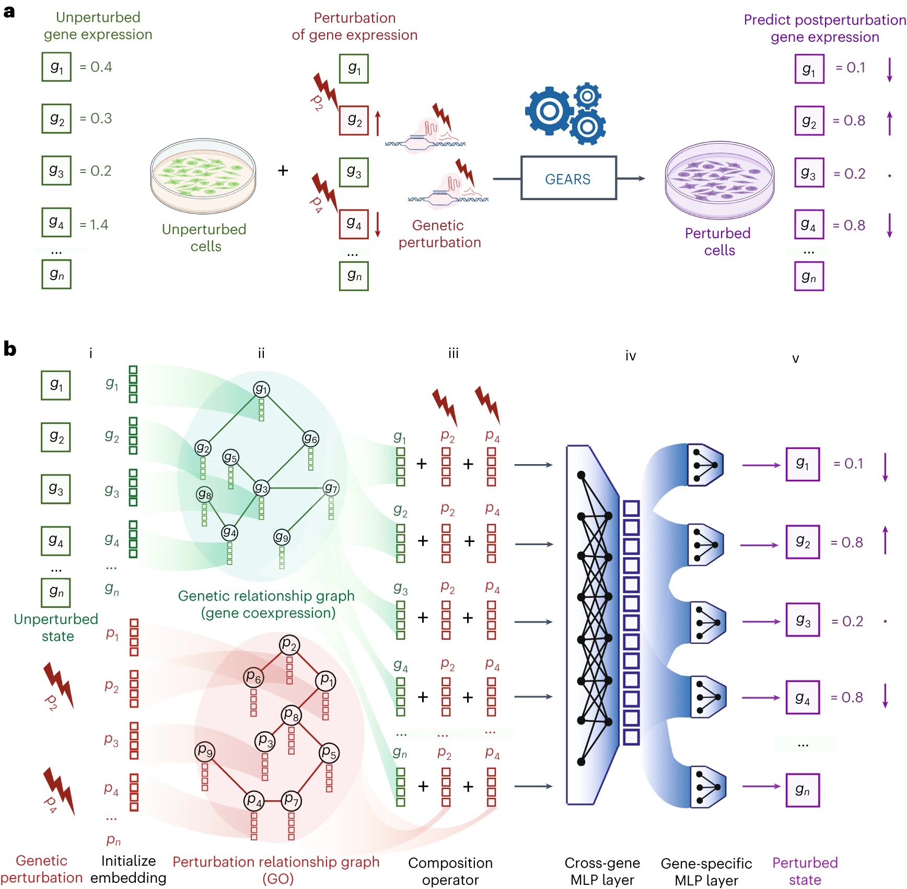

I'll help summarize the research paper using the provided template.

📊 Paper Metadata
* **Title:** Predicting transcriptional outcomes of novel multigene perturbations with GEARS
* **Authors:** Yusuf Roohani, Kexin Huang, Jure Leskovec
* **Publication:** Nature Biotechnology (Aug 2024)
* **Institution:** Stanford University
* **Paper Link:** https://doi.org/10.1038/s41587-023-01905-6
* **Code/Data:** https://github.com/snap-stanford/GEARS
* **Tags:** #DeepLearning #GeneticPerturbation #Transcriptomics #BiologicalPrediction

🎯 Core Contributions
1. Developed GEARS (graph-enhanced gene activation and repression simulator), integrating deep learning with knowledge graphs for predicting transcriptional responses
2. Enabled prediction of perturbation outcomes for previously unperturbed gene combinations
3. Achieved 40% higher precision in predicting genetic interaction subtypes compared to existing approaches

📋 Paper Structure
1. Introduction
* Background: Understanding cellular responses to genetic perturbation is crucial for biomedical applications
* Problem: Combinatorial explosion limits experimental testing of multigene perturbations
* Current Limitations: Existing methods can't predict outcomes for unseen gene combinations
* Main Innovation: Integration of deep learning with biological knowledge graphs

2. Results/Methods
* Technical Framework: Graph neural networks with gene coexpression and GO knowledge graphs
* Applications: Single and multigene perturbation predictions
* Experimental Validation: Tested on multiple datasets including RPE-1 and K562 cells
* Performance: Demonstrated superior accuracy in predicting genetic interactions

3. Discussion
* Key Findings: Successfully predicted new phenotypes and genetic interactions
* Advantages: Can predict outcomes for unseen gene combinations
* Limitations: Requires training on same cell type/condition
* Impact: Potential applications in drug discovery and cell engineering

🔬 Technical Details
Algorithm Framework

1. Core Components:
   * Gene coexpression graph encoder
   * GO knowledge graph integration
   * Combinatorial perturbation modeling
   * Cross-gene effects prediction

2. Workflow:
   * Initialize gene embeddings
   * Apply GNN on knowledge graphs
   * Combine perturbation embeddings
   * Predict postperturbation state

Implementation Details
1. Computing Stack:
   * Code available at GitHub
   * Used deep learning frameworks
   * Integrated with gene ontology databases
### Software & Libraries
1. Primary Code Implementation
- GitHub Repository: https://github.com/snap-stanford/GEARS
- Results reproduction code: https://github.com/yhr91/gears_misc

2. Dependencies & Other Packages Used
- CellOracle (v0.12.0) [https://github.com/morris-lab/CellOracle]
- CPA [https://github.com/facebookresearch/CPA]
- pySCENIC (v0.12.0)

### Data Resources & Knowledge Bases
1. Gene Expression Datasets (GEO Accession Numbers)
- Dixit et al.: GSE90063
- Adamson et al.: GSE90546
- Norman et al.: GSE133344
- Jost et al.: GSE132080
- Tian et al.: GSE124703
- Replogle et al.: GSE146194
- Horlbeck et al.: GSE116198

2. Knowledge Graphs
- Gene Ontology (GO) database
- Gene coexpression networks
- Pathway information

### Model Architecture Components
1. Neural Network Components
- Graph Neural Networks (GNNs)
- Multilayer Perceptrons (MLPs)
- Gene-specific decoder layers
- Cross-gene decoder layers

2. Training Parameters
- Used 5 different random train-test data splits (n=5)
- For genetic interaction prediction: 3 different model runs (n=3)

💻 Computational Tasks
1. Main Computational Operations
- Gene embedding initialization
- Graph neural network processing
- Perturbation effect prediction
- Genetic interaction scoring

2. Evaluation Metrics Computation
- Mean squared error (MSE)
- Pearson correlation
- Precision@10
- Uncertainty quantification

### Statistical Analysis
- One-sided t-tests for comparing distributions
- Bonferroni correction for multiple hypothesis testing
- Bootstrapped 95% confidence intervals
- Hypergeometric distribution calculations

### Visualization Tools
- Generated UMAP representations
- Created heatmaps for genetic interactions
- Produced various statistical plots and figures

### Data Processing
1. Input Data Handling
- Single-cell RNA sequencing data processing
- Gene expression normalization
- Perturbation set encoding

2. Output Processing
- Postperturbation state prediction
- Genetic interaction score calculation
- Uncertainty score computation

### Documentation
- Methods section in main paper
- Supplementary notes (1-22)
- Code documentation on GitHub
- Online repositories for data access

📊 Evaluation
* Baseline Models:
  - CPA (existing deep learning approach)
      - Based on deep neural networks trained on perturbational screens
      - Directly maps genetic relationships into a latent space
      - Skips the network inference step
      - Requires each gene in combination to be experimentally perturbed before prediction
  - Gene regulatory network-based methods, adapted from CellOracle
      - Infers transcriptional relationships between genes
      - Uses SCENIC algorithm for network construction
      - Based on gene expression datasets
  - No perturbation baseline

* Evaluation Metrics:
  - Mean squared error
  - Pearson correlation
  - Precision@10 for genetic interactions
  - Top 10 accuracy

💭 Critical Analysis
Strengths
1. Novel integration of biological knowledge with deep learning
2. Ability to predict previously unseen combinations
3. Comprehensive validation across multiple datasets

Limitations
1. Performance depends on network connectivity
2. Requires training on same cell type/condition
3. Limited by quality of available knowledge graphs

📌 Key Takeaways
1. GEARS enables accurate prediction of multigene perturbation outcomes
2. Successfully identifies different types of genetic interactions
3. Could significantly reduce experimental costs in genetic studies
4. Potential applications in personalized medicine and drug discovery

