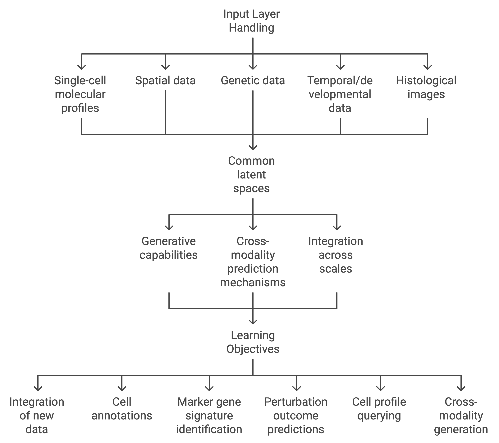

## 📊 Paper Metadata
- **Title:** The Human Cell Atlas from a cell census to a unified foundation model
- **Authors:** Jennifer E. Rood, Samantha Wynne, Lucia Robson, Anna Hupalowska, John Randell, Sarah A. Teichmann & Aviv Regev
- **Publication:** Nature (2024)
- **Institution:** Human Cell Atlas Inc., Cambridge, MA, USA; Genentech; Cambridge Stem Cell Institute
- **Paper Link:** https://doi.org/10.1038/s41586-024-08338-4

## 🎯 Core Contributions
1. Presents five key perspectives on cell atlases: cell census, 3D maps, genotype-to-phenotype maps, developmental maps, and foundation models
2. Outlines the progress and challenges in developing comprehensive reference maps of human cells
3. Demonstrates how cell atlases are transforming medicine through disease understanding and patient stratification
4. Introduces the concept of using AI/ML foundation models to integrate and analyze cell atlas data

## 📋 Paper Structure
### 1. Introduction
- Background: Understanding cell function in health and disease is essential for medical advances
- Problem: Need to map >37.2 trillion cells across diverse types, states, and human diversity
- Current Status: HCA initiative launched in 2016 aims to create comprehensive reference maps
- Innovation: Integration of new technologies and AI/ML approaches

### 2. Results/Methods
The paper presents five key perspectives on cell atlases:

1. Cell Census
- Integration of single-cell molecular profiling data
- Development of standardized resources and references
- Creation of annotated tissue and organ reference data

2. 3D Multimodal & Multi-scale Maps
- Integration of spatial profiling and clinical imaging
- Development of computational methods for multi-scale representation
- Creation of common coordinate frameworks

3. Genotype-to-Phenotype Maps
- Integration with human genetic data
- Focus on diverse populations and ancestries
- Connection of variants to cell-specific traits

4. Temporal Maps of Development
- Mapping human development in 4D
- Integration of fate maps, lineage maps, and morphogenesis
- Combination of experimental and computational approaches

5. Foundation Models
- Development of large-scale pre-trained models
- Integration across modalities and scales
- Generation of predictions beyond observations

### 3. Discussion
- Current Impact: Already transforming biomedical research and clinical applications
- Future Directions: Need for experimental perturbations and increased data collection
- Broader Impact: Will serve as framework for understanding health and disease

## 💭 Critical Analysis
### Strengths
1. Comprehensive integration of multiple data types and approaches
2. Strong focus on practical medical applications
3. Clear roadmap for future development
4. Emphasis on diversity and ethical considerations

### Limitations
1. Many aspects still theoretical or in development
2. Computational challenges in data integration
3. Need for substantial increase in data collection
4. Technical limitations in current methods

## 📌 Key Takeaways
1. Cell atlases are evolving from simple censuses to complex foundation models
2. Integration of multiple data types and scales is crucial
3. AI/ML approaches will be essential for future development
4. Strong potential for medical applications and understanding disease
5. Need for continued focus on diversity and ethical considerations

## 💡 Personal Notes
### Structural Components of FMs

- Key Capabilities:

  - A. Core Functions:

    - Data integration across modalities
    - Transfer learning between datasets
    - Generation of missing modalities
    - Prediction of cell states and features

  - B. Advanced Features:

    - Cross-species generalization
    - Prediction of new cell types
    - Generation of cell states from genetic profiles
    - Integration across anatomical scales

### Research Ideas
- Development of new computational methods for data integration
- Creation of specialized foundation models for specific biological systems
- Improved methods for spatial data analysis
- Novel approaches to developmental mapping

### Questions
- What are the computational requirements for running these foundation models?
- How can we validate predictions from foundation models?

