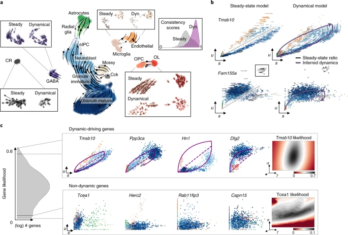

文章链接
https://www.nature.com/articles/s41587-020-0591-3 

doc链接
https://scvelo.readthedocs.io/en/stable/

中文操作笔记 
https://www.jianshu.com/p/fb1cf5806912

牙龈神经发生过程中使用动态模型和稳态模型来估计RNA速率的比较。

1. 动态模型更准确：在UMAP图上，动态模型准确地显示了神经母细胞发育为颗粒细胞的主要流向，并正确识别了其他细胞类型的状态，如终末状态的CR细胞和从OPC分化为OL的过程。
2. 稳态模型的局限性：相比之下，稳态模型错误地为CR细胞分配了高速率，并错误地指示OPC远离OL，这表明它在捕捉细胞状态变化时不如动态模型准确。
3. 基因层面的洞察：动态模型还能在基因层面提供更准确的信息。例如，它正确地识别了Tmsb10基因在神经母细胞分化为颗粒细胞过程中的关键作用，并准确地描述了Fam155a基因在CR细胞中的表达状态。
4. 识别驱动基因：动态模型的一个独特优势是能够系统地识别可能的驱动基因，这些基因表现出明显的动态行为，而不是由噪音或不存在的瞬时状态所主导。

# Generalizing RNA velocity to transient cell states through dynamical modeling

RNA速率是一种创新的技术，用于通过测量未成熟和成熟的mRNA水平来预测细胞的未来状态。随着时间的推移，这项技术不断发展，以更好第捕捉细胞发育过程中的动态变化。
1. 稳态/确定性模型（最简单）：这是最早的RNA速率模型，假设细胞处于稳定状态，就像一条平稳流动的河流。它认为，如果你观察河流足够长的时间，你就能预测水流的速度和方向。同样，这个模型假设细胞的基因表达已经达到平衡，通过观察现有的mRNA水平，可以估计转录和剪接的速率。但是，就像河流可能突然变快或改变方向一样，细胞也可能快速改变状态。这时这个简单的模型就可能出错。
2. 随机模型（稍微复杂）：这个模型可以理解为看起来平静的河流，水流速度和方向也会有小的变化。同样，即使细胞似乎处于稳定状态，基因表达也会有自然的波动。随机模型不仅看平均水平（河流的平均速度），还看波动的程度（水流速度的变化）。这有助于更好地估计RNA速率，但仍然假设细胞处于相对稳定的状态。
3. 动态模型（最复杂但最准确）：想象一条河流在山区，有急流、瀑布和平缓的部分。这条河流的的动态非常复杂，每个部分都有独特的流动方式。类似地，细胞发育是一个动态的过程，每个基因都有独特的转录和剪接模式，特别是在细胞改变状态（如从干细胞到特定类型的细胞）时。动态模型是专门设计来处理这种复杂性的。它不假设所有基因都以相同的速率被剪接，也不假设细胞处于稳定状态。相反，它仔细研究每个基因的独特性为，就像研究河流的每个部分一样。它还考虑到细胞可能处于过度状态，就像水流从一个部分移到另一个部分。通过这种方式，动态模型可以更准确地预测细胞的未来状态，即使是在快速变化的情况下。更重要的是，通过详细研究每个基因的行为，这个模型可以找出哪些基因在驱动变化。就像识别哪些急流或瀑布导致河流的整体流动模式一样，它可以识别哪些基因正在推动细胞从一种状态转变到另一种状态。
