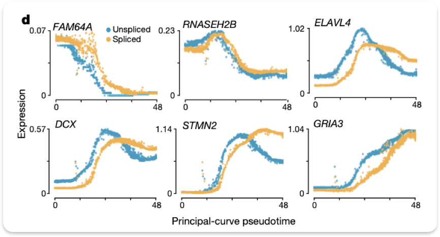

文章链接:
https://www.nature.com/articles/s41586-018-0414-6

doc链接：
https://velocyto.org/velocyto.py/index.html 

RNA velocity是一种从单细胞RNA测序数据推测细胞命运和状态变化的计算方法。它的主要原理可以通俗地总结如下:

1. 一个基因从被转录到成熟mRNA需要一些时间。在这个过程中,细胞内会同时存在未剪接的pre-mRNA和已剪接的成熟mRNA。
2. 如果一个基因的表达量正在升高,那么未剪接的mRNA相对已剪接的mRNA会更多一些;反之如果基因表达量在下降,已剪接mRNA会相对更多。
3. 通过比较每个基因未剪接和已剪接的mRNA比例,我们可以知道这个基因表达是在升高还是降低。把所有基因的变化趋势综合起来,就可以
测这个细胞的状态是在向什么方向改变。
4. 把每个细胞的状态变化方向展示在一起,我们就可以推测细胞群体的发育轨迹,判断一个细胞将来会分化成什么细胞类型。
RNA velocity利用了RNA剪接动力学的信息,相当于在静态的基因表达数据中加入了时间维度,可以用来研究细胞命运决定、分化等动态过程。

Principle-curve pseudotime: 是一种用于分析单细胞RNA测序数据的计算方法，用于推断细胞在一个生物学过程中的进展程度或“时间”。原理如下：

1. 在一个发育或分化过程中，细胞会经历一系列的状态变化，但是不同细胞的进展速度可能不同。我们希望知道每个细胞在这个过程中的相对位置和“时间”；
2. 单细胞RNA测序数据提供了每个细胞基因标的的高纬度快照。我们可以假设，随着发育过程的进行，细胞会在这个高维表达空间中移动，形成一条轨迹；
3. Principal curve是一种数学方法，它可以在数据点形成的分布中找到一条“中心线”。如果我们把细胞在基因表达空间中的轨迹看作一条曲线，主曲线就近似这个轨迹；
4. 我们可以把每个细胞投影到主曲线上最近的点，然后以这个点在曲线上的位置（即曲线起点到这个点的距离）作为这个细胞的pseudotime；
5. pseudotime 反映了细胞在发育轨迹上的相对位置，可以用来推断细胞的发育阶段，寻找关键的转变点，分析不同基因表达的动态变化等。

原理：
u 代表 unspliced reads，s 代表 spliced reads, γ 代表 RNA降解和剪接速率的估计，虚线是拟合出来的平衡态。\
一般认为当 u> γs 时基因处于转录激活态，反之为抑制。这样，对于每个基因，拟合出 γ 后，就可以根据平衡态预测速率；再通过基因预测结果综合判断细胞的速率；最后计算细胞见速率相关性，最终完成轨迹推断。

